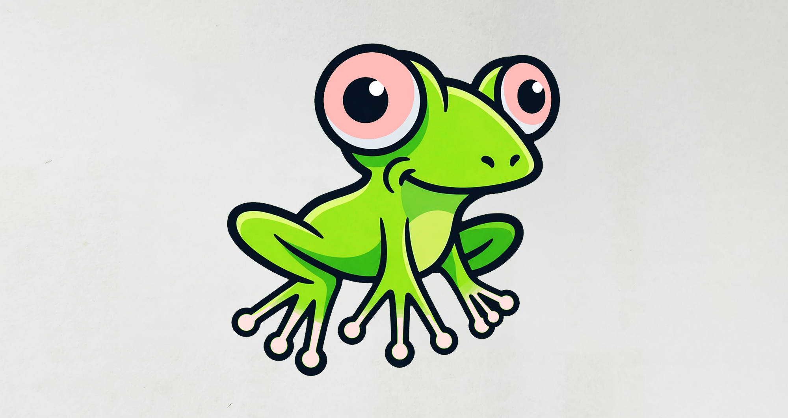
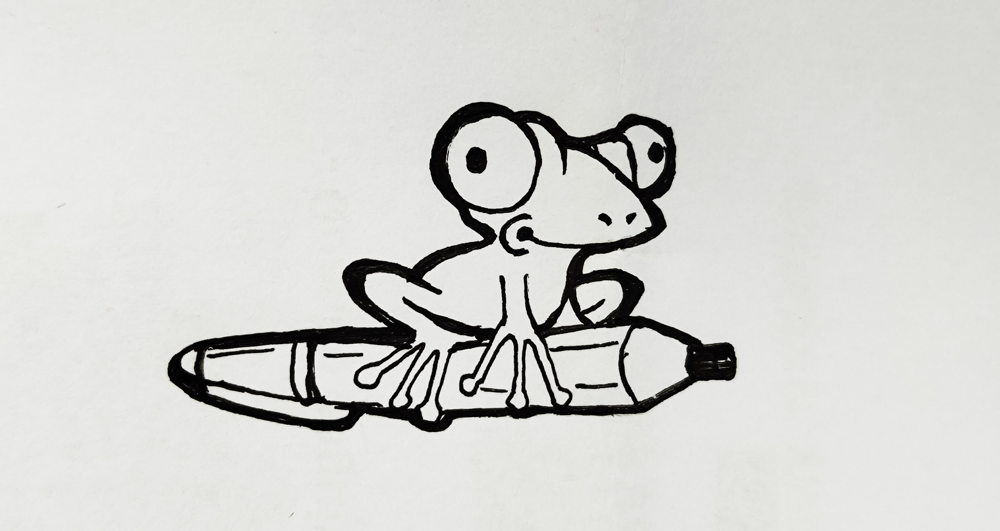
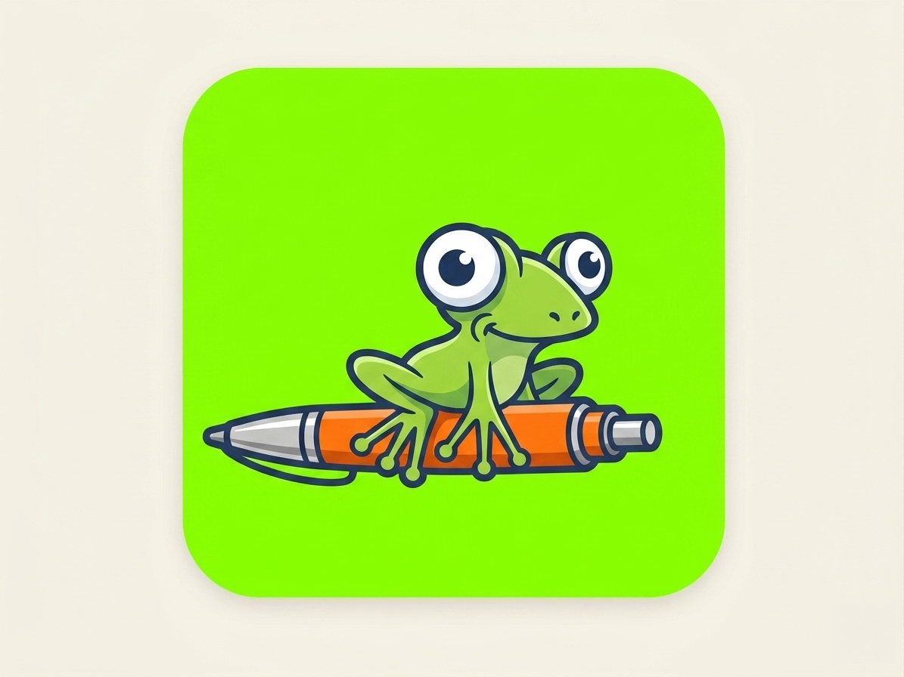
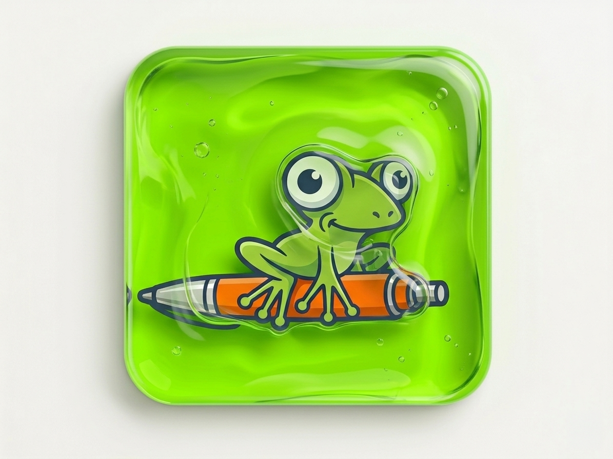
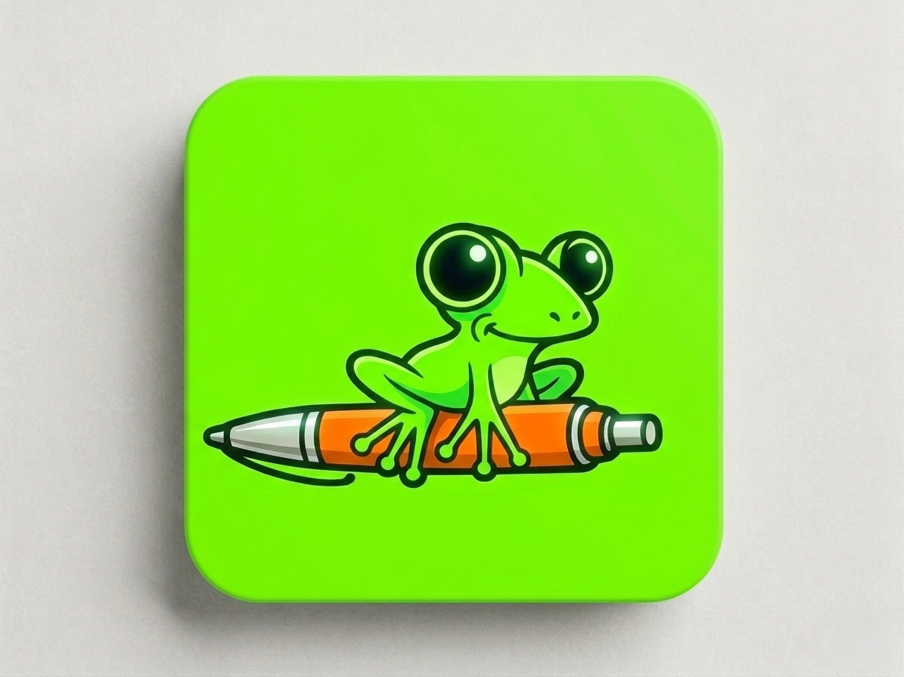
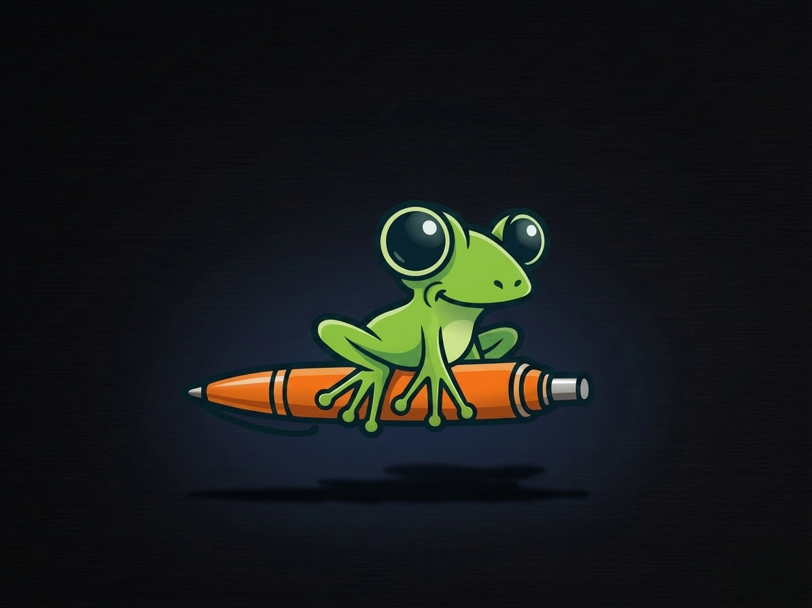

*Frogmeleon Jumpy++ logo*

# Jumpy++ Fan logo contributed by <a href='https://github.com/gianpox86'>@gianpox86</a>

One of the fans of Nextpad++, @gianpox86, created a few very nice flog logos for the app. I want to share. We may need to loose the pencil for the 1.0.7 logo refresh. I want to keep them here for others to enjoy. Great work @gianpox86. 

