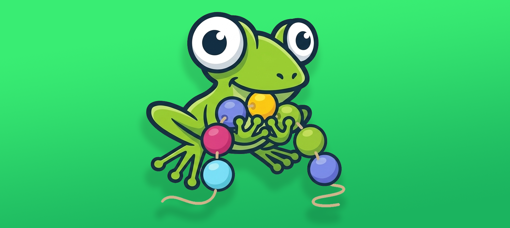
*Chameleon walking on Beads*
<div style="text-align: center">
 <download-button href="https://github.com/nextpad-plus-plus/NppBeads/releases/download/v0.9.2/BeadsViewer_0.9.2.dmg" variant="primary" icon="download">Download Beads Viewer DMG (Universal)</download-button>
 <download-button href="https://github.com/nextpad-plus-plus/NppBeads" variant="secondary" icon="github">View NppBeads Source on GitHub</download-button>
</div>

# Beads - a new Jira for Agentic AI

The Nextpad++ Beads plugin and the native macOS Beads viewer were inspired by two amazing people, [Steve Yegge](https://www.linkedin.com/in/steveyegge/) and [Jeffrey Emanuel](https://www.linkedin.com/in/jeffreyemanuel/), who did most of the heavy lifting. Steve built Beads. Jeff designed and built the original Beads Viewer, which I adapted to work as a plugin in Nextpad++ and later decided to make into a standalone Mac app so people are free to use it without any editor. 

However, the Nextpad++ Beads Viewer is not only a viewer. It's more advanced and incorporates the work of Justin Dillon, who built the Beads extension for Visual Studio. The Beads Viewer I’m releasing today is likely more advanced than most Beads plugins available today. It includes editing and real-time sync functionality and works with both Beads JSONL files in read-only mode and Dolt DB in read-write mode.

Please note that some screenshots contain examples of Beads from Jeff's public github product repos. 


## Agents Context

Here's a thing that happens when you let an AI coding agent work on something for more than an hour. It loses the plot. Not in a sudden crash sort of way. It just slowly forgets what it started doing.

The reason is that an agent has a context window, basically a fixed amount of memory it can read at one time. When that fills up, the agent compresses the older parts of its conversation into a summary. Summaries lose information. After a few rounds of compression, the agent's notes about the original task may loose substantial amount of information. The agent doesn't know why it started the refactor, which file the colleague was supposed to finish, or that an early attempt at the bug fix introduced a quiet race condition. This isn't a bug. It's how language models keep running.

Beads is institutional memory for agents. NppBeads is what makes it pleasant to use without leaving your editor.


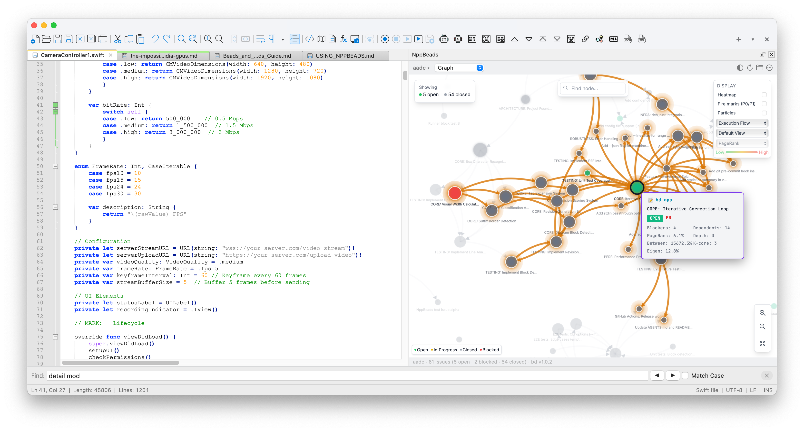
*Nextpad++ Beads Viewer Plugin Graph View*


## What is Beads

Beads is an issue tracker for agentic AI. It doesn't look like Jira or Linear. There's no website, no login, no central server you depend on. The tracker lives inside your repository.

When you run `bd init` in a project, Beads creates a `.beads/` directory next to `.git/`. Inside that directory is a Dolt database. Dolt is what you'd get if say you crossed PostgreSQL or MySQL with Git. It's a real SQL database, and every change is a commit. You can branch the data, diff between branches, merge them, and roll it back if you want. It's pretty amazing. It's like partitioning in Oracle but without an overhead.

You drive Beads with a small command line tool called `bd`. The whole interface is a CLI:

```bash
$ bd init
Initialized Beads tracker in .beads/

$ bd create "Fix cache eviction race" -t bug -p 1 -l backend
Created bd-a3f8

$ bd update bd-a3f8 --claim
# Sets assignee + status=in_progress in one transaction.

$ bd dep add bd-a3f8 bd-b1
# bd-a3f8 now depends on bd-b1; equivalently, bd-b1 blocks bd-a3f8.

$ bd ready
# Returns only issues that are open AND have no unresolved blockers.

$ bd comment add bd-a3f8 --body "Reproduced on staging"

$ bd close bd-a3f8 --reason "merged in commit a1b2c3d"
```

That's it. No web UI. No service to log into. The first time you set up a project you run `bd init` and a `.beads/` folder appears. From then on, the issues travel with the code. Clone the repo on a new machine, the issues come along. Push your code, the tracker pushes with it. Want to back it up, copy the repo. Want to roll back, `git checkout` last Tuesday and the tracker rolls back too.

A small note on issue ids. They look like `bd-a3f8` (or `bd-a3f8.1.2` for parent-child relations) rather than `PROJ-1234`. The reason is collisions. Sequential ids fight when two branches each try to create issue 1235 at the same time. Hash ids never collide, even when ten agents are creating issues in parallel. Beads scales the hash length with the project size: 4 characters under 500 issues, 5 under 1500, 6 or more after that.


## Why this design matters

Most issue trackers assume a human in a browser. They have login pages, OAuth flows, scoped tokens, rate limits, and webhooks. None of that is a problem for a person clicking around in a tab. All of it is a problem for an agent as it's super slow.

Beads assumes the writer might be a script or a coding agent. That changes everything.

For an agent using Jira, every action means dealing with API tokens, dealing with rate limits. For an agent using Beads, every action is a subprocess call. The agent runs `bd create`, gets back an issue id, runs `bd comment add`, gets a confirmation. No authentication. No internet round trip. Local SQL latency.

That's also why Beads works as institutional memory. An agent can write things into Beads as it goes:

- Progress updates on what it tried
- Observations about how the code behaves
- New issues for problems it can't fix right now
- Decisions and the reasons for them

When the agent's internal memory gets compressed an hour later, that information is still there. The agent runs `bd show bd-a3f8` and reads back everything it did, in order, with timestamps.


## The dependency graph

Beads is more than a flat list. Each issue can be connected to others using ten different relationship types: `blocks`, `parent-child`, `conditional-blocks`, `waits-for`, `related`, `tracks`, `discovered-from`, `caused-by`, `validates`, and `supersedes`. That vocabulary is enough to describe how real engineering shapes itself: a child issue under an epic, a blocker that only applies in one condition, a follow-up that was found while fixing something else, a validation issue that confirms an earlier fix held.

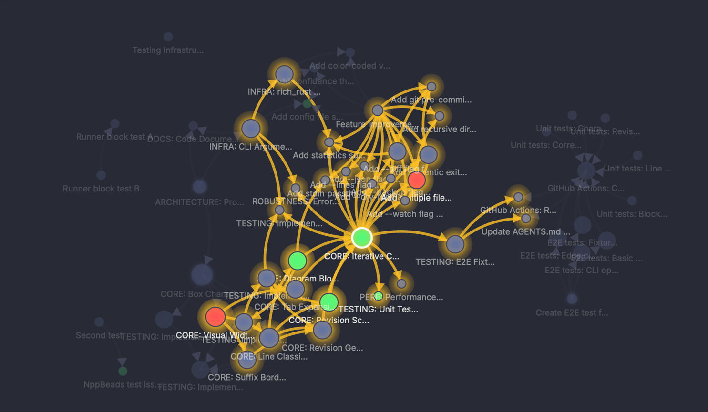
*Sample Nextpad++ Beads Graph View*


These relationships form a graph. These graphs can be huge. The graph powers a single useful question.. what can be worked on right now?

The command `bd ready` answers it. It walks the whole graph and returns only issues that are genuinely unblocked. An issue with a `waits-for` dependency on a closed issue becomes ready the moment the closure commits. A child issue stays hidden until its parent is done.

The graph also unlocks structural analysis. Beads computes PageRank to find the most load-bearing issues, betweenness centrality to find bottlenecks, and the critical path through the dependency chain. The Insights view in NppBeads surfaces all of these. When an agent is grinding through a hundred-issue backlog without supervision, "give me the five most structurally important issues that are currently ready" has a clean answer.


## Beads as an Agent Orchestrator

Once you have a dependency graph and atomic claim semantics, Beads stops being just a tracker and starts behaving like a lightweight orchestrator. Not a heavyweight workflow engine. More like a shared ledger that coordinates independent workers. If you've used a job queue or a pub/sub broker, the mental model is the same. The queue is the dependency graph. The workers are whoever can run a subprocess.

A few details make this real:

**Atomic claim.** `bd update --claim` sets assignee plus status=in_progress in one transaction and refuses if someone else already claimed it. Two agents starting from the same `bd ready` snapshot will both try to claim the top of the list. Exactly one wins. 

**Dependency-aware dispatch.** `bd ready --json` only returns truly unblocked work. You can file a hundred issues with the real dependencies between them and let agents drain the queue in topological order without scheduling anything yourself.

**Handoff.** When one agent closes an issue that unblocks a second agent's work, the second agent's next `bd ready` call picks it up. No webhooks, no signals, no retry loops. The second agent just asks "what can I do now" and gets a fresh answer. A team of three agents on a two second `bd ready` poll behaves as a self-scheduling worker pool.

**Discovery.** When an agent mid-work discovers a follow-up bug, it files a new issue with a `discovered-from` link back to the issue it was working on. The graph grows organically. Other agents see the new item next time they poll. Humans reviewing the project a week later can trace every discovered-from chain back to its origin.

**Review and rollback.** Because the whole store is in Dolt and Dolt is in the repo, the orchestration log is a git log. `git log .beads/` is a chronological record of every claim, every status change, every comment. `git blame` on a closed issue tells you which agent closed it and when. If an afternoon of agent work produced bad results, `git revert` on the relevant range of commits rolls the tracker state back atomically, and the code it was working on rolls back in the same operation. You watch the Kanban board in NppBeads fill with in-progress cards and drain into closed without telling any of the agents what to do.

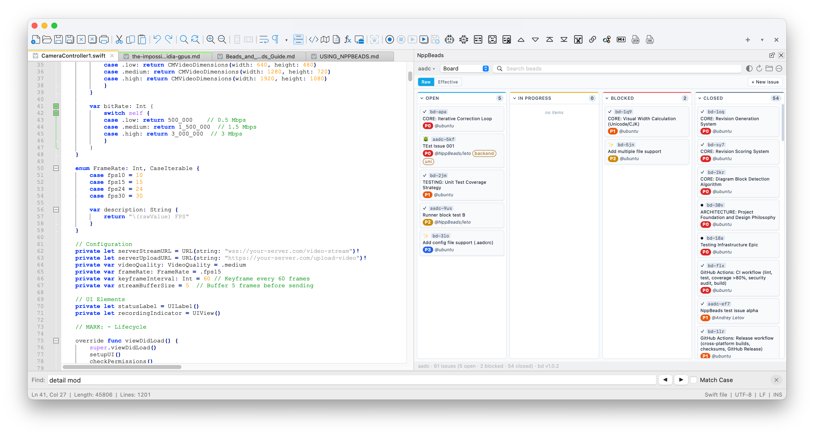
*Nextpad++ Beads Viewer Plugin Board View*

A point worth making up front, because it changes how you think about the whole tool: in a Beads-driven workflow, **most of the writing and most of the reading is done by agents, not humans.** Humans file the load-bearing issues. Epics. High-priority bugs the agent can't be trusted to scope on its own. Decisions that need a person to weigh in. Agents do everything else. 


## What's differnt from Jira

Both are issue trackers. Both have hierarchical relationships, statuses, comments, custom fields. Both are how work gets coordinated.

The differences come from where the data lives and who the writer is supposed to be. For a team of human managers, Jira is fine. It has an app, a rich permission system, dashboards built for executives. It's OK for a team of humans plus one or more agents working through a backlog while the humans sleep..

A few things stand out in practice:

- **Speed.** A `bd update` returns in milliseconds. A Jira REST call returns in hundreds. Multiply that by an agent doing thirty updates an hour and the difference is real.
- **No third party.** Atlassian has outages. So does GitHub. When they're down, the agents that depend on their APIs wait. Beads keeps working because the database is on the same disk as the code.
- **Rollback.** `git revert` on the `.beads/` directory undoes the tracker. You can't do that with a SaaS tracker. The closest you get is a manual trail of "undo edit" clicks.
- **Audit at git fidelity.** `git log .beads/` shows you every state change with author, timestamp, and the surrounding code commits. Try   answering "who changed this issue's priority and why" in Jira when you're not the admin.

What Beads doesn't try to do (and isn't going to be good at):

- Long-term portfolio planning. 
- Permission models with departmental access controls. Although this can be implemented.

For those, keep MS Project. Run Beads alongside it. There's a `bd jira sync` for that, covered further down.


## Running Beads with a Team

The most common reaction to all of this is fine for one developer with several agents on one laptop, but what about a real team? The answer scales surprisingly well, with three different setups for three different sizes.

### Two humans on the same repo (single machine or shared filesystem)

The simplest team setup is two or more developers working out of the same repo, on the same machine, or on a shared filesystem (NFS, SMB, even a synced Dropbox/iCloud folder if you trust it). Each runs NppBeads or Beads Viewer installed. Each binds the panel to the same project root. That's the whole setup. Both panels read the same `.beads/`, both watch it for changes, both poll `bd` every two seconds.

When developer A drags a card from Open to In Progress, developer B's panel reflects it within two seconds. When developer B's agent posts a comment, developer A's status bar shows the "● N new" indicator tick up.

Single-machine multi-writer is handled by Dolt's embedded mode (the default after `bd init`) up to a point. Concurrent writes from the same process are fine. Truly parallel writers from different processes switch to server mode.

### Many agents on one machine: server mode

When you start running multiple agents in parallel and they trip over
each other on writes, switch to Dolt server mode:

```bash
bd init --server                 # initial setup, or
export BEADS_DOLT_SERVER_MODE=1  # for an existing project
```

Server mode runs `dolt sql-server` as a separate process exposing two ports. MySQL on 3306 for SQL access, and remotesapi on 8080 for peer sync. Every `bd` invocation from every agent and every NppBeads panel talks to the same server. Concurrent writes are serialized through Dolt's transactional layer. Five agents grinding through a backlog at full tilt? Server mode and they don't see lock errors. The Bead Viewer doesn't care which mode you're in. It runs `bd` the same way.


### Multiple offices, multiple machines (federation)

This is where Beads gets interesting compared to Jira. Each machine, or each office, runs its own Beads. They sync to each other peer-to-peer using federation, which is Dolt's distributed version control feature. The same one that makes Dolt a "Git for SQL." There's no central server in the architectural sense. Each town (Beads's word for a participating workspace) is autonomous and can keep working through a network partition.

Setup looks like adding a remote to git:

```bash
# One time, per peer, per machine:
bd federation add-peer team-alpha dolthub://my-org/beads
bd federation add-peer team-beta  ssh://team-beta.example.com/srv/beads
bd federation add-peer backup     s3://my-bucket/beads-backup

# Sync (run on demand, or scheduled via cron / launchd / systemd timer): bd federation sync
```

Endpoints can point at DoltHub (Dolt's hosted Git-for-data service), an SSH host running `dolt sql-server`, an S3 or GCS bucket, an HTTPS server, or a local file path on a network share. Push/pull happens at row-merge granularity, not file-diff. Two teams editing different fields of the same issue don't collide. When real cell-level conflicts do happen (both sides changed the same field on the same row), `bd federation sync` either pauses for manual resolution or auto-resolves with `--strategy ours` / `--strategy theirs` for unattended sync.

Each office writes to its own local server (low latency, no internet round trip, works during outages). A cron job in each office runs `bd federation sync` every few minutes. 


### When you also need contributor isolation

When more than one human writes to the same `.beads/`, you sometimes want their personal experiments not to leak into the shared issue list. Beads has contributor namespace isolation for this. You set it up once:

```bash
bd init --contributor
# Configures: routing.mode=auto, routing.contributor=~/.beads-planning
```

After that, Beads detects whether you're a maintainer or a contributor (HTTPS remote, typical of a fork) and routes new issues to the right place.


## Existing trackers (Jira, Linear, etc.)

If your organization lives in Jira, GitHub, Linear, GitLab, Azure DevOps, or Notion, Beads can treat any of them as another peer. The `bd <tracker> sync` family does bidirectional sync over the tracker's REST or GraphQL API.

The pragmatic deployment looks like this:

1. Keep your Jira (or Linear, or whatever) for the things it's good at. Formal release management, stakeholder reporting, anything that needs a person logging into a polished web UI. 

2. Run Beads with NppBeads as the day-to-day surface for the engineering team and the agents working alongside them. Most issues live and die in Beads without ever touching Jira.

3. Set up `bd jira sync` (with `jira.push_prefix` configured to limit what gets pushed) to bubble a curated subset up to Jira on a fifteen-minute schedule. PMs and execs see what they need without anyone hand-typing tickets.

Same pattern teams have used for years to bridge Jira and GitHub Issues. The difference is Beads's local side is a fully versioned database the agents can write to at thousands-of-issues-per-second throughput, not a SaaS API with rate limits. The bridge stops being the bottleneck.


Beads is like a red pill in the age of AI. You want to move at a slower pace, take a blue pill and stay on Jira. You want things to move at blazing speed, look at Beads. Any reporting you can think of can be added into the Beads Viewer/Editor to make it look like Jira and have executive level views that will refresh in real-time.


## Where Nextpad++ Beads comes in

Beads itself is command line only. NppBeads adds a visual layer inside Nextpad++. The "UI" is a docked side panel (a webview running locally inside the editor) that shows six different surfaces, all driven by `bd` calls under the hood.

A critical detail: NppBeads or macOS Beads app do not replace Beads. They are thin wrappers. Every read goes through `bd list --json` or `bd show --json`. Every write goes through `bd create`, `bd update`, `bd close`, `bd comment add`, or friends. There's no NppBeads database, no separate sync process, no caching beyond what `bd` itself does. If you do something via NppBeads, the next person who runs `bd list` from a terminal sees it. If a teammate's agent runs `bd update` from a script, your panel refreshes within two seconds.

That hard rule (everything is `bd`) means NppBeads doesn't lock you in. Use it in the morning, switch to a terminal in the afternoon, let an agent run overnight, come back the next morning. There's no merge conflict because there's nothing to merge. The single source of truth is whatever `bd` says. NppBeads is one of several front ends. 

The plugin and macOS app exist for the same reason: to remove a context switch. Dropping out of Nextpad++ or MacViewer into a terminal to run `bd update` is small individually but multiplicative across a day. After a couple of weeks of running Beads from the terminal alone, the friction wins and people stop updating statuses. A stand-alone macOS viewer can be amazing for management to monitor a project.   


## Installing Beads Plugin

Best way to install NppBeads plugin from the Nextpad++ Plugins Admins

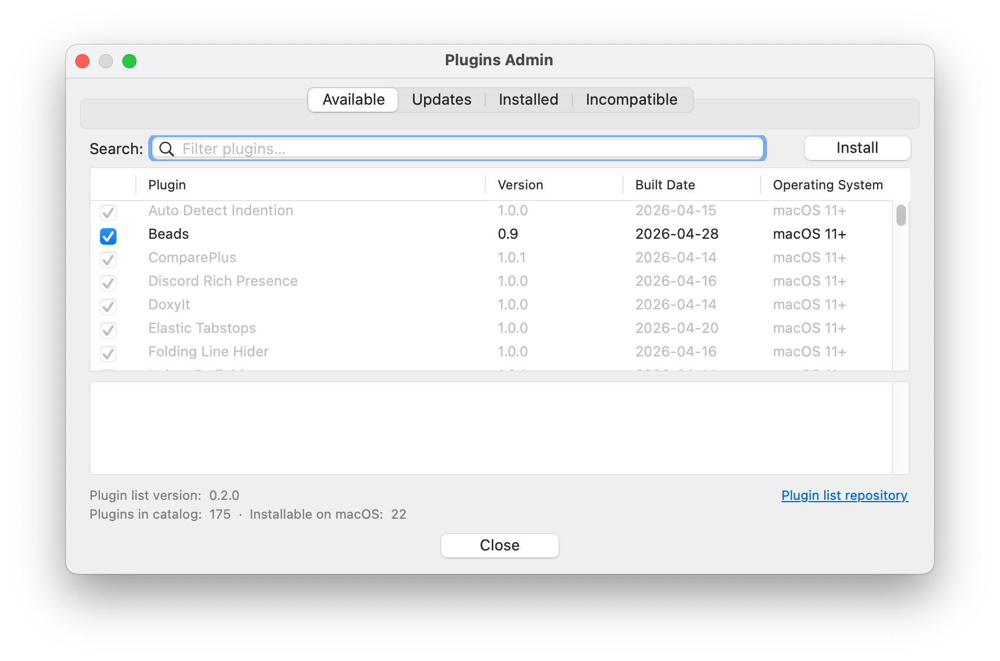
*Nextpad++ Beads in Plugin Admin*

Restart Nextpad++. The plugin shows up as a main toolbar icon 

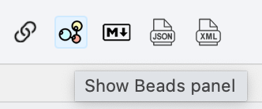 and under `Plugins → NppBeads` with three menu items at first (Show Beads panel, Reload issues, Reveal .beads/ in Finder) and a few more once you've used it (Jump to bead under caret, Copy bead id, Create issue from selection). The default keyboard shortcut for opening the panel is Cmd-Option-Shift-B. If that conflicts with anything in your setup, rebind via the standard NPP shortcut manager.


If you'd rather have a stand-alone macOS Beads Viewer application, you can download the 2MB DMG install (top of this page), launch it and simply drag the Beads Viewer App into your Mac Applications folder.
 
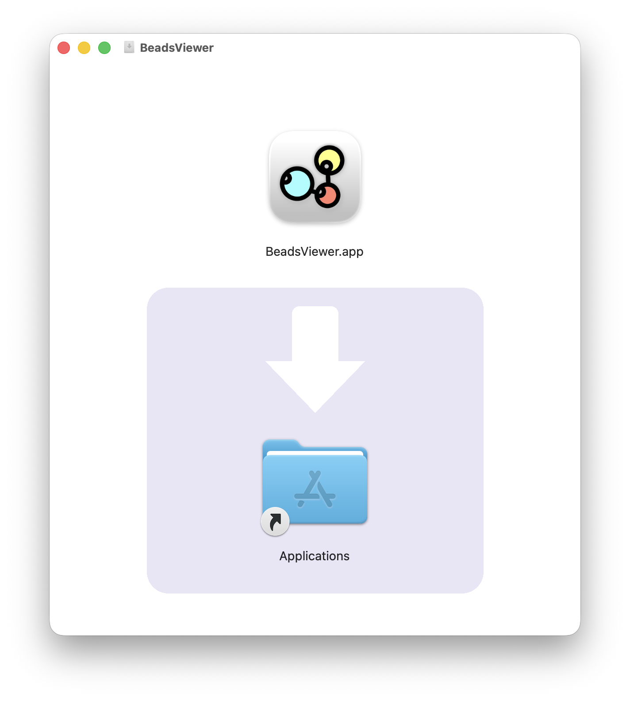
*Install Beads as Mac stand-alone app*


For editing to work you also need the `bd` CLI on your `PATH`. Homebrew is easiest:

```bash
brew install beads
bd version   # confirms install
```

Without `bd` the plugin runs in read-only mode. It reads `.beads/issues.jsonl` (the export file Beads maintains for compatibility) and shows you the data, but every edit attempt fails with a "ReadOnly" error. The status bar at the bottom of the panel tells you which mode you're in: `bd v1.0.2` or similar means full mode, `read-only (JSONL)` means fallback.

If you launch Nextpad++ from Finder rather than from a terminal, NPP inherits a sparse `PATH` that often doesn't include `/opt/homebrew/bin`. NppBeads handles this by checking common install locations directly (`/opt/homebrew/bin`, `/usr/local/bin`, `~/bin`, `~/.local/bin`, `~/go/bin`) before falling back to the inherited `PATH`. So `brew install beads` followed by an NPP relaunch should just work.


NppBeads Nextpad++ plugin and macOS App have exactly the same functionality, codebase and live in the same repo. I make updates to NppBeads plugin, the macOS app gets all updates automatically. They look exactly the same. 

## The first time you open it

Open the panel with Cmd-Option-Shift-B (or Plugins → NppBeads → Show Beads panel). You land on the Dashboard view by default.


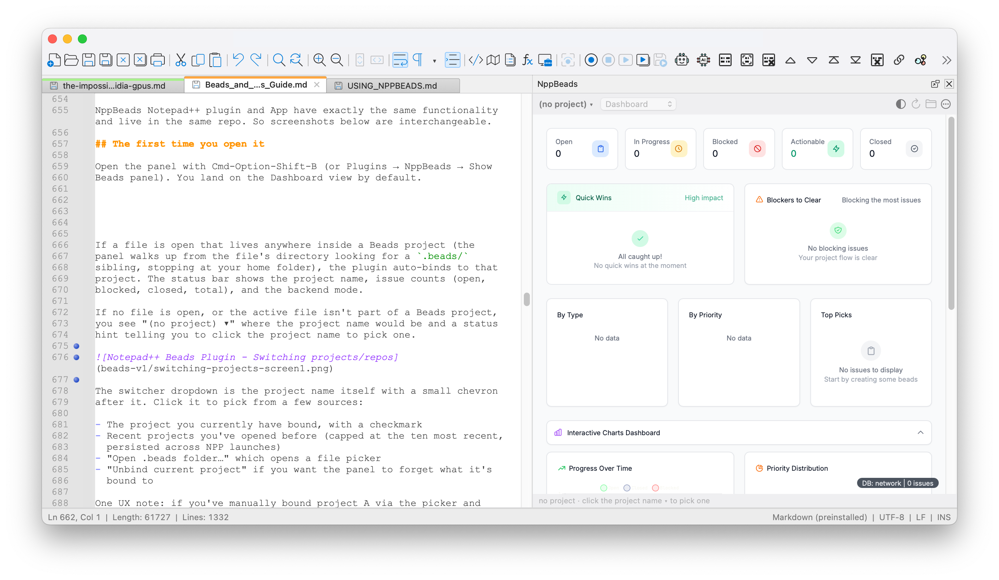 *Nextpad++ Beads Plugin launched first time*

If a file is open that lives anywhere inside a Beads project (the panel walks up from the file's directory looking for a `.beads/` sibling, stopping at your home folder), the plugin auto-binds to that project. The status bar shows the project name, issue counts (open, blocked, closed, total), and the backend mode.

If no file is open, or the active file isn't part of a Beads project, you see "(no project) ▾" where the project name would be and a status hint telling you to click the project name to pick one.


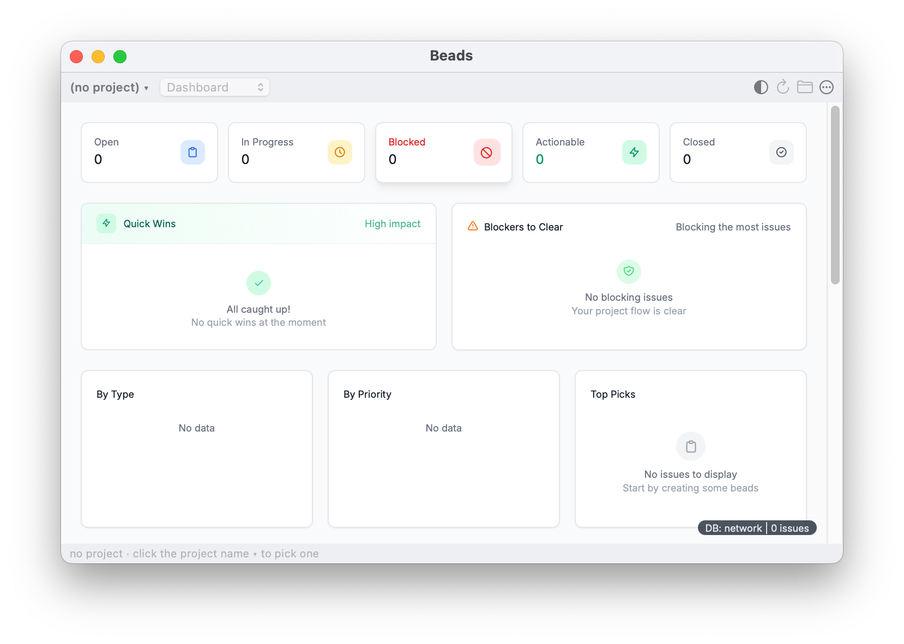 *Beads macOS App launched first time*

The switcher dropdown is the project name itself with a small chevron after it. Click it to pick from a few sources:

- The project you currently have bound, with a checkmark
- Recent projects you've opened before (capped at the ten most recent,
  persisted across NPP launches)
- "Open .beads folder…" which opens a file picker
- "Unbind current project" if you want the panel to forget what it's
  bound to

One UX note: if you've manually bound project A via the picker and then open a file from project B, the panel switches to B. The most recent action wins. If that's not what you want, pick A again from the switcher and don't open files from B until you're done.


## A tour of the six Views

The view popup in the toolbar (next to the project name) toggles between six different surfaces. They overlap intentionally. Different angles on the same data for different moods.

### Dashboard

The start screen. Total issue counts split by status (Open, In Progress, Blocked, Closed), top "AI Priority Picks" (issues ranked by an internal greedy unblock score), distribution charts by type and priority, recent activity summary. Open the panel cold, glance for two seconds, and either keep going (everything's normal) or notice that the blocked count jumped overnight (which is when you switch views).

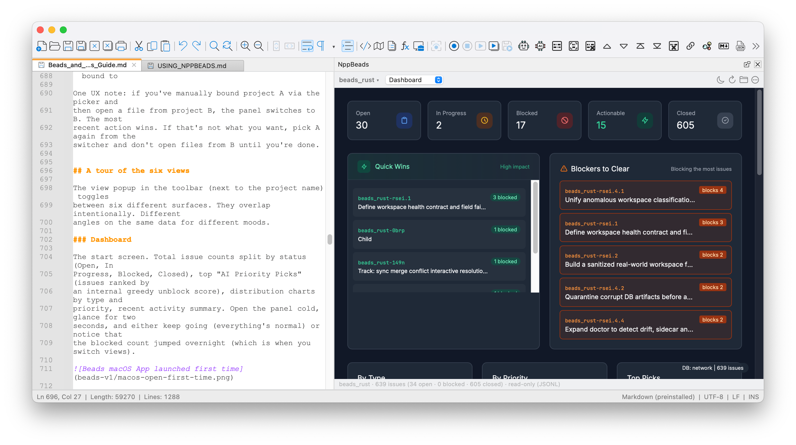 *Dashboard view pointed to github.com/Dicklesworthstone beads_rust repo*

### Issues

The flat searchable list. Where you go when you remember "there was a bug about the cache, something about a race condition" and need to find it. Type into the search field; the list filters live across issue id, title, and description. Behind the scenes it tries an FTS5 full-text index first and falls back to a LIKE query on the same fields if FTS doesn't find anything (which catches substring matches that FTS's word-prefix matching misses).

A second row of filters narrows by assignee, status, priority, label, sort order, blocked / not-blocked, blocking / not-blocking. The combination of search query plus filters is sticky across navigations within the panel, so you can click into an issue's detail, come back, and the list is still where you left it.

The list paginates a hundred at a time. For projects with more than a hundred issues, controls at the bottom let you walk through pages. For most projects under a hundred, you'll see everything on one page.

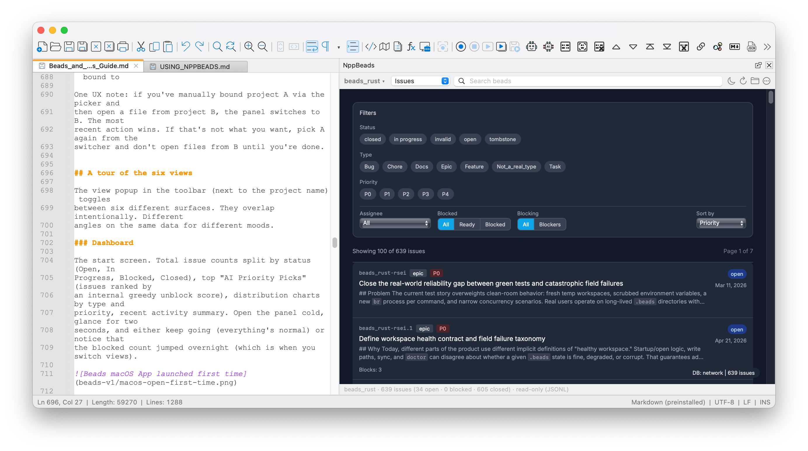 *Issues view pointed to github.com/Dicklesworthstone beads_rust repo*


### Insights

The analytics surface. Top by PageRank (recursive importance based on the graph's link structure), top by betweenness centrality (fraction of shortest paths between all node pairs that pass through this one), top by critical path depth (longest dependency chain that touches the node), k-core analysis, articulation points (issues whose removal would disconnect the dependency graph), cycles (if any), and several other graph-derived rankings.

The numbers come from a small WebAssembly graph engine bundled with the panel that runs the algorithms over the dependency edges. For a hundred-issue project the whole thing computes in a few hundred milliseconds, recomputed automatically when the data changes.

This is the view to open when you want a structural answer to a structural question. "What's the most load-bearing issue in this project right now?" Insights answers it.


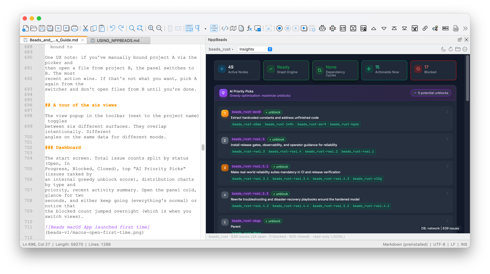 *Insights view pointed to github.com/Dicklesworthstone beads_rust repo*

### Graph

The dependency graph rendered as a force-directed layout, with all the visual affordances you'd expect: hover for highlights, click for details, zoom and pan, drag to reposition, color-coded nodes, animated particles flowing along edges. Nodes are issues. Edges are dependencies, drawn as curved lines between related issues. Two cyan particles flow along each edge. The particles are a visual cue, not a metric, but a node with a steady inflow of particles from many sides is one a lot of work funnels through.

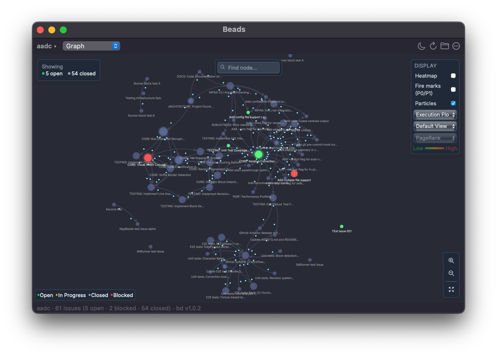 *Graph view in macOS app pointed to github.com/Dicklesworthstone beads_rust repo*

A small Display panel in the upper right of the Graph view controls five things:

- **Heatmap.** When on, every node is colored by its current value of   the selected metric (next bullet), green to red, low to high.
- **Metric.** Five options: PageRank, Betweenness Centrality, Critical   Path, In-Degree. Each picks out a different kind of importance.
- **Arrows.** Two options. Execution Flow (default; arrow points from   prerequisite to dependent, matching how you describe work   temporally: "do A, then B, then C") and Dependency Flow (arrow   points from dependent to prerequisite, matching how build systems   talk: "this depends on that"). Flipping the mode reverses both the   arrowheads and the direction the cyan particles travel in the same   motion. Your choice persists per-user across reloads. Underneath,   the stored data model doesn't change. Every metric computed from   the dependency graph stays semantically identical regardless of   which way the arrows point.
- **View.** Seven options: Default, Force, Compact (a hierarchical   DAG layout, good for narrow projects with deep chains), Spread (more   spacing, good for screenshots), Grid, Radial, and Cluster (groups   nodes by status). Switch between them while watching; the   simulation re-runs each time.
- **Fire marks.** Optional glyphs over high-priority nodes. P0 gets   two flames, P1 gets one. Useful when you're scanning for hot items   and don't want to enable the heatmap.
- **Particles.** Toggle the animated dots flowing along edges. Slight   CPU cost, no effect on the data.

The two metrics most useful in practice:

**PageRank** colors structurally load-bearing issues red. The ones the project funnels through (the database schema migration; the API contract change; the build system overhaul). When you're triaging "what's the highest-leverage thing I could finish this week," PageRank's red set is the short list.

**Betweenness centrality** colors bridge nodes red. A high-betweenness issue connects otherwise-independent regions of the graph. Resolving it unlocks parallel work in streams that would otherwise stay parallel-but-stuck. Different from PageRank: PageRank values depth, betweenness values bridging. They surface different short lists.

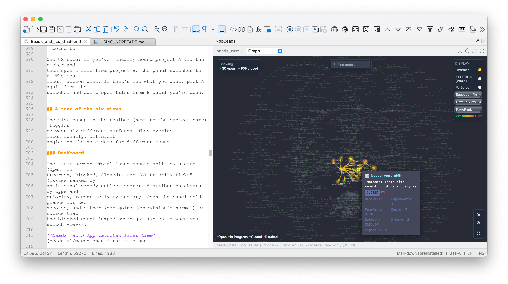 *Graph view in Nextpad++ Beads plugin pointed to github.com/Dicklesworthstone beads_rust repo*

The graph is also where the panel's theme awareness shows up. Switch to light mode (theme button in the toolbar) and the canvas redraws with a white background and a darkened version of every status, priority, and accent color, so contrast remains readable. Same graph, dark or light, within a couple of frames.

### Board

The kanban surface. Four columns by default: Open, In Progress, Blocked, Closed. Each card is an issue. Drag a card to a new column, that column's status is committed via `bd update --status`. Optimistic UI: the card moves immediately, then either confirms (toast) or rolls back (toast plus original position) depending on what `bd` reports. 

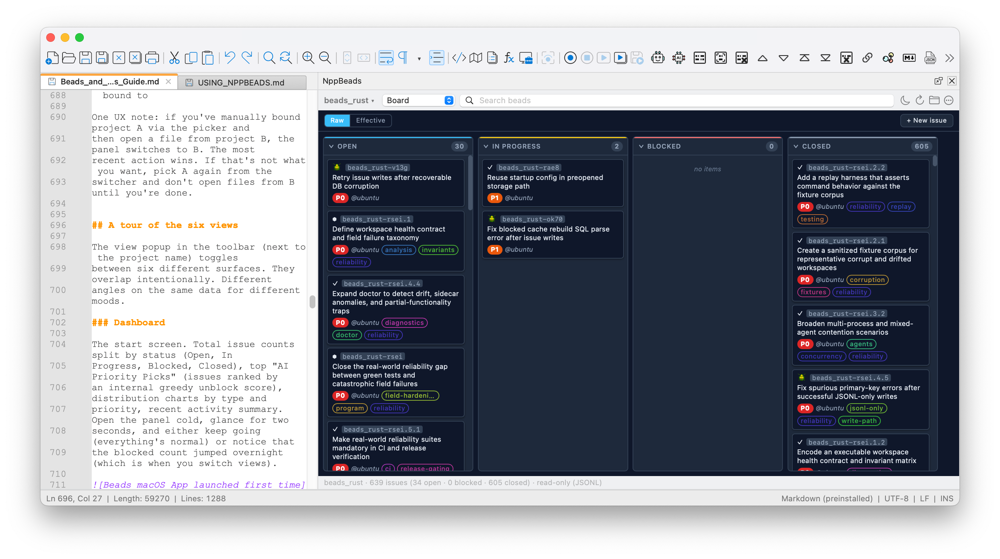 *The Board view in Nextpad++ Beads plugin pointed to github.com/Dicklesworthstone beads_rust repo*

There's a **Raw / Effective** toggle in the top-left header of the Board. It changes which column each card lives in without touching the underlying data, and it's worth understanding why the distinction exists.

`bd` does not automatically rewrite an issue's stored `status` when one of its blockers opens or closes. That's a design choice. "Status" is the value you last committed ("I wrote this down as in_progress"). The blocked-by-the-graph state is something the tracker computes on the fly from the dependency edges. Two different facts about the same issue, both useful.

- **Raw** groups by the stored `status` field exactly as `bd` wrote   it. A card is in the Blocked column only if you (or an agent, or a   teammate) explicitly called `bd update --status blocked` on it. The   manual-data view: what does the database actually say.
- **Effective** adds one rule on top: any open or in-progress card   with at least one non-closed blocker dependency gets promoted into   the Blocked column, regardless of what its stored status says. The   view that matches what `bd ready` returns. What you mean when you   ask out loud "what's blocked right now."

Most of the time, leave Effective on, because that's the question you're usually asking. Switch to Raw when you're auditing the data itself. A card that sits in Open under Raw and Blocked under Effective is one whose dependency graph is ahead of its manual status. Usually the manual status is what needs updating.

The "+ New issue" button in the top-right opens a modal where you can fire off a new issue without leaving the panel. Title, type, priority, labels, description (Markdown), plus two chip-input fields for declaring blocked-by and blocks relationships at creation time. Each chip can be tagged with one of the ten Beads dependency types.

### Activity

Reverse-chronological feed. Issues sorted by their `updated_at` timestamp, descending. Each row shows the id, title, status pill, priority pill, assignee, last-updated time. Hover any row and it expands inline with a preview block: description excerpt (first six hundred characters of the Markdown source, with a fade mask if truncated), type, labels, blocked-by count, blocks count, source repo if any.

The view is read-only on click on purpose. Nothing in a row navigates you to the detail modal except the "Open ↗" button on the right side, which only appears when you hover. This is so you can scan the feed without your finger landing somewhere that pulls you into an editing flow you didn't ask for.

Activity also drives the "● N new" indicator in the status bar. Every time you visit Activity, the panel records the current timestamp. Later updates that happen after that timestamp (your own edits, agents, teammates) get counted in the badge. Visiting Activity again resets the counter. Quitting and reopening NPP preserves the count correctly across sessions.

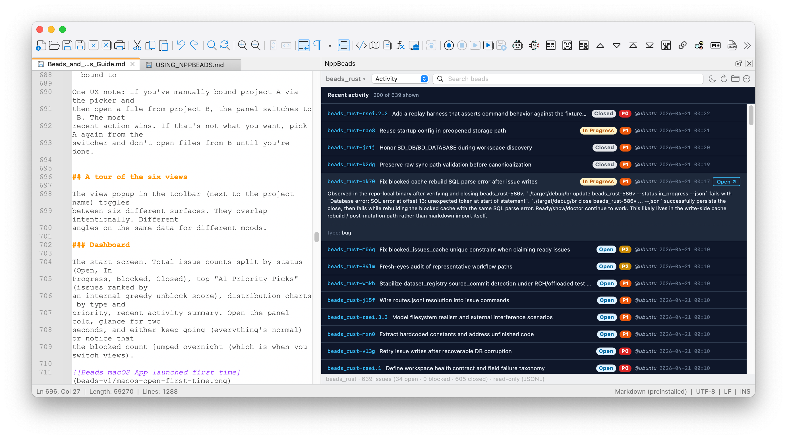
*The Activity view in Nextpad++ Beads plugin pointed to github.com/Dicklesworthstone beads_rust repo*

## Creating and editing beads

The detail modal is the workhorse. You get to it three ways:

1. Click any card on the Board View.
2. Click the "Open ↗" button on any Activity row.
3. Use Cmd-Option-Shift-J on a `bd-XXX` reference in your code (more
   on that further down).

What you see is a single dialog with every field of the issue, all editable in place: title, status (dropdown), priority (P0..P4), type (bug / feature / task / epic / chore / decision), assignee, labels (comma separated), description (Markdown textarea), dependencies, comments, plus five action buttons at the bottom (Reopen or Close depending on current state, Claim, Delete, Cancel, Save).

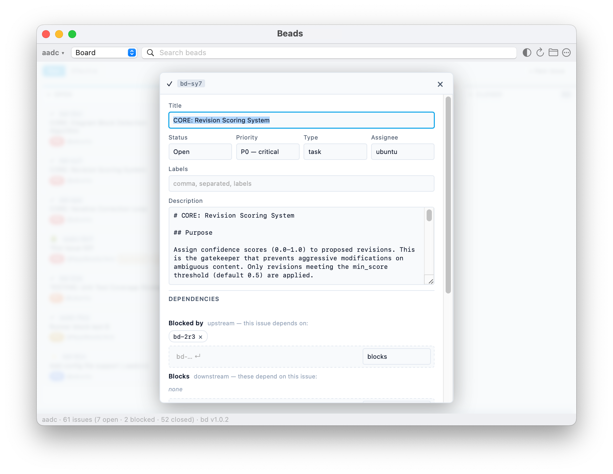 *Editing a bead/issue in the Board View pointed to github.com/Dicklesworthstone beads_rust repo*


**Save** is diff-aware. It computes the difference between the form values and the original loaded values, and only sends what changed. If you only touched the priority, only `--priority N` goes in the `bd update` call. If you cleared an assignee, the call uses `--unassign` rather than `--assignee ""` (which `bd` would treat as "no change"). If nothing changed, Save says "no changes" and doesn't fire any call.

**Close** does what you'd expect, and also checks for the classic "blocked by open issues" error case. If `bd` refuses to close because there are open blockers, the UI surfaces a confirm dialog listing the blocker ids and offers a "force close" path that retries with `--force`.

**Reopen** is what the Close button becomes when the issue is already closed. Single click.

**Claim** maps to `bd update --claim`. The atomic primitive that sets `assignee` to the caller and `status` to `in_progress` in one transaction. Refuses (with `BdErrorKindAlreadyClaimed`) if someone else already claimed it. Use this when you're about to start working on something and want to flag it before another agent grabs the same item.

**Delete** is destructive and the dialog knows it. The confirm lists every issue that currently depends on the one you're about to delete (capped at the first eight, with "and more" if there are more). The deletion runs `bd delete --force`, and `bd` cleans up the dangling dependency rows server-side. The dependent issues stay; they just lose their reference to the deleted one.

### The dependency editor

Halfway down the modal is the Dependencies section. Two rows: "Blocked by" (this issue depends on...) and "Blocks" (...these issues depend on this one). Each row shows existing dependencies as chips with an `×` button for removal and a small tag showing the dependency type if it isn't the default `blocks`.

Below each existing chip list is an add-row: a chip input and a type dropdown. Type a bead id (autocomplete suggests known ids as you type), pick a type if you don't want the default, hit Enter or comma or Tab to add. The bridge call to `bd dep add` fires immediately. The chip appears as soon as `bd` confirms.

Removing a chip works the same way. Click the `×`, the bridge fires `bd dep remove`, the chip disappears.

There's no separate Save for dependencies. Each edit is an independent commit at the `bd` level, transactional on the database side without needing to be batched in the UI.

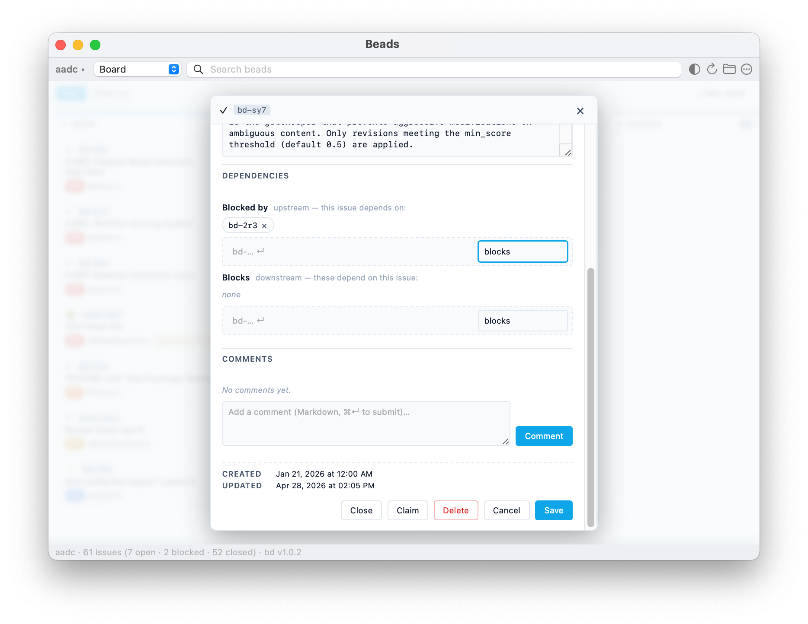 *Editing a bead/issue dependency in the Board View pointed to github.com/Dicklesworthstone beads_rust repo*

### Comments

Below the dependency editor is the Comments section. Existing comments render as Markdown (via `marked` plus DOMPurify sanitization, both vendored offline). Author and timestamp at the top of each comment, the rendered body below. Code fences get monospace styling, links are clickable, bold and italic work, you can paste a small image data-URL and it renders.

Add a comment via the textarea below the thread. Cmd-Enter posts. Empty body is rejected client side (the bridge handler also rejects, defensively). On post, the thread reloads from `bd show` and the new comment appears at the bottom.

A note on field names: Beads's comment schema isn't perfectly stable across versions. NppBeads reads the body, author, and timestamp using a fallback chain (`body || text || content`, `author || created_by || user || actor`, `created_at || timestamp`) so it tolerates whatever the current `bd` version returns.


## Working alongside agents

A few patterns that work well when you're running agents that use the same Beads project you're browsing through NppBeads.

**Let the agent claim before working.** Have the agent run `bd update <id> --claim --json` as the first step on any issue. That sets the assignee to the agent's actor name (configured via the `BEADS_ACTOR` env var or `--actor` flag) and status to `in_progress` atomically. If you happen to grab the same issue from NppBeads at the same moment, one of the two will lose the race cleanly, and you'll see the conflict instead of fighting over a half-edited card.

**Use `bd ready --json` for what's-next.** This filter respects all ten dependency types and only returns genuinely unblocked work. An agent that picks the first item from `bd list --all --json` will pick blocked work and waste cycles. `bd ready` gives you the actually-ready set. Same logic when you're triaging from NppBeads. The Activity view's sort shows recent work; the Insights view's "Top Picks" is the ready-set ranked.

**Have the agent post comments at meaningful boundaries.** "Started", "ran tests, here are the failures", "fixed, committed in abc123", "discovered this also breaks bd-c2, filing follow-up." These show up in the comments thread of each issue, rendered as Markdown with timestamps, attributed to the agent's actor. Reviewing the agent's work after the fact becomes "scroll through Activity" instead of "read a slack log in a tab."

**Use `discovered-from` for follow-ups.** When the agent finds a bug while working on an unrelated issue, have it file a new issue with a `discovered-from` dependency back to the original. NppBeads renders the relationship in both issues' Dependencies sections with the right type tag, so when you're reviewing later you can trace why each issue was filed.

**Run the agent's bd calls in a directory inside the repo.** `bd` finds the project the same way NppBeads does (walks up looking for `.beads/`), so an agent script doesn't need to be told where the project is. If you're scripting multiple agents on multiple projects, use a per-project working directory and a per-agent `BEADS_ACTOR` env var so each agent's writes attribute correctly.


## Multiple repos and contributor workflows

Sometimes one project root isn't enough. A few patterns Beads supports natively:

**Open-source contributor.** You're working on a fork of an upstream repo. You want to track your personal experiments without polluting the upstream issue list when you push a PR. `bd init --contributor` configures auto-routing. Your issues land in `~/.beads-planning` instead of the project's `.beads/`, and pushes to upstream don't include them.

**Multi-phase development.** Planning repo, implementation repo, maintenance repo, all linked. `bd config set repos.additional "~/repo1,~/repo2"` aggregates issues across them in `bd list` and `bd ready`. Cross-repo dependencies work natively:

```bash
bd dep add impl-42 plan-10 --type blocks
```

Issues automatically carry a `source_repo` field for provenance. Filter with `bd list --json | jq '.[] | select(.source_repo == ".")'` to see only the current repo's issues. When an agent files a follow-up with a `discovered-from` link, the new issue inherits the parent's `source_repo` automatically.

**Personal experiment workspace.** `BEADS_DIR=~/.beads-planning bd create "My task"` puts an issue in a private workspace without touching the project's `.beads/`. Useful for spike work that may or may not land.


## Live updates and polling

NppBeads and macOS App keeps itself current with two independent mechanisms.

The first is a file watcher on `.beads/issues.jsonl`. Beads maintains this file as a denormalized JSONL export of the issue table, updated on every commit. Any time the file changes on disk (a write you did in NppBeads, a teammate's push, an agent running `bd close` from a script), the watcher fires within 750 ms and the panel re-reads the data.

The second is a two-second poll of `bd list --all --json`. This catches changes that don't go through the JSONL file (certain server-only Dolt operations). The poll hash-diffs the result against the previous tick and only fires a refresh if something actually changed, so it's not pushing empty re-renders all day.

Both mechanisms are coordinated. They both call the same internal "refresh" path, which is idempotent and reconciles optimistic UI state with confirmed state.

The poll pauses when Nextpad++ isn't focused. Switch to a browser, the panel stops polling. Come back, the poll resumes and picks up any changes within one cycle. This matters mostly for the case where an agent is running in a terminal you're not watching: you don't want NPP burning `bd` processes while you're working in another app.

There's also a "drag-guard" on the Board view. If a refresh fires while you're mid-drag of a card, the render is deferred until your drag ends. Without this, the dragged card's DOM node would get replaced by the refresh and the drag would die in your hand. An eight second watchdog releases the guard if the drag-end event somehow doesn't fire (drop outside the window, modifier-key issues).


## Settings

Three knobs.

**Theme.** A small icon next to the search field cycles through Auto, Light, and Dark. Auto follows the macOS system appearance (handy if you have a Shortcuts automation that flips system theme at sunset). The selection persists in NSUserDefaults under `NppBeadsThemePref`. The Graph view's force-graph canvas listens for theme changes and repaints immediately. Everything else uses Tailwind's `dark:` class system and switches on the class flip.

**Zoom.** Cmd-Plus, Cmd-Minus, and Cmd-Zero adjust the WebView's `pageZoom` property. The default is 0.80 (everything about twenty percent smaller than the upstream Tailwind sizing, so the Dashboard and Insights views fit a typical docked-panel width without you having to drag the divider out to seven hundred pixels). Each Cmd-Plus or Cmd-Minus is a ten percent step, clamped to the range 0.50 to 2.00, snapped to a 0.05 grid. Cmd-Zero resets to default. The setting persists under `NppBeadsPanelZoom`.

The keystrokes only fire when the WebView has focus. If your focus is in the NPP editor, Cmd-Plus and Cmd-Minus fall through to NPP's own editor zoom controls. Contextual based on which surface you're interacting with.

**Auto-push.** The one with subtlety. By default, every `bd` call NppBeads makes includes the `--sandbox` flag, which disables Beads's automatic dolt-push step (the part where it pushes the underlying Dolt commit to a configured git remote). With `--sandbox` on, writes return in a fraction of a second. Without it, every write attempts the push, and if your project has a remote configured but no working non-interactive git auth (no SSH agent, no credential helper), every write hangs about twenty-three seconds while Git tries to prompt for credentials the subprocess can't accept.

So the default is sandbox-on and writes are fast and local. The overflow menu (`⋯`) has an item called "Enable bd auto-push for this project" which flips that flag for the currently-bound project. Use it only if you have working non-interactive git auth on the project's `sync.remote`. The opt-in is persisted per-project in NSUserDefaults under `NppBeadsAutoPushProjects`. The first time you flip it on for a project, an alert explains the trade-off so you know what you're getting into.


## Limitations

A few things NppBeads doesn't do, on purpose or out of necessity:

- **No cross-repo aggregated view.** Each `.beads/` is independent. If   you work across two repos with two trackers, you switch projects in   the dropdown to switch trackers. There's no "all my open work   across all projects" view. Beads supports cross-repo dependencies   via `external:other-project:bd-X` references, but NppBeads doesn't   render them as live links; they appear as plain text in the   dependency list.

- **No hover preview on bead-ids.** This is a feature I may implement in the Nextpad++ editor.


- **Per-issue comments don't auto-refresh while the modal is open.**   The Board and Activity views auto-refresh on `bd` activity. The   detail modal's comments thread does not. If a teammate posts a   comment while your modal is open, you won't see it until you close   and reopen the modal. Deliberate scope decision (the alternative is   more bridge plumbing for a case that doesn't come up often) but a   real limitation.

- **Beads itself is currently v0.9. Don't bet a   mission-critical production system on it yet. For agent workflows,   internal team projects, personal productivity, and agent-first   tools, it's where you want to be.

- **No built-in role/permission system.** Filesystem permissions and   Dolt server's SQL auth are the access model. Fine for agent fleets, not enough for org with department-level access controls."


## Audit, attribution, rollback

Because Beads is in Dolt and Dolt is in the repo, every action an agent takes is also a git commit you can review. `git log .beads/` is a chronological tour of what the agent did. `git blame` on a status change tells you which agent changed it and when. Reverting a bad afternoon of agent activity is the same operation as reverting bad code: identify the commits, `git revert`, and the tracker rolls back with the code. Few SaaS trackers offer anything close.

For audit, every `bd` write attributes itself to an actor (set via the `BEADS_ACTOR` env var, the `--actor` flag, or git's `user.name`). Every write becomes a Dolt commit in the workspace's history. Federation pushes that commit history across peers, so the trail is global, not local. `git blame` and `git log` on `.beads/` answer "who did what when" at the same fidelity they answer the same question about source code.

Beads also has a compaction operation for archival:

```bash
bd admin compact --dry-run --all   # preview
bd admin compact --days 90         # remove issues closed 90+ days ago
cd .beads/dolt && dolt gc          # garbage collection
```

Useful when a long-lived project's tracker grows past what you want to
ship in every clone.


## Where to start

If you've gotten this far and want to try it, the steps are short.

1. Install the CLI:
   ```bash
   brew install beads
   bd version
   ```

2. Initialize a project:
   ```bash
   cd ~/your/project
   bd init
   ```

3. File your first issue:
   ```bash
   bd create "First issue" -t task -p 2
   bd list
   bd ready
   ```

4. Install NppBeads.

5. Open a file from your project, hit Cmd-Option-Shift-B, the panel
   auto-binds to the project.

For agents:

- `bd setup claude` if you're using Claude Code or the Agent SDK.
- Otherwise point your agent's harness at the `bd` binary and tell it   to use `bd ready --json` for what to work on, `bd update <id>   --claim` to claim work, and `bd comment add` for progress notes.

For teams:

- Single machine, two or three humans plus agents: `bd init` and   you're done.
- Many agents on one machine: `bd init --server` for parallel write   safety.
- Multiple machines or offices: `bd federation add-peer` for each   peer, schedule `bd federation sync` on a cron timer.
- Bridging to Jira / GitHub / Linear / GitLab / Azure DevOps / Notion:   `bd <tracker> sync` with the appropriate `bd config set` keys.

The repo for NppBeads is at [nextpad-plus-plus/NppBeads](https://github.com/nextpad-plus-plus/NppBeads). The Beads source is at [gastownhall/beads](https://github.com/gastownhall/beads). Both have docs folders that double as feature documentation. 

## Final thoughts


Beads changes one assumption every other issue tracker takes for granted: that the writer is human. Once you let go of that, the design follows. Put the data in the repo so it travels with the code. Make the interface a CLI so anything that can run a subprocess can use it. Make every change a git-style commit so audit and rollback come for free. Let the dependency graph do the scheduling so independent workers (whether human, agent, or both) can coordinate without a controller.

NppBeads Viewer and Beads macOS Viewer app makes that system pleasant to watch and easy to use. But the reason it works isn't the visuals. It's that the underlying model treats issue tracking as something both humans and agents can write to, and built every feature around that assumption. Beads is your next multi-agent Jira but in the age of AI and speed. That's the shift. Everything else follows.

Special Thanks to [Steve Yegge](https://www.linkedin.com/in/steveyegge/) and [Jeffrey Emanuel](https://www.linkedin.com/in/jeffreyemanuel/). More to come.