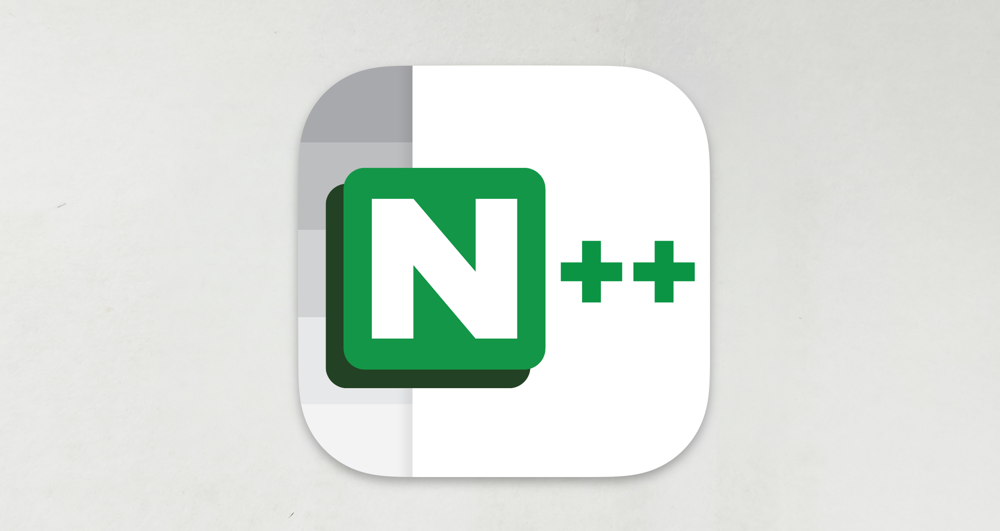

*Jumpy Presenting new App icon*

# New Nextpad++ Application Icon

Starting with version 1.0.7, Nextpad++ is getting a brand new App icon! Don't worry our beloved mascot, Mr. Jumpy, is here to stay. The brilliant design was created by Gianpiero Ozzella <a href='https://github.com/gianpox86'>@gianpox86</a>, who did an amazing job bringing him to life.

### New application Icon starting from Nextpad++ version 1.0.7

Changing an icon is always a tough decision. However, with the iOS and iPad ports nearly ready, a change was necessary. The new design scales much nicer at smaller sizes and delivers a massive 10x savings in bundled icon file size.

*New application icon starting from Nextpad++ version 1.0.7*
