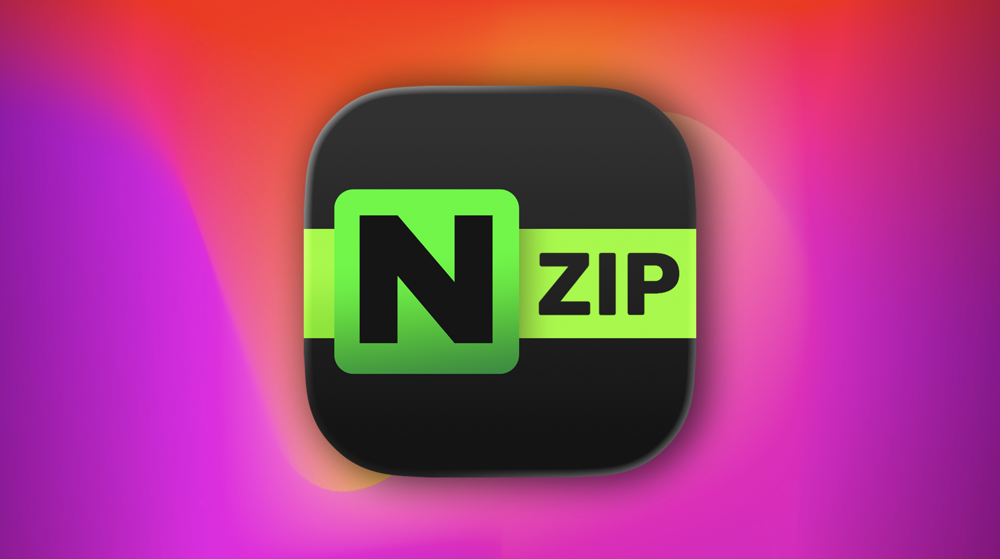
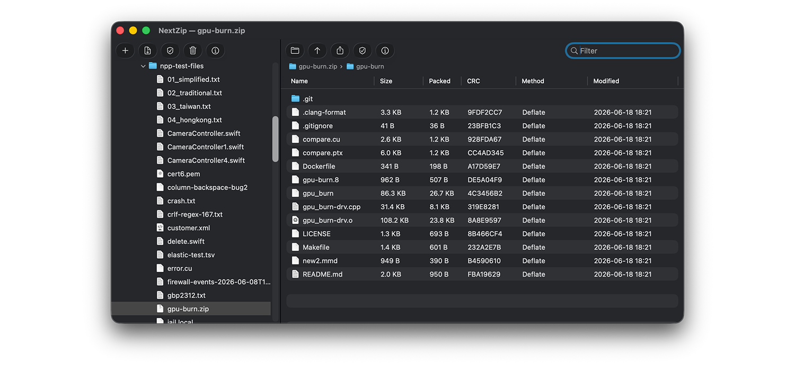
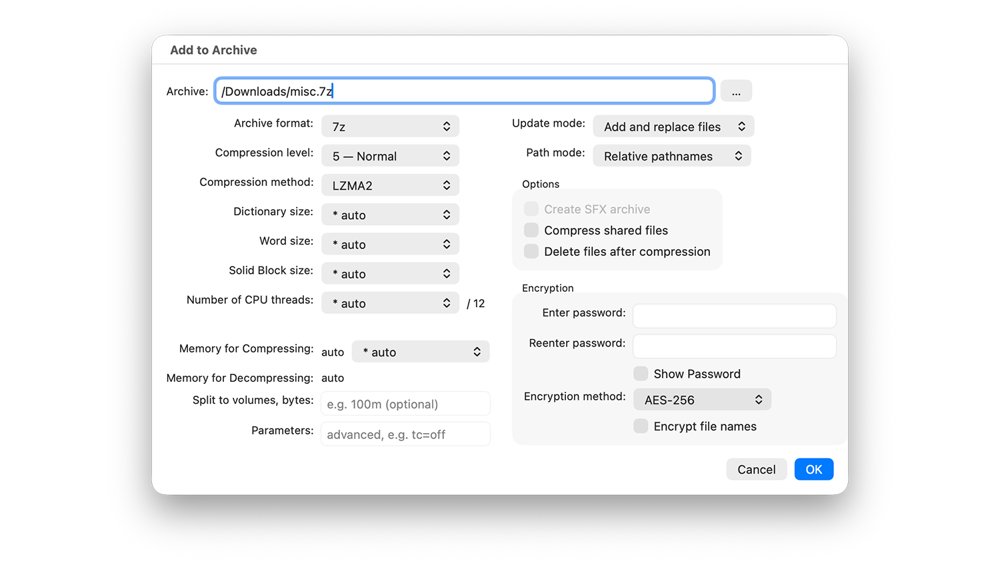
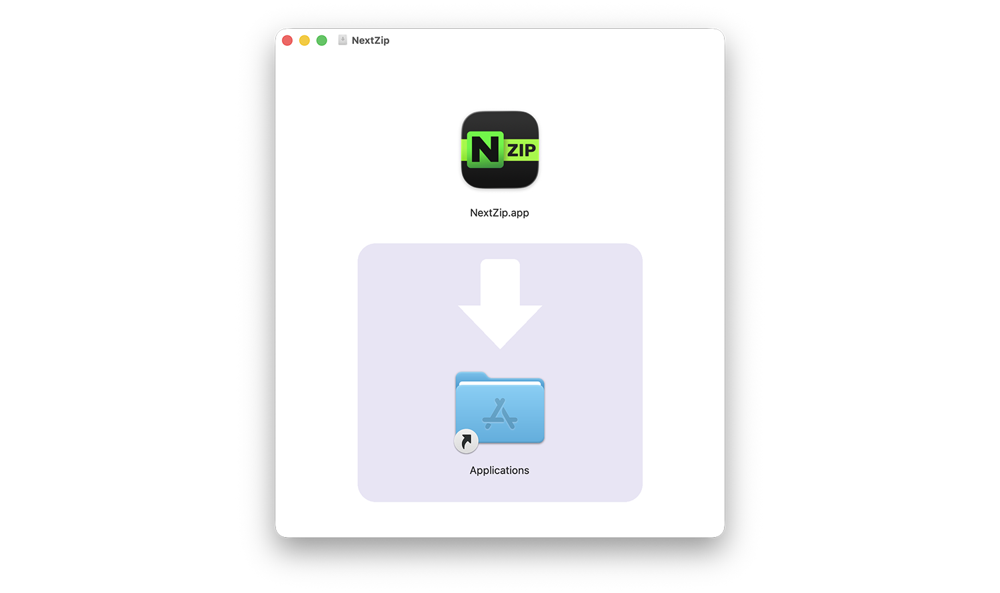
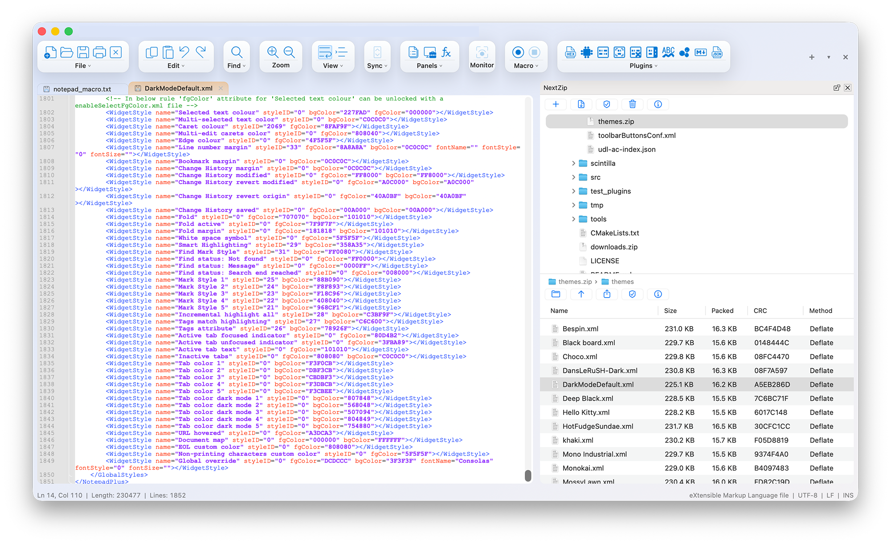
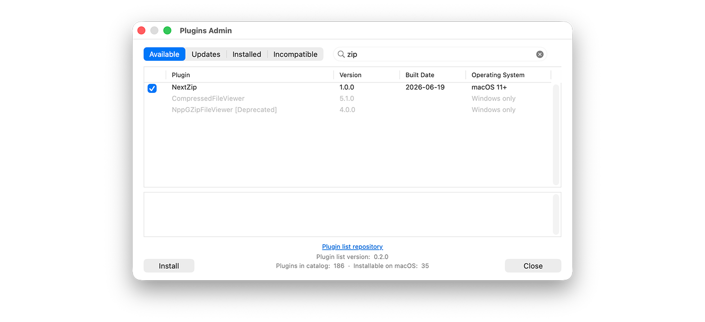

 *NextZip — browse, extract, and create archives on macOS, powered by 7-Zip*

 <download-button href="https://nextpad.org/nextzip/" variant="primary" icon="download">Download NextZip (Universal)</download-button>
 <download-button href="https://github.com/nextpad-plus-plus-plugins/NextZip.macos" variant="secondary" icon="github">View NextZip (Nzip) Source on GitHub</download-button>

# NextZip v1.0.0 — Release Notes

**NextZip** is a light-weight 7-Zip-powered archive manager for macOS. It started life as a dockable panel inside Nextpad++ and has grown into a full archive tool that ships **two ways from the same codebase**: a **Nextpad++ plugin** and a **standalone, notarized macOS app with only 3.5MB download**. Both share the same in-process 7-Zip engine, so they open and create exactly the same formats.

I built NextZip because macOS doesn't really have a good archive utility. The built-in Archive Utility is all-or-nothing: double-click a `.zip` and it extracts the *entire* thing, with no way to peek inside first or pull out just one file. NextZip fixes that — you browse an archive like a folder, preview it, and extract only what you actually want, with a UI that will feel familiar to anyone who has used 7-Zip on Windows.

---

# The standalone app

The standalone **NextZip.app** is a Finder-style, two-pane archive browser: your disk on the left, the open archive on the right, each pane with its own toolbar.

 *The standalone app — filesystem on the left, archive contents on the right*

- **Drag & drop, both ways** — drop an archive onto the window to open it (and the left pane jumps to the folder it came from); drag files or folders *out* of an archive into any Finder folder to extract just those, on the fly; or drop files and folders *onto* an open archive to add them to it.
- **Open and edit in place** — double-click a file inside an archive and it opens in your default macOS app for that file type.
- **Live filter** — a search box in the archive pane narrows the current folder by name as you type.
- **Tahoe Liquid Glass toolbar** — on macOS 26 the toolbar icons render as translucent glass capsules; older macOS gets the classic buttons. Same buttons, native feel.
- **Finder right-click Services** — select files in Finder and use **Services → "N-zip Add to archive"** or **"N-zip Compress and email"** (the latter compresses your selection and opens a new message in your default mail app with the archive already attached).
- **Right-click on any folder in NextZip** — You can also right-click on any folder or file in Nzip app and select Add to archive.

 *Add to archive window*

- **Open With** — double-click an archive in Finder and choose NextZip (N-Zip); the app registers itself for all the formats below.

Installation is simple: double-click on the DMG install file and drag the Nzip App into the Applications folder. The installable file is code-signed with an Apple Developer ID certificate and notarized by Apple.

 *NextZip (Nzip) Install*

---

# The Nextpad++ plugin

Inside Nextpad++, NextZip (Nzip) is a dockable two-pane panel that keeps you in the editor while you work with archives. 

 *The NextZip panel docked inside Nextpad++*

- **Edit straight out of an archive** — open a file from inside an archive in the editor, make your changes, and on **Save** it's written straight back into the archive — including through nested layers like `.tar.gz`.
- **Full "Add to Archive" dialog** — the Windows-faithful create dialog with format, compression level, method, dictionary and word size, solid mode, threads, and encryption.
- **Extract your way** — full or flattened paths, overwrite / skip / auto-rename, and eliminate-root options, with a password prompt for encrypted archives.
- **Test & checksum** — verify an archive's integrity, and compute CRC32 / MD5 / SHA-1 / SHA-256 / SHA-384 / SHA-512 from the right-click menu.

Plugin installation is simple: Open Nextpad++ Plugins Admin, filter for 'zip', select NextZip and click install. The install is instant at 1MB file download. Make sure to restart the Nextpad++. 

 *NextZip (Nzip) Plugin Install*

---

# Supported formats

NextZip uses the same 7-Zip engine for both editions, so the format support is identical everywhere.

**Create — make new archives in:** **7z, ZIP, TAR, GZIP (.gz), BZIP2 (.bz2), XZ, and WIM**, with optional **AES-256** encryption for 7z and ZIP. As on Windows, RAR is extraction-only — NextZip reads RAR/RAR5 but, per the unRAR license, cannot create them.

**Open & extract — read and pull files out of:**

- **Everyday archives** — 7z, ZIP, RAR / RAR5, TAR (including `tar.gz`, `tar.bz2`, `tar.xz`, and `.tgz`), GZIP, BZIP2, XZ, Z (`.taz`), CPIO, ARJ, LZH / LHA, and CAB.
- **Installers & packages** — NSIS installers, RPM, DEB, XAR (`.xar` / `.pkg` / `.xip`), CHM help files, and Microsoft Compound files (`.msi` and legacy `.doc` / `.xls` / `.ppt`).
- **Disk images & filesystems** — ISO, DMG, UDF, WIM / SWM, HFS / HFS+, APFS, EXT (2/3/4), SquashFS, CramFS, VHD, VHDX, VDI, VMDK, and QCOW / QCOW2.

NextZip also transparently descends nested single-stream archives, so opening a `site.tar.gz` drops you straight into the inner `.tar`'s file list — no two-step unwrap.

---

# Compatibility

- **macOS**: 12.0 (Monterey) and later.
- **Architecture**: universal (arm64 + x86_64).
- **Standalone app**: Developer-ID signed, notarized, and stapled — download the DMG, drag to Applications, done.
- **Plugin**: install through **Plugin Admin → Available** in Nextpad++ (requires Nextpad++ 1.0.8 or later).
- **Engine**: bundles the in-process 7-Zip engine. 7-Zip by Igor Pavlov (LGPL + unRAR restriction); NextZip itself is GPL.

---

*NextZip is part of the Nextpad++ family of native macOS tools — built fresh in Objective-C++ on top of the 7-Zip engine, with a Finder-style interface that brings 7-Zip's "browse, preview, extract only what you need" workflow to the Mac.*
