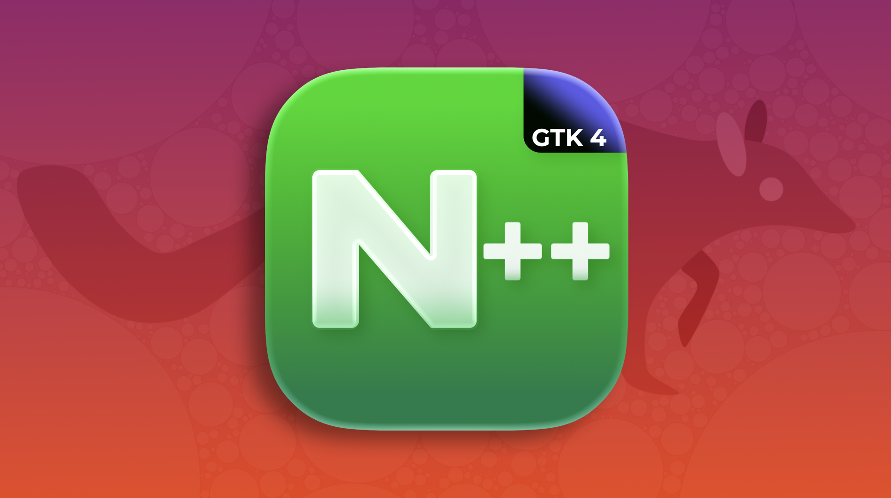 *Nextpad++ v1.1.0 for Linux*

<div style="text-align: center">
 <download-button href="https://nextpad.org/download/linux.html" variant="primary" icon="download">Download Nextpad++ for Linux</download-button>
</div>

# Nextpad++ for Linux it's Here

You asked for it in macOS release thread, and the answer was always "soon". Today, *soon* ships. **Nextpad++ v1.1.0 for Linux** is the full native port of Notepad++ for the Linux desktop. It's not an Electron wrapper, not a Wine bottle, not Flatpak, not GNUstep not a half-finished clone. A real GTK4 application built on the same Scintilla/Lexilla engine as Notepad++ itself, carrying the **same version number as the macOS edition because it carries the same features**: the two ports were developed against each other line by line, dialog by dialog, until the parity audit ran out of things to list. (Note Nextpad++ is a full port of Notepad++ for Windows)


**The launch pitch, in numbers:**

- **5 MB download. ~32 MB on disk. Starts in about a second.** Your whole editor is smaller than one node_modules folder.
- **99 languages** syntax-highlighted, **137 interface languages**, **22 color themes** — byte-identical resources with the macOS and Windows editions.
- **26 native Linux plugins at launch**, one click away in the built-in Plugins Admin.
- **Git, spell check, Markdown preview and change history built in** — things even Windows Notepad++ doesn't have.
- **.deb and .rpm for x86_64 and arm64**, plus a Snap in the Ubuntu App Center. Yes, arm64 — Nextpad++ flies on a Raspberry Pi 5 and on ARM laptops.

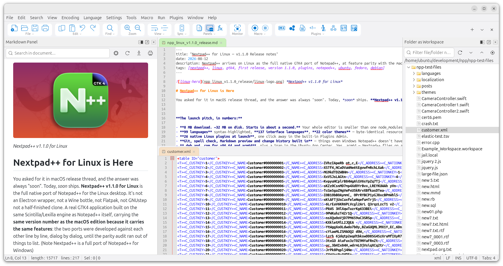 *Nextpad++ v1.1.0 on Ubuntu 24.04 — light theme*

---

# What you get

Everything you know from Notepad++ and the macOS Nextpad++ releases, natively on Linux:

## The editor

The Scintilla GTK4 engine with the complete Notepad++ feature set: multi-caret and column editing, macros you can record/save/replay (and run over whole folders), code folding, bookmarks, Hide Lines, bracket matching, auto-completion with parameter hints for 33 languages, clickable links, word/character statistics, large-file mode, EOL/encoding conversion across 45 character sets, session snapshots and periodic backups, and print support. Line operations, blank-line surgery, case conversion, Base64/URL/hash (MD5/SHA-1/SHA-256/SHA-512) tools — all present.

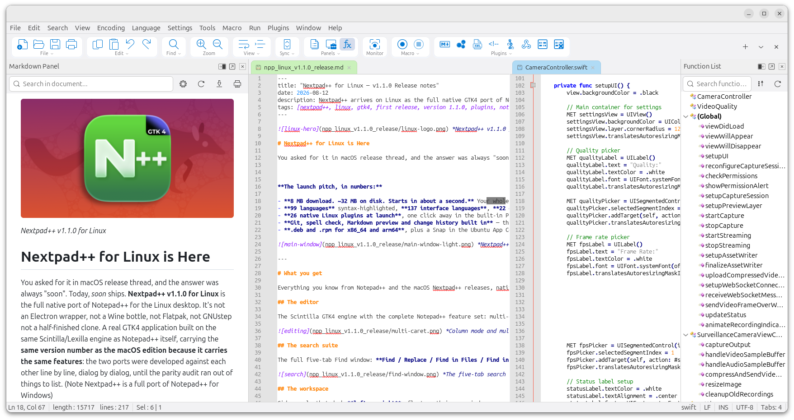 *Multi-panel View*

## The search suite

The full five-tab Find window: **Find / Replace / Find in Files / Find in Projects / Mark**, with regular expressions, the typo-tolerant **Fuzzy search** mode from macOS 1.0.9, incremental search bar (Ctrl+I), volatile find, match highlighting, and the collapsible Search Results panel with per-search grouping. Replace in Files reports real replacement counts and tells you when a file couldn't be written.

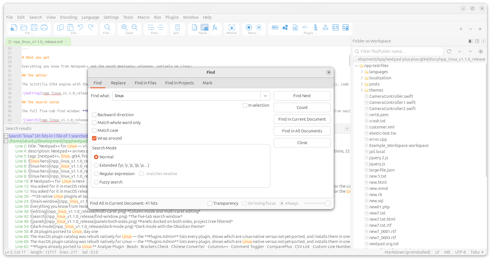 *The five-tab search window*

## The workspace

Side panels that dock **left or right**, float as their own windows, remember their width, position, zoom and open state across restarts: Document List, Function List, Document Map, Folder as Workspace (multi-root, filterable), Project panels, Character panel, Clipboard history — plus every plugin panel. Split view (vertical or horizontal) with synchronized scrolling. The tab bar does colors, pinning, multi-line wrap, zoom-follow and drag reordering.


## Looks

Light and dark mode (independent of the system, or following it), the **22 Notepad++ themes** you already know — Obsidian, Solarized, DansLeRuSH, Zenburn and friends — a Style Configurator for per-language styling, User Defined Languages with a live admin, and the optional **Tahoe-inspired look** for people who enjoyed the macOS 1.0.8 redesign. Post-It and Distraction Free modes included.

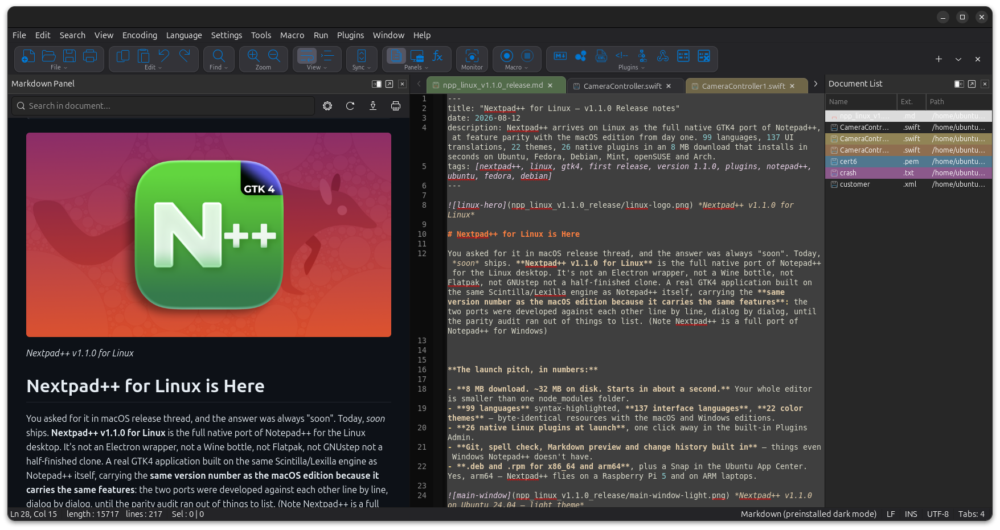 *Dark mode Tahoe look*

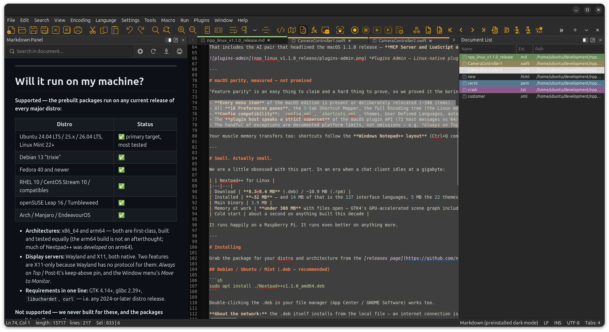 *Dark mode Classic*

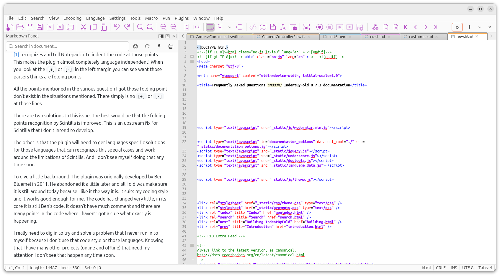 *Light mode Classic*

---

# 26 plugins ported to Linux, day one

The macOS plugin catalog was rebuilt natively for Linux — the **Plugins Admin** lists every plugin, shows which are Linux-native versus not-yet-ported, and installs them in one click (per-architecture builds for x86_64 and arm64, checksum-verified):

**Plugins already ported to Linux:** Analyse Plugin · Beads · Brackets Check · Chinese Converter · Columns++ · Comment Toggler · ComparePlus · CSV Lint · Custom Line Numbers · DSpellCheck · Elastic Tabstops · Folding Line Hider · JSON Viewer · **LuaScript** (script the whole editor from an interactive Lua console) · **MCP Server** (connect Claude, Cursor or any MCP-speaking AI assistant to your open tabs — local-only, token-guarded, read-only until you say otherwise) · Markdown Panel · NextZip (7-Zip archives as a panel) · NppDoxy · NppFTP · Poor Man's T-SQL Formatter · Pork to Sausage · SecurePad · URL Encode/Decode · XML Navigator · XML Tools · Zap Gremlins.

That includes the AI pair that headlined the macOS 1.1.0 release — **MCP Server and LuaScript are on Linux from day one.**

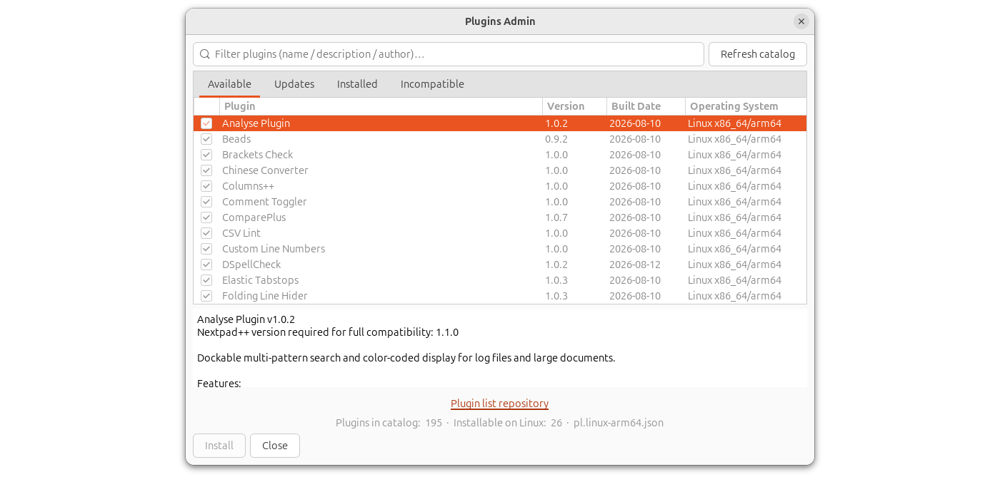 *Plugins Admin — Linux-native plugins sort to the top*

---

# macOS parity, measured — not promised

"Feature parity" is an easy thing to claim and a hard thing to prove, so we proved it the boring way: a standing audit document that diffs the two codebases menu-by-menu, dialog-by-dialog, message-by-message. As of this release:

- **Every menu item** of the macOS edition is present or deliberately relocated (~340 items).
- All **16 Preferences panes**, the 5-tab Shortcut Mapper, the full Encoding tree (the Linux menu actually carries 45 character sets to macOS's 43).
- **Config compatibility**: `config.xml`, `shortcuts.xml`, themes, User Defined Languages, autoCompletion and functionList definitions use the same schema — the "Settings on cloud" feature can point both a Mac and a Linux box at the same synced folder.
- The **plugin host speaks a strict superset** of the macOS plugin API (72 host messages vs 64), so plugin authors port once and gain both platforms.
- The handful of exceptions are documented platform limits, not omissions — e.g. *Always on Top* and window keep-above are things the Wayland protocol simply doesn't allow any app to do.

Your muscle memory transfers too: shortcuts follow the **Windows Notepad++ layout** (Ctrl+Q comments, Ctrl+Shift+S saves all, F3 finds next…), and the new **Window menu** brings the macOS goodies — tab sorting, the Windows… dialog, New Window, and Move to Monitor on multi-head X11 setups.

---

# Small. Actually small.

We are a little obsessed with this part. In an era when a chat client idles at a gigabyte:

| | Nextpad++ for Linux |
|---|---|
| Download | **5.1–5.2 MB** (.deb) / ~7.5 MB (.rpm) |
| Installed | **~32 MB** — and 14 MB of that is the 137 interface languages, 5 MB the 22 themes |
| Main binary | 3.9 MB |
| Memory at work | **under 300 MB** with files open — GTK4's GPU-accelerated scene graph included |
| Cold start | about a second on anything built this decade |

It runs happily on a Raspberry Pi. It runs even better on anything more.

---

# Installing

Grab the package for your distro and architecture from the [Linux Download page](https://nextpad.org/download/linux.html) — files are named like `Nextpad++v1.1.0_amd64.deb`, `Nextpad++v1.1.0_arm64.deb`, `Nextpad++v1.1.0_amd64.rpm`, `Nextpad++v1.1.0_arm64.rpm`.


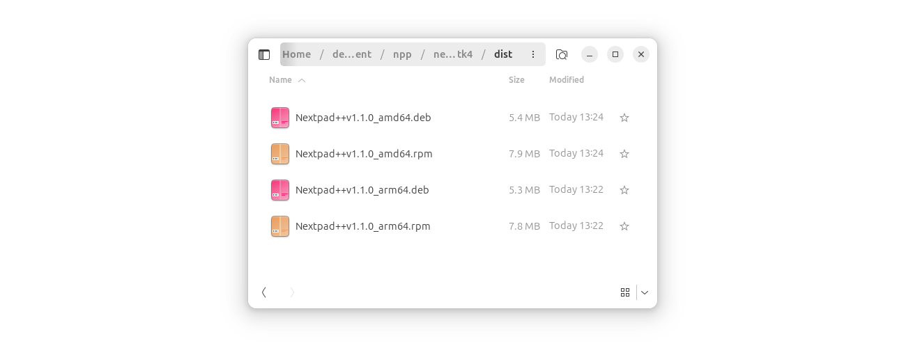 *Nextpad++ packages to match your system*


## Debian / Ubuntu / Mint (.deb — recommended)

```sh
sudo apt install ./Nextpad++v1.1.0_amd64.deb
```

Double-clicking the .deb in your file manager (App Center / GNOME Software) works too.

**About the network:** the .deb itself installs from the local file — an internet connection is only needed if `apt` has to fetch missing **dependencies**. On a stock Ubuntu 24.04 Desktop nearly everything Nextpad++ needs (`libgtk-4-1`, `libglib2.0`, `libstdc++6`, `curl`) is already on the machine; the packages you may see downloading are usually the *recommends* — `git` (which powers the Source Control panel) and `unzip` (used by the Plugins Admin). So: **have Wi-Fi on for the first install** and everything arrives in one go.

**Fully offline?** `sudo dpkg -i Nextpad++v1.1.0_amd64.deb` installs without touching the network whenever the core dependencies are present (dpkg skips recommends). The app degrades gracefully — without `git` the Source Control panel politely tells you what's missing; everything else works.

## Fedora / RHEL 10 / openSUSE (.rpm)

```sh
sudo dnf install ./Nextpad++v1.1.0_amd64.rpm      # Fedora / RHEL
sudo zypper install ./Nextpad++v1.1.0_amd64.rpm   # openSUSE
```

Same story: local install, network only for missing dependencies.

## Ubuntu App Center / Snap Store

Prefer store-managed installs and automatic updates? Nextpad++ is in the Snap Store as **`nextpad`** — find it in the Ubuntu App Center or:

```sh
sudo snap install nextpad
```

The snap is strictly confined: it reaches your files through the standard snap `home` and `removable-media` permissions, so if a file outside your home folder won't open, grant the permission in App Center → Nextpad → Permissions. When you want the fastest startup and the smallest footprint, the .deb/.rpm is the recommended route; when you want zero-thought auto-updates, the snap is there.

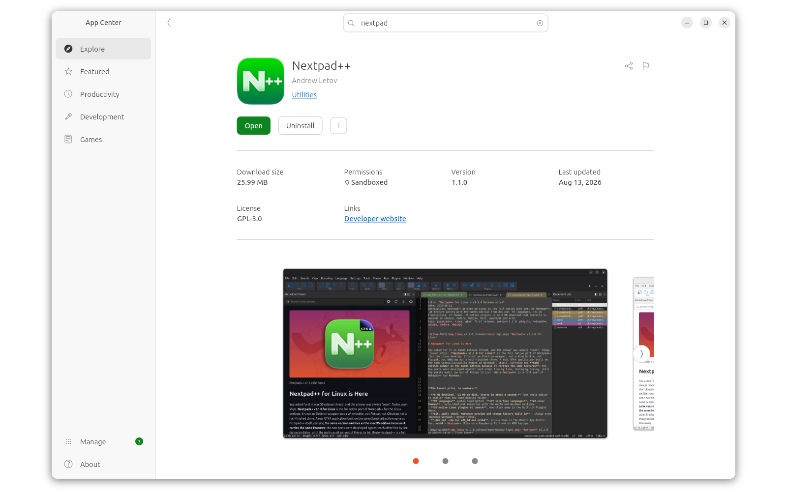 *Nextpad++ in the Ubuntu App Center*

## Staying current

Nextpad++ checks for new releases **once a day** (needs a network connection) and shows the same quiet in-app update card the macOS edition got in 1.1.0 — new version number, download button, no nagging, nothing installed behind your back. You can toggle it in *Preferences → General* or check manually from the Help menu. Snap installs update through the store instead.

---

# Will it run on my machine?

**Supported — the prebuilt packages run on any current release of every major distro:**

| Distro | Status |
|---|---|
| Ubuntu 24.04 LTS / 25.x / 26.04 LTS, Linux Mint 22+ | ✅ primary target, most tested |
| Debian 13 "trixie" | ✅ |
| Fedora 40 and newer | ✅ |
| RHEL 10 / CentOS Stream 10 / compatibles | ✅ |
| openSUSE Leap 16 / Tumbleweed | ✅ |
| Arch / Manjaro / EndeavourOS | ✅ |

- **Architectures:** x86_64 and arm64 — both are first-class, built and tested equally (the arm64 build is not an afterthought; much of Nextpad++ was *developed* on arm64).
- **Display servers:** Wayland and X11, both native. Two features are X11-only because Wayland has no protocol for them: *Always on Top* / Post-It's keep-above pin, and the Window menu's *Move to Monitor*.
- **Requirements in one line:** GTK 4.14+, glibc 2.39+, `libuchardet`, `curl` — i.e. any 2024-or-later distro release.

**Not supported — we never built for these, and the packages won't install or run there:**

- **Ubuntu 22.04, Debian 12, RHEL 9 / AlmaLinux 9, openSUSE Leap 15.x** — their GTK (4.6–4.12) and frozen glibc predate what the packages are built against. These releases are aging out together; if you're on one of them, the source tree does carry compatibility guards down to GTK 4.6 for the adventurous self-builder, but there are no packages and no support.
- **32-bit x86** — never built, never planned (Ubuntu retired i386 desktops back in 2019).
- **GTK3** — Nextpad++ for Linux was born briefly on GTK3 during early development and moved to GTK4 before anything shipped. There is not and will not be a GTK3 build.

---

# Known first-run quirks (and their one-line fixes)

We'd rather tell you now than have you find out:

- **`dpkg -i` complains about dependencies** → use `sudo apt install ./file.deb` instead (or run `sudo apt -f install` after) — apt resolves and fetches what's missing; plain dpkg doesn't.
- **"It's downloading extra packages!"** → those are the recommends (`git`, `unzip`) that power Source Control and plugin installs. One-time, a few MB.
- **The dock icon shows a generic gear until next login** → GNOME caches icons aggressively; log out/in once after the very first install and it's permanent from then on.
- **"Always on Top does nothing"** on Wayland → correct, and true for every app: the Wayland protocol has no keep-above. Run an X11 session if you need the pin.
- **Snap can't open a file in `/opt` or another user's folder** → strict confinement; grant the folder permission in App Center, or use the .deb.
- **Plugins Admin shows an empty catalog** → it fetches the plugin list online; check the connection and hit *Refresh catalog*.
- **Markdown preview panel is blank** → install `libwebkitgtk-6.0-4` (it's a soft dependency so the other 99 % of the app never has to carry WebKit).

If you hit anything else, the issue tracker is open — see below.

---

# Parity with macOS Nextpad++, Windows Notepad++, or both

- Settings live in `~/.config` / `~/.local/share/nextpad++` following the XDG spec, but the **file formats are the Notepad++ formats** — copy your `shortcuts.xml`, your themes, your User Defined Languages from Windows or macOS and they load.
- Turn on **Settings on cloud** (*Preferences → Cloud & Link*) and point it at a synced folder to share one configuration between your Mac and your Linux box.
- Keyboard defaults follow **Windows Notepad++**. The Shortcut Mapper (5 tabs, including Scintilla commands) is there when you disagree.

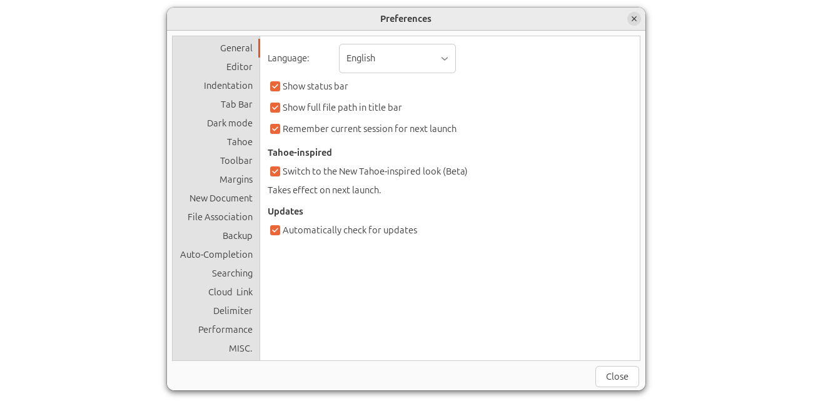 *Nextpad++ Preferences*

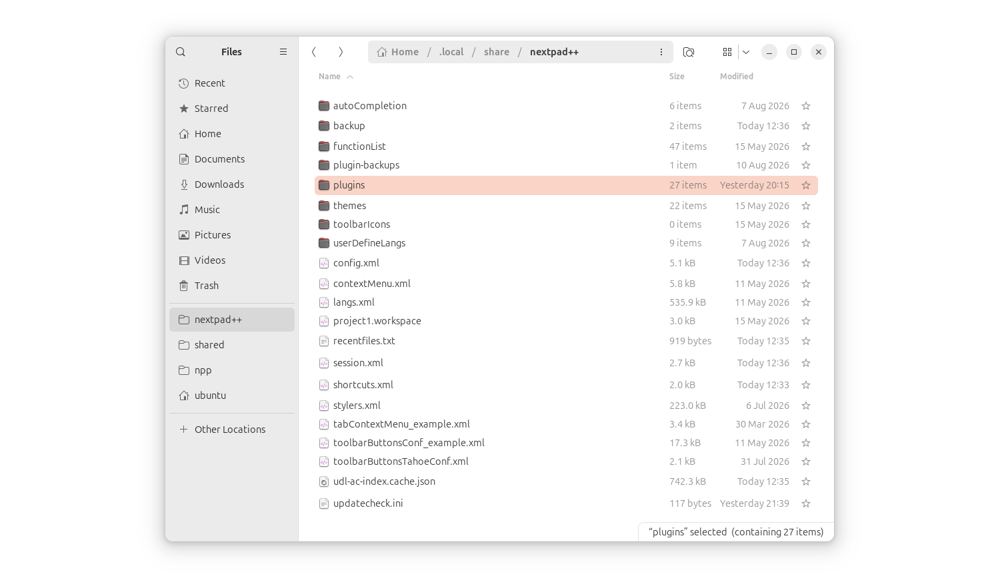 *Nextpad++ home directory*

---

# What's next

Nextpad++ Mac and Linux versions will go hand-in-hand to keep parity. More plugins to come to Linux. The roadmap published with macOS 1.1.0 — the **Onyx** knowledge-base plugin and the **Tiny** workflow-automation server — is being built cross-platform from the start. The days of "coming to Linux soon" ended today: from v1.1.0 on, macOS and Linux ship together, same versions, same features, same plugins.

---

# Thank you

Unlike macOS there are many flavors of Linux and I bet we will see some paper-cut issues, which I will iron out with time. But Linux port of Notepad++ is here, it happened. Thank you for downloading and using it. Log your issues here: https://github.com/nextpad-plus-plus/nextpad-plus-plus-linux/issues

---

# Compatibility

- **Distro floor:** GTK 4.14 / glibc 2.39 (Ubuntu 24.04-era) — see the support table above
- **Architectures:** x86_64 (amd64) and arm64 (aarch64), .deb and .rpm for each, plus the `nextpad` snap
- **Display servers:** Wayland and X11 (two documented X11-only features)
- **Plugin API:** superset of the macOS 1.1.0 plugin host — macOS plugin ports run against it unchanged; 26 native plugins in the catalog at launch
- **Settings:** Notepad++-compatible `config.xml` / `shortcuts.xml` / themes / UDLs under `~/.local/share/nextpad++`, shareable with macOS via Settings on cloud

---

*Nextpad++ is the full native port of Notepad++ — on Linux, built in C on GTK4 on top of Scintilla and Lexilla, with everything the desktop deserves: real menus, real dialogs, dark mode, 137 UI languages, Git, spell check, and a 5 MB download. Free and open, GPL-3, like the original.*
