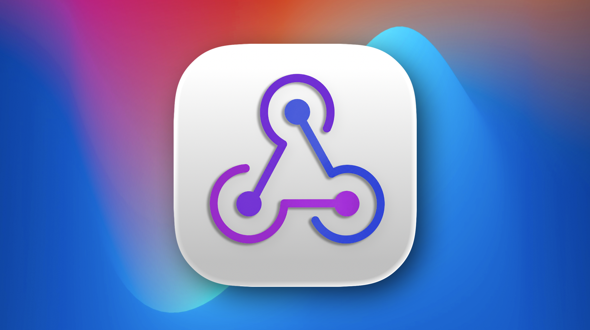
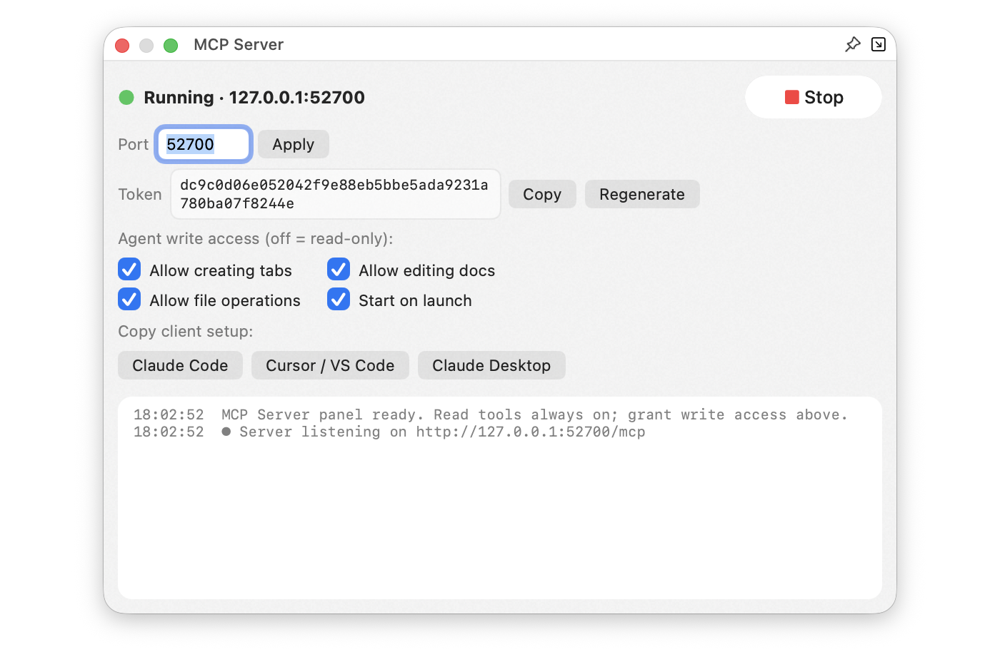

 *Your editor, visible to your AI — on your terms*

# MCP Server v1.1.0 — A Complete Guide

AI assistants are great at reasoning about code and text but normally they **can't see the document you're actually looking at**. You end up copy-pasting into a chat window, or pointing the assistant at a file on disk that doesn't include the change you just typed.

The **MCP Server** plugin fixes that. It teaches Nextpad++ the **Model Context Protocol (MCP)** — an open standard that lets any assistant talk to any app) that **Claude Code, Claude Desktop, Cursor, VS Code agents, and Windsurf** already speak. Turn it on, connect your assistant once, and it can look at your open tabs — *live, unsaved edits included* — answer questions about them, and, with your permission, edit them for you.

This guide takes you from "off" to "using it well": how to connect each assistant, exactly what Nextpad++ shows your AI, **every prompt you can ask**.

Requires **Nextpad++ v1.1.0**. Installs in one click from **Plugin Admin → Available**.

---

# Safety and privacy first

Turning this on is designed to risk nothing. Here's the whole security model in plain terms:

- **Local-only.** The server listens on `127.0.0.1` — your Mac, and only your Mac. It is **never reachable from the network or the internet**, and web pages are blocked from probing it (browser requests from a non-local origin are rejected — a defense against malicious sites).
- **Nothing is sent to any cloud by this plugin.** Your AI assistant runs where it already runs; the plugin simply lets *that* assistant talk to *your* editor on *your* machine. The plugin itself phones home to no one.
- **A personal token.** Every request must present your secret Bearer token (generated per install, stored with owner-only file permissions, compared in constant time). No token, no answer.
- **Read-only until you say otherwise.** Out of the box, an assistant can only *look*. Writing is unlocked by three separate permission switches, each off by default — and a tool you haven't allowed isn't just refused, it's **invisible** to the assistant.
- **No code execution, ever.** There is deliberately **no "run a command" tool**, no shell, no terminal. The server reads and edits text in your editor — nothing more.
- **Fully visible.** Every request appears live in the panel's activity log, so nothing happens that you can't watch.

---

# Why you'd want this — the advantages

The MCP Server changes your assistant from something you *paste into* to something that *works alongside you in the editor*:

- **No more copy-paste.** Ask about "the tab I'm on" and the assistant reads it directly — including the edits you haven't saved. The days of pasting a function into chat and pasting the answer back are over.
- **It sees the truth, not a stale file.** Assistants normally read files from disk. Your editor almost always has unsaved changes; the MCP Server exposes the **live buffer**, so the assistant reasons about what's really on your screen.
- **It works where you work.** Results land as new tabs or precise in-place edits inside Nextpad++, not in a separate window you then have to reconcile.
- **Edits are reversible and safe.** Multi-line edits arrive as a **single undo** — one ⌘Z reverts the assistant's whole change — and a checksum guard prevents it from editing a document that changed underneath it.
- **It sees your whole workspace.** The assistant can list and search across every open tab — including untitled scratch tabs that exist nowhere on disk — and, with permission, rename or rewrite something in all of them at once.
- **It powers other plugins.** Parakeet's **Agent mode** uses this very server so your own AI writes voice-note summaries into a tab. One bridge, many uses.

---

# Getting started in a minute

 *The MCP Server Plugin*

1. Open **Plugins → MCP Server → Show MCP Server Panel** (or the toolbar button).
2. Press **Start**. The status shows **Running · 127.0.0.1:<port>**.
3. Click one of the **Copy client setup** buttons — **Claude Code**, **Cursor / VS Code**, or **Claude Desktop** — and paste it into that app. The snippet already contains the address and your personal token.

For example, the **Claude Code** snippet is a single terminal command:

```
claude mcp add --transport http nextpad http://127.0.0.1:52700/mcp \
  --header "Authorization: Bearer <your token>"
```

The **Cursor / VS Code** button copies the JSON config block those editors expect. The **Claude Desktop** button copies a config that bridges through the standard `mcp-remote` helper — Claude Desktop can't reach a local HTTP server on its own, so the plugin sets that up for you.

That's it. Your assistant is now connected to Nextpad++.

 *MCP Server Started*

---

# What Nextpad++ actually shows your AI

Before the prompts, it helps to know the **surface** — the specific things the plugin exposes. Ask for something in this list and it works; ask for something outside it and the assistant has nothing to reach for. Nextpad++ exposes:

- **The active document** — its text (live, unsaved edits included), file path (or "untitled"), language, line-ending style, whether it has unsaved changes, its length, and where your **caret** is.
- **Your current selection** — the exact text you have highlighted.
- **The lines around your caret** — for "look at what I'm on."
- **Every open tab** — across both split views, saved files *and* untitled scratch tabs, with the active one flagged.
- **Search results** — matches for a literal or regex query, with line, column, and line text: in the active document, or across **every open tab** at once, grouped per document.

And, when you grant permission, it lets the assistant **change** those same things: edit text, run a find-and-replace across every open tab, create tabs, set a document's language, and open/save/close/reload files.

That's the whole world the assistant can see and touch. Everything below is built from these pieces.

---

# Everything you can ask — the 21 tools, with example prompts

You don't call these tools by name — you just talk to your assistant, and it picks the right one. The names are here so you understand what's possible.

### Reading your work (always available, no permission needed)

| Tool | What it does | Say something like… |
|---|---|---|
| **get_status** | server / host / plugin status: version, port, which permissions are on | *"Is the Nextpad++ connection working?"* |
| **get_active_document** | facts about the current tab: path or untitled, language, unsaved flag, length, caret, selection | *"What file am I in and what language is it?"* |
| **get_text** | the **live** text of a document — whole file or a line range — with a checksum for safe editing | *"Read the document I'm editing."* / *"Show me lines 40–80."* |
| **get_selection** | exactly what you have highlighted | *"Explain what I've selected."* |
| **get_caret_context** | the lines around your cursor | *"What am I looking at right now?"* |
| **list_open_documents** | every open tab in both views, saved and untitled, active one flagged | *"Which files do I have open?"* |
| **find_in_document** | search the **active** document (literal or regex): each match's line, column, and text | *"Find every TODO in this file."* |
| **find_in_documents** | search **every open tab** (both views, untitled included): matches grouped per document | *"Find every TODO across all my open tabs."* |

*Why this matters:* this is the difference between an assistant reasoning about a stale copy on disk and one that sees exactly what's on your screen this second.

### Writing for you — *Editing* (requires the **Allow editing docs** switch)

| Tool | What it does | Say something like… |
|---|---|---|
| **replace_selection** | replace the current selection with new text | *"Rewrite this selected paragraph to be clearer."* |
| **insert_at_caret** | insert text at the cursor | *"Insert a docstring here."* |
| **apply_text_edits** | several precise line-range edits as **one undo step**, with a checksum guard | *"Fix all the JSON syntax errors in this file."* |
| **replace_in_documents** | find-and-replace across **every open tab** — regex groups supported, one undo step per tab, nothing saved until you save; a `dry_run` previews the per-document counts first | *"Rename oldName to newName in all my open tabs."* |
| **set_selection** | select a range, or just move the caret | *"Select the function I'm inside."* |

### Writing for you — *Creating* (requires the **Allow creating tabs** switch)

| Tool | What it does | Say something like… |
|---|---|---|
| **create_document** | open a new tab, optionally pre-filled with text and a language | *"Draft a README in a new tab."* |
| **set_language** | set the active document's syntax language | *"Set this document to Python."* |

### Writing for you — *Files* (requires the **Allow file operations** switch)

| Tool | What it does | Say something like… |
|---|---|---|
| **open_file** | open a file from disk by absolute path (or focus its tab if open) | *"Open /Users/me/project/config.json."* |
| **activate_document** | bring a tab to the front, by id or path | *"Switch to my notes tab."* |
| **save_document** | save a document to disk | *"Save this file."* |
| **save_all** | save every modified **named** document (untitled tabs are skipped, so no surprise Save-As dialogs) | *"Save everything."* |
| **close_document** | close a tab (refuses to discard unsaved changes unless told to) | *"Close this tab."* |
| **reload_document** | reload a file from disk, discarding unsaved edits | *"Reload this file from disk."* |

Two touches make the write tools trustworthy: multi-line edits land as a **single undo** (for `replace_in_documents`, one undo **per tab**), and the **checksum guard** means an edit computed against an old version of a document is safely rejected instead of corrupting your file. One heads-up for the cross-tab tools: while they sweep, each tab is brought forward for a moment — the tab you were on comes back when the sweep finishes.

---

# Permissions — you decide how far it goes

Three independent switches in the panel, **all off by default**:

| Switch | Unlocks |
|---|---|
| *(always on)* | **Reading** — status, documents, selections, caret, search |
| **Allow creating tabs** | `create_document`, `set_language` |
| **Allow editing docs** | `replace_selection`, `insert_at_caret`, `apply_text_edits`, `set_selection`, `replace_in_documents` |
| **Allow file operations** | `open_file`, `activate_document`, `save_document`, `save_all`, `close_document`, `reload_document` |

Grant exactly what you're comfortable with — and no more. A great starting point is to leave everything off and just *read*; turn on **Allow editing docs** when you want the assistant to start making changes you can undo with ⌘Z.

---

# What it can't do (yet) — so you don't waste a prompt

Just as important as what works is what **doesn't**, so you're not left wondering why an assistant "won't" do something. The MCP Server deliberately does **not** expose these — asking for them won't work:

- **No running commands.** There is no terminal, shell, or "execute this" tool, by design. It won't run your tests, your build, or a script.
- **Search covers open tabs only.** `find_in_document` searches the tab you're on and `find_in_documents` searches every open tab — but **not** files on disk and not a whole project folder. For "search my project," use your AI's own file tools, not this plugin. (During an all-tabs search each tab is brought forward for a moment; your original tab comes back when it finishes.)
- **No browsing the file system.** It can `open_file` by an **absolute path** you (or the assistant) already know, but it can't list folders, glob, or explore your disk.
- **No find-and-replace across files on disk.** `replace_in_documents` rewrites every tab you have **open** (undoable per tab with ⌘Z, and nothing is saved until you save) — but there's no project-folder-wide rewrite of files you don't have open.
- **No editor chrome.** It can't run menu commands, change Preferences, drive other plugins, manage Git, toggle themes, or click buttons for you.
- **Text only.** It reads and writes text documents; it doesn't handle images or binary files.

Rule of thumb: **if it's about the text in your open tabs, it can do it; if it's about your machine, your disk at large, or the app's UI, that's your assistant's own tools' job, not this plugin's.**

---

# A few prompts to try first

Once connected (reading is enough for most of these):

- *"Read the tab I'm on and explain what it does."*
- *"Summarize these meeting notes into a to-do list in a new tab."* *(needs Allow creating tabs)*
- *"Find every FIXME in this file and list them."*
- *"Which of my open tabs mentions the deploy script?"*
- *"Find every TODO across all my open tabs and give me one list."*
- *"Rename `oldName` to `newName` in every open tab — dry-run it first."* *(needs Allow editing docs)*
- *"Reformat the selected block as pretty-printed JSON."* *(needs Allow editing docs)*
- *"Fix the syntax errors in this file — I'll ⌘Z if I don't like it."* *(needs Allow editing docs)*
- *"Draft a Python script that does X in a new tab, set to Python."* *(needs Allow creating tabs)*

---

# Parakeet Agent mode — two plugins, one bridge

If you also use the **Parakeet** voice plugin, the MCP Server is what lets *your own* AI assistant summarize or translate your voice notes: Parakeet asks your assistant (through this server) to read the transcript tab and write the result into a new tab. Your subscription does the work — no third party resells anyone's API. Just enable the relevant write permission (**Allow creating tabs**) so the assistant can deliver the result.

---

# The panel's settings

Everything is configurable in the panel and remembered between sessions (saved to `NppMcpServer.ini` in the plugin's config folder):

- **Port** — the local port the server listens on (change it if something else uses the default).
- **Token** — your secret access token; **Copy** it to the clipboard or **Regenerate** a fresh one (which invalidates old client setups — re-copy the snippet after).
- **The three permission switches** — described above.
- **Start on launch** — have the server start automatically when Nextpad++ opens.
- **Activity log** — a live record of every request; your window into exactly what your AI is doing.

---

# Compatibility

- **Requires**: Nextpad++ **v1.1.0** or newer
- **macOS**: 12.0+ (Intel and Apple Silicon, universal binary)
- **Works with**: any MCP client — Claude Code, Cursor, VS Code (Continue / Cline), Windsurf, Claude Desktop, and more
- **Install**: Plugin Admin → Available → MCP Server

---

*The MCP Server is part of the macOS-native Nextpad++ plugin family. Pair it with **Parakeet** to give your voice notes an AI that writes their summaries for you — see the Parakeet v1.0.0 guide.*
