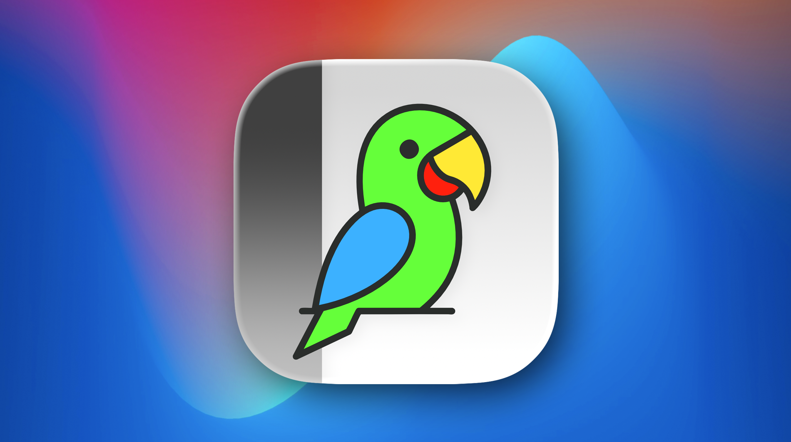
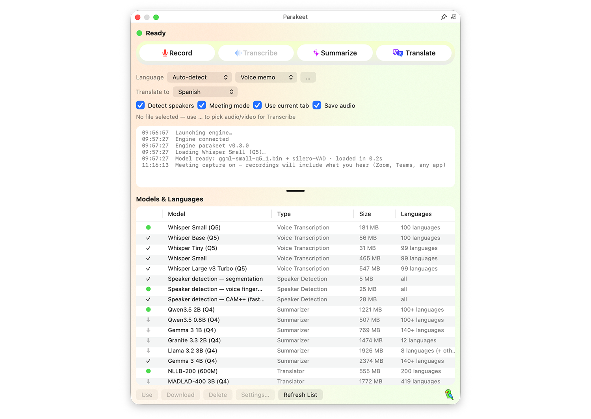
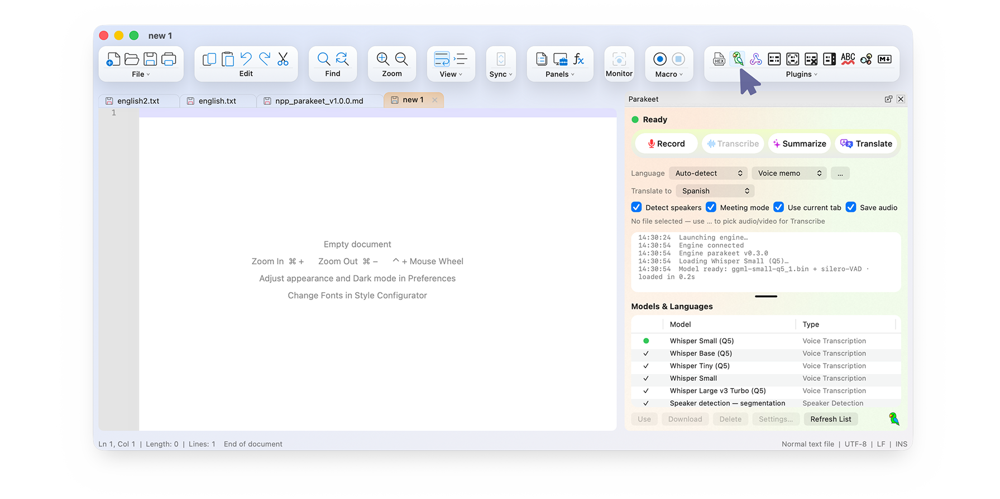
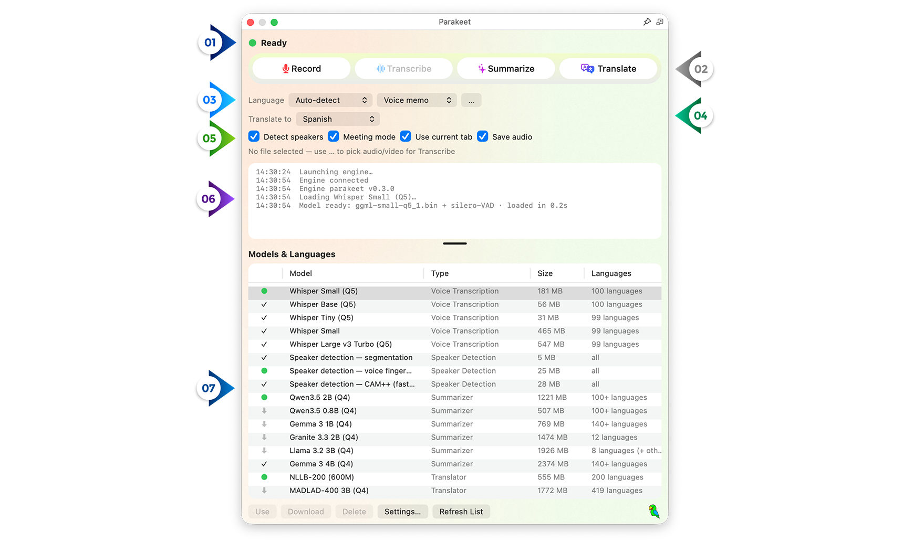
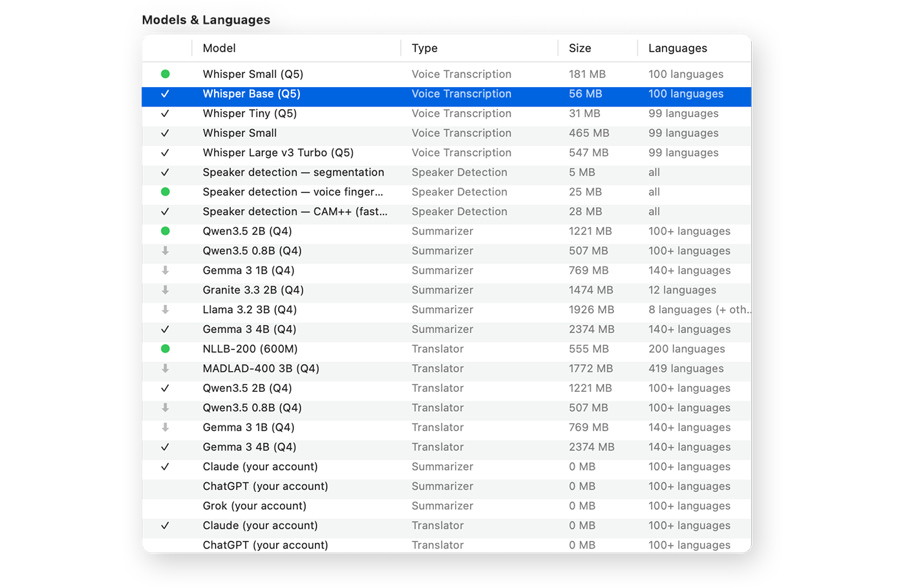
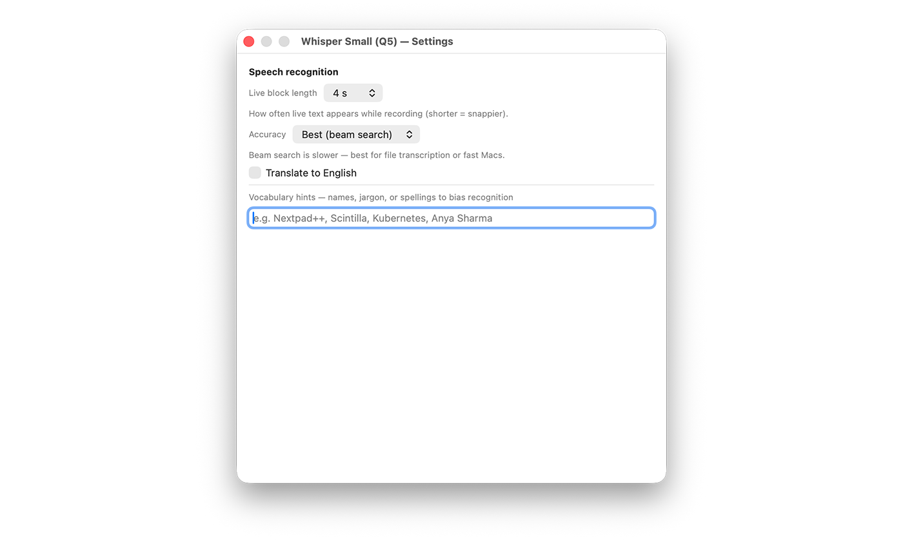
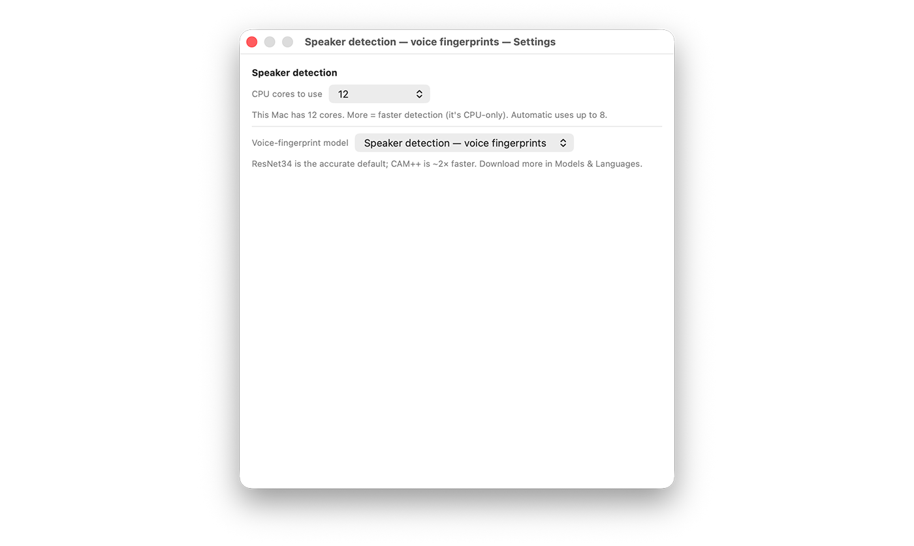
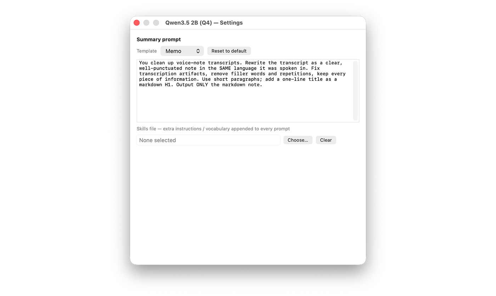
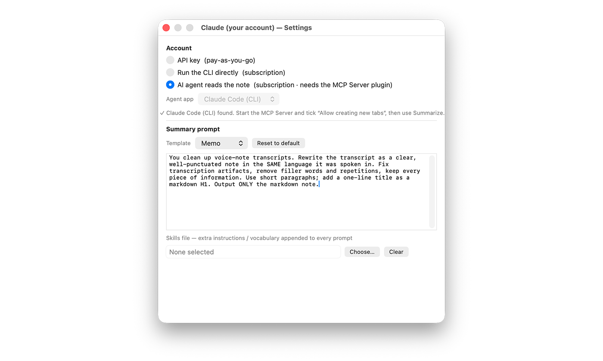

 *Parakeet v1.0.0 — your voice, straight into the editor*

# Parakeet AI Plugin v1.0.0 

Parakeet Plugin turns Nextpad++ into a **voice workstation**. Speak, and your words appear in a tab as you talk. Record a zoom meeting and get a transcript neatly labeled **You:** and **Them:**. Turn a voice memo into clean meeting notes or a to-do list. Translate any note into any of **200 languages**. Privacy and simplicity is the goal and **all of it happens on your Mac** — nothing is uploaded anywhere. You can use it on 10 year old Macs and transcribe your yoga instructor translating into English in real-time deep in Bali and it should work fine. 

If you've used an AI meeting-notes app like **Granola Notepad**, Parakeet gives you most of the same experience — record a call, or run it to get a clean transcript, turn it into structured notes and action items — with one decisive difference: it runs **entirely on your Mac, with full privacy and no internet connection required.** No bot joins your call, no audio is uploaded to anyone's servers, and there's no subscription. The plugin is free and the AI models live on your own disk. 

Installing and using it is literally 2 clicks and the UI was designed to give you all controls on a single screen.

This guide walks you from install to power-user: how to record, how to run meetings, how the model "store" works, what every setting does, and what the messages in the activity log mean.

Parakeet requires **Nextpad++ v1.0.7** and above and installs in one click from **Plugin Admin → Available**.

 *Parakeet v1.0.0 main screen*

---

# Privacy first — read this before anything else

 *Privacy by design*

Parakeet was built **private by default.** Here is exactly where your voice and text go:

- **Recording, transcription, speaker labels, meeting capture, on-device summaries, parallel audio mp4 format file recording, and on-device translation all run entirely on your Mac, offline.** The AI models are ordinary files sitting in your Library folder. The audio is processed by a small helper app on your machine and is **never uploaded, never stored on a server, and never sent to anyone else.**
- **Your microphone is only ever touched while you're recording**, and the macOS permission prompt is attributed to *ParakeetEngine* (Parakeet's helper), so you always know who's listening.
- **The only time any text leaves your Mac** is if *you* deliberately pick a **cloud** summarizer or translator (Claude, ChatGPT, or Grok). Even then, only the text of the one note you're summarizing or translating is sent — over *your* account — and nothing else. Every core feature has a fully local option, so you never have to use the cloud at all.
- **No account, no sign-in, no subscription** is required for any on-device feature.

In short: speak freely. What's said on your Mac stays on your Mac. Parakeet doesn't manage notes for you. It uses Nextpad++, which stores them locally and can track changes or optionally, in your private cloud (can be adjusted in Nextpad++ settings). 

---

# Getting started

 *The Parakeet panel — Record, Transcribe, Summarize, Translate, and the model store below*

Open the panel with the toolbar parakeet button or **Plugins → Parakeet → Show Parakeet Panel**. The first time you record, macOS asks for microphone access — approve it (the prompt names **ParakeetEngine**).

Two models ship inside the plugin so it works immediately:

- **Whisper Small** — speech recognition, 100 languages, the default transcriber.
- A **voice-activity detector** that cleanly splits your speech into sentences.

The standard summarizer (about 1.2 GB) downloads by itself in the background the first time you summarize. Everything else — bigger transcription models, translators, speaker detection — is optional and lives in **Models & Languages** at the bottom of the panel.

**The panel at a glance:**

- **1. Status dot + label** — Idle, listening, transcribing, etc.
- **2. Four action buttons** — **Record**, **Transcribe** (a file), **Summarize**, **Translate**. Record lights up once the status shows **Ready** (the speech model takes a second to load). While any of these runs, its button turns into a **Stop** button — press it again to cancel the recording, transcription, summary, or translation mid-flight.
- **3. Language** row — your spoken language (or Auto-detect) + a summary **template** + the **…** file picker.
- **4. Translate to** row — the target language for translation.
- **5. Detect speakers**, **Meeting mode**, **Use current tab** and **Save audio** checkboxes.
- **6. Activity log** — a running commentary of what Parakeet is doing (explained near the end of this guide).
- **7. Models & Languages** — the model store.

 *The Parakeet panel at a glance*

---

# Recording voice notes

 *Live transcription streaming into a tab*

Press **Record** (or **Plugins → Parakeet → Start / Stop Voice Note**). Parakeet opens a fresh tab titled with the date and streams your words into it as you speak — a floating level meter confirms it can hear you. Press **Record** again to stop; the transcript wraps up within a few seconds.

Three ways to capture speech:

- **Voice note** — the button above; a new dated tab.
- **Dictate at Caret** (**Plugins → Parakeet → Dictate at Caret**) — the same live transcription, but inserted at your cursor inside whatever document you're already editing. Perfect for dictating a paragraph into notes or a code comment.
- **Transcribe a file** — click **…**, choose any audio or video file (anything QuickTime can open), and Parakeet transcribes it into a new tab — including speaker labels if enabled.

 *File transcription streaming into a tab*

**Prefer everything in one document?** Tick **Use current tab** (next to the meeting checkbox) and Parakeet works inside the tab you're in instead of opening new ones:

- **Recording & file transcription** — the text **appends to the end** of your tab (no date header, just your words after a blank line).
- **Summarize & Translate** — with **nothing selected**, the whole document is processed and the result is written **at your cursor**; with **text selected**, only the selection is processed and the result appears **just below it**. Select one paragraph of a long note, press Translate, and the translation lands right underneath.

Your existing text is always safe: Parakeet only appends or inserts — it never replaces what you wrote (speaker labels only touch text Parakeet itself streamed). If the current tab is read-only, it tells you and opens a new tab as usual.

**Want to keep the audio too?** Tick **Save audio** and every live recording is also saved as an **.m4a** file in **`~/Music/Parakeet`**, named with the date and time (e.g. *Voice note 2026-07-19 14.32.05.m4a*). The exact file path appears in the activity log when the recording stops, so it's always one glance away. In **Meeting mode** the file contains **both sides of the call** — your mic and the meeting audio, exactly as transcribed — which makes it perfect for re-transcribing later with a bigger model, or translating the same meeting into several languages from the **…** file picker. Cancelled recordings don't leave a file behind. (Files are compact: about 14 MB per hour of audio.)

---

# Meeting capture — transcribe your calls, no bot required

 *Meeting mode + Detect speakers = a labeled meeting transcript*

This is Parakeet's flagship feature. On a Zoom / Teams / Meet call **with headphones on**, the other participants' voices exist only inside your computer's audio output — an ordinary microphone can't hear them. Tick **Meeting mode** and Parakeet records **both sides**: your mic *and* everything you hear.

- **One-time setup, one password.** The first time you enable it, Parakeet installs a small audio component called **Parakeet Loopback** — a single administrator authentication, once per Mac, with about two seconds of audio blip while the sound system restarts. You'll never be asked again.
- **Automatic on every call.** When you press Record, Parakeet quietly routes your sound through a temporary **Parakeet Meeting Output** device (you keep hearing everything normally), captures both streams, and **restores your audio the instant you stop** — even after a crash or force-quit.
- **You: / Them: labels.** Tick **Detect speakers** *together with* **Meeting mode** and your transcript is grouped into **You:** (your microphone) and **Them:** (the call audio) paragraphs. Because Parakeet knows which audio *stream* each word arrived on, this is more reliable than any voice-fingerprint AI — and it needs no extra models, so it works on every Mac.

> **Tips for great meeting transcripts.** Keep your meeting app's speaker setting on "Same as System" (its default). Wear headphones — without them your mic also hears the speakers, so remote voices can appear twice. And note: the macOS volume keys pause working while a meeting recording is active, so set a comfortable volume before you start.

No bots joining your call, no cloud transcription service, no recording uploaded anywhere.

---

# Summarize — from rambling to structured

 *A voice memo turned into meeting notes*

**Summarize** rewrites the active tab into a clean, structured note in a brand-new tab (your original is never touched). Pick a **template** from the dropdown next to the Language box — it decides *how* the note is structured:

- **Voice memo** — a tidy memo of the key points,
- **Meeting notes** — decisions, action items, discussion topics,
- **To-do list** — a checkbox list of everything actionable,
- **Interview** — a Q&A-style write-up,
- **Lecture** — organized notes with headings and takeaways.

*(The template only affects **Summarize** — it doesn't change recording or transcription. Each template has its own editable prompt; see **Settings for each model type**.)*

Summaries run one of two ways, your choice per model:

- **On your Mac**, with a local model — Qwen 3.5 (the auto-downloaded default), Gemma 3, Granite 3.3, or Llama 3.2 — completely private.
- **In the cloud**, with **Claude, ChatGPT, or Grok** — the strongest quality, when you're comfortable sending that one note to a provider you already pay for.

(Cloud connection options and per-model settings are covered in **Settings for each model type**, below.)

---

# Translate — 200 languages, on your Mac

 *The Translate row — pick a target language, get a new tab*

Pick a target language in the **Translate to** row and press **Translate**. The active tab is translated into a new tab with its paragraph structure intact. Install whichever translators you like from the catalog:

- **NLLB-200** *(recommended)* — Meta's dedicated translation model: one 555 MB download covering **200 languages**, a few seconds per note, fully offline. The best quality-for-speed of the local options.
- **MADLAD-400** — Google's translation model, 419 languages, auto-detects the source language.
- **LLM translators** — the Qwen/Gemma summarizer models double as translators using the *same* download; if you already have the summarizer, Translate works out of the box.
- **Cloud translators** — Claude, ChatGPT, or Grok, with an editable translation prompt; they share the account you set up for summaries.

---

# Detect speakers for in-person recordings

For recordings *without* meeting capture — an interview across a table, a hallway chat — **Detect speakers** labels the transcript **Speaker 1 / Speaker 2 / …** using on-device voice fingerprints. Install the **Speaker detection pack** (about 31 MB) from Models & Languages. *(This pack needs macOS 15.5 or newer. In meeting capture, the superior You/Them labeling is used instead and works on every supported macOS.)*

---

# Models & Languages — your private model store

 *The catalog: every model, its type, size, and languages, with per-row actions*

The bottom half of the panel is a small, private app store for AI models. It's sortable and searchable, and every row has clear actions.

### How to download a model

Find the model you want, click **Download**, and Parakeet fetches it in the background with a live progress bar. Every download is **verified with a SHA-256 checksum**, so a corrupted or tampered file is rejected automatically. When it finishes, the row shows it as installed.

### How to switch models for a task

Each of the four jobs — transcription, speaker detection, summarizing, translating — uses one **active** model at a time. To change which one, click **Use** on the model you want; it becomes the active model for its type immediately, and the next recording, summary, or translation uses it. If you've never chosen one, Parakeet automatically uses the first installed model of that type (and suggests the catalog's recommended one to download).

So, for example: download **Whisper Tiny** and click **Use** to make transcription fast on an older Mac; download **NLLB-200** and click **Use** to make it your translator; download **Gemma 3** and **Use** it if you prefer it over Qwen for summaries.

### What happens if you delete a model

Click **Delete** and the model's file is removed from your disk to reclaim space — that's all it does. **Nothing is lost permanently:** the entry stays in the catalog, and you can **re-download it any time** with one click. Deleting is completely safe; think of it as clearing space, not throwing anything away. (If you delete the model that was active, Parakeet falls back to another installed model of that type, or prompts you to download one.)

### Keeping the catalog fresh

New models can appear without updating the plugin — Parakeet periodically pulls a live catalog. Click **Refresh List** to check for new additions right now.

### The four model types

| Type | What it does | Examples |
|---|---|---|
| **Voice Transcription** | speech → text | Whisper **Tiny** (31 MB, fastest — great for older Macs), **Base**, **Small** (bundled default), full-precision Small, **Large v3 Turbo** (best quality) |
| **Speaker Detection** | who spoke when | segmentation + voice-fingerprint models (ResNet, CAM++) |
| **Summarizer** | note → structured summary | Qwen 3.5 (0.8B / 2B), Gemma 3 (1B / 4B), Granite 3.3, Llama 3.2, plus Claude / ChatGPT / Grok (cloud) |
| **Translator** | any language → any language | **NLLB-200 (200 langs)**, MADLAD-400 (419 langs), LLM translators, cloud translators |

---

# Settings for each model type

Every model has its own **Settings…** (open Models & Languages and click a model's gear/Settings). What you'll find depends on the model type.

### Voice Transcription (Whisper) settings

- **Live block length** (2–8 seconds) — how often live text appears while you talk. Shorter = snappier updates; longer = slightly more accurate at the seams.
- **Accuracy** — **Fast (greedy)** for speed, or **Best (beam search)** for the highest accuracy. Beam search is ideal for transcribing files or on a fast Mac.
- **Translate to English** — Whisper's built-in speech translation: speak any language and the transcript comes out in English, at no extra cost.
- **Vocabulary hints** — a place to type names, jargon, or unusual spellings (e.g. *Nextpad++, Scintilla, Kubernetes, Anya Sharma*) so Parakeet recognizes and spells them correctly.
 *Voice Transcription Settings*
Each speech model remembers its **own** settings, so you can keep Small on beam search and Tiny on greedy, for instance.

### Speaker Detection settings

- **Voice-fingerprint model** — choose the **accurate** ResNet model or the **faster** CAM++ model.
- **CPU cores to use** — speaker detection is CPU-only; more cores = faster. **Automatic** uses up to 8.
 *Speaker Detection Settings*

### Summarizer settings

**For local (on-device) summarizers:**

- **Template + Prompt** — pick a template (Voice memo, Meeting notes, To-do list, Interview, Lecture) and edit the system instructions that shape that kind of note. These prompts are shared across all your summarizer models, so a tweak to "Meeting notes" applies whichever model you use.
- **Skills file** — point to a text file of extra instructions or vocabulary that gets appended to every prompt (great for a house style or a glossary shared across a team).
 *Summarizer Settings*

**For cloud summarizers (Claude / ChatGPT / Grok)**, you pick *how* Parakeet reaches the provider:

- **API key (pay-as-you-go)** — paste an API key; it's stored securely in the macOS **Keychain**.
- **Run the CLI directly (subscription)** — use the provider's own command-line tool with the subscription you already have.
- **Agent mode** — your own AI assistant (e.g. Claude Code) reads the note through the **MCP Server** plugin and writes the summary itself. Bring the AI you already pay for; Parakeet resells nobody's API. *(Grok offers API-key mode only.)*
 *Summarizer Settings*

### Translator settings

- **NLLB-200 / MADLAD-400** — no configuration needed; download, click **Use**, and translate.
- **LLM translators** — share the summarizer models, so they inherit those models' settings.
- **Cloud translators** — show the provider account status (shared with that provider's summarizer setup) plus an **editable translation prompt** with `{source}` and `{target}` placeholders, so you can tailor how translation is phrased.

---

# Understanding the activity log

The activity log narrates everything Parakeet does, so you're never guessing. Here's what the common messages mean:

| Message | What's happening |
|---|---|
| **listening…** | The microphone is live and capturing your speech. |
| **Meeting capture on — recording your mic (…) + what you hear** | Meeting capture started successfully; both audio streams are being recorded. The device it names is your microphone. |
| **microphone route changed — reconnecting…** | Your input device changed mid-recording (e.g. AirPods switched modes). Parakeet is reconnecting automatically — no action needed. |
| **Speaker labeling armed — You/Them from the meeting audio** | You/Them labels will be applied when you stop. |
| **Speaker labeling armed (labels apply after stop)** | Voice-fingerprint speaker labels will be added after you stop. |
| **detecting speakers…** | After stopping, Parakeet is working out who spoke when. |
| **speaker inference · Xs for Y min of audio** | How long speaker detection took — purely informational. |
| **Loading summarizer model… / Loading translation model…** | The model is being loaded into memory (only on the first use each session). |
| **Structured note created / Translation created** | Done — the new tab is ready. |
| **Audio saved: /Users/…/Music/Parakeet/…** | The recording's audio file (Save audio) — this is where to find it. |
| **Recording cancelled** | The recording was discarded. |
| **⚠️ Your microphone (…) sounds silent** | The mic isn't producing audio (e.g. muted or the wrong input). Check System Settings → Sound → Input. |
| **No speech / summarizer / translation model installed — open Models & Languages** | You need to download a model of that type first. |
| **Speaker detection pack not installed — continuing without labels** | Recording proceeds normally, just without speaker labels. |
| **Meeting capture isn't set up on this Mac (audio loopback driver not installed) — recording microphone only** | The one-time meeting-capture setup hasn't been done; the recording continues with just your mic. |

If anything ever fails, Parakeet's rule is simple: **it degrades, it doesn't block.** A missing model or a failed meeting setup produces a friendly log line and the recording carries on with what's available.

---

# Performance

- **Apple Silicon (M-series)** — transcription and summarization run on the GPU (Metal). A voice note transcribes in real time, and NLLB translates ~3,000 characters in about ten seconds on an M2.
- **Intel Macs** — fully supported back to 2015-era machines. v1.0.0 ships hand-tuned **AVX2** speech kernels for Intel (several times faster than a generic build — verified on 2015 and 2016 MacBooks) plus an optimized translation engine, so even a 2015 MacBook Air transcribes usably with the **Base** or **Tiny** model. On an older Mac, switching transcription to **Tiny** is the single biggest speed-up.

---

# Every command at a glance

| Where | Function |
|---|---|
| Plugins → Parakeet | **Show Parakeet Panel** — open/close the panel |
| Plugins → Parakeet | **Start / Stop Voice Note** — record into a new tab |
| Plugins → Parakeet | **Dictate at Caret** — record into the current document at the cursor |
| Plugins → Parakeet | **Structure Note…** — summarize the active tab |
| Plugins → Parakeet | **Translate Note…** — translate the active tab |
| Plugins → Parakeet | **Models && Languages…** — open the model store |
| Panel | **Record / Transcribe / Summarize / Translate** buttons |
| Panel | **Language** (source, 100 + Auto) · **template** · **…** file picker · **Translate to** (target) |
| Panel | **Detect speakers** · **Meeting mode** · **Use current tab** · **Save audio** checkboxes |
| Panel | Activity log · Models & Languages with **Use / Download / Delete / Settings… / Refresh List** |

---

# Compatibility

- **Requires**: Nextpad++ **v1.0.7** or newer
- **macOS**: 12.0+ (Intel and Apple Silicon, universal) — the speaker-detection pack needs macOS 15.5+; meeting capture and You/Them labeling work on every supported version
- **Disk**: ~240 MB installed (bundled speech models included); optional models range 31 MB – 1.7 GB and can be downloaded and deleted individually at any time
- **Install**: Plugin Admin → Available → Parakeet

---

*Parakeet is part of the growing family of macOS-native Nextpad++ plugins. It pairs beautifully with the **MCP Server** plugin — let your own AI assistant read and write your notes (see the companion MCP Server v1.1.0 guide).*
