 *New application icon starting from Nextpad++ version 1.0.7*

# Nextpad++ v1.0.7 — Release Notes

Successor to **v1.0.6** (May 27th, 2026). 34 commits, 36+ user-reported issues
resolved, 5 newly-ported plugins shipping alongside the host update, batch processing feature added. Also new application icon https://nextpad.org/news/?slug=applogo-changes. See all details below.

---

## New Features

### Editor & UX

- **Adjustable line spacing** — pick a multiplier (1.0 / 1.2 / 1.3 / 1.4 / 1.5)   in *Preferences → Editor*. Live-applied to every open buffer; persists   across launches. Some users wanted to have it to make text more readable.

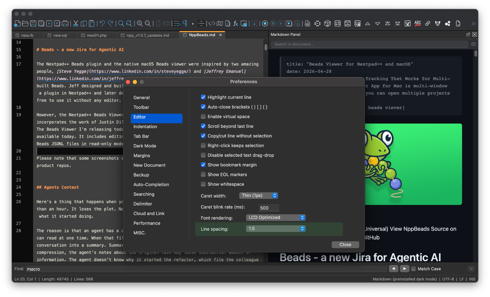
*Adjustable line spacing for better readability*

- **Clickable links in the editor** — URLs, file paths, and other configurable   schemes are auto-detected and openable with a single click. Toggle and   appearance (underline vs. box, full-box hover) in *Preferences*. Similar to Windows NPP.

- **Find window transparency** — Find/Replace floats over your work with   configurable opacity. Choose "on losing focus" or "always," and tune the   alpha slider 0.2–0.9. Matches Windows NPP's transparency control.

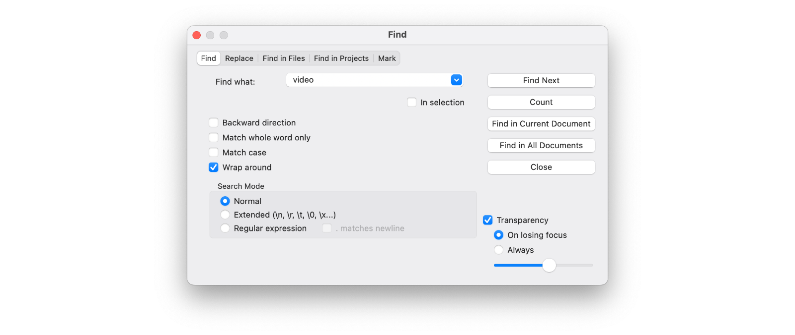
*Window transparency*

- **Document List panel overhaul** — sortable columns, modified-state floppy   icon, right-click context menus per row (close, copy path, reveal in   Finder).

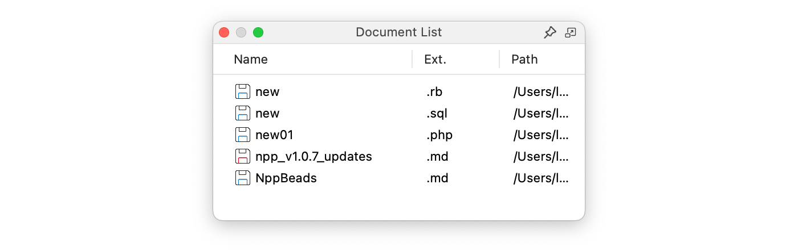
*Updated Document List Panel*

- **Search Results: per-search timestamps** — every Find All / Find in Files   / Find in Projects header line gets a timestamp, so you can tell batches   apart when you accumulate results in the panel.

### Style Configurator

- **Global Override** — seven "Force … for all styles" checkboxes   (foreground, background, font, font size, bold, italic, underline) replace   per-style attributes across the active language. Same control surface and   semantics as Notepad++ for Windows. Persists to `config.xml`.

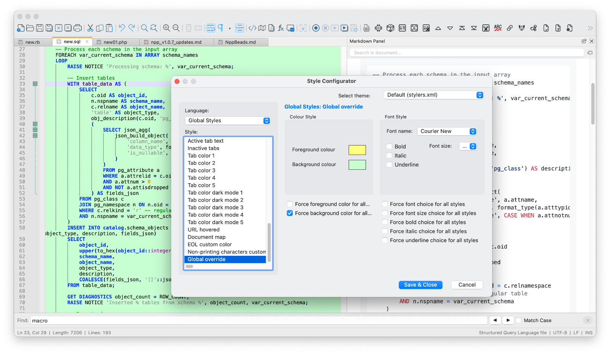
*Style Configuration Global override*

### Toolbar

- **Icon colorization** — Off / Partial (hue-rotate) / Complete (mono fill)   modes, with nine preset palette choices (red, green, blue, purple, cyan,   olive, yellow, accent) plus a custom NSColor picker. Toggle whether plugin   icons inherit the colorization. Matches Windows NPP's *Toolbar* settings   pane.

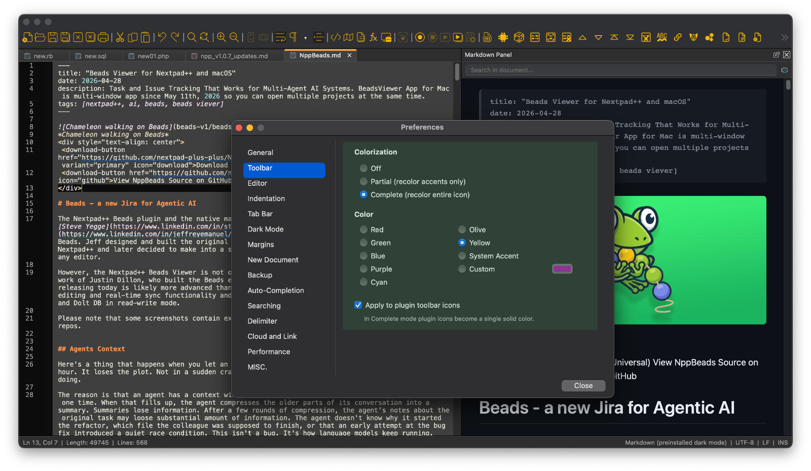
*Toolbar colorization*

### Macros

- **Plugin commands in macros** — recording a plugin's menu item now captures   it correctly and replays it on playback. Lets you build keybinds and   saved macros that run, say, *Zap Gremlins* over a selection.

- **Run a Macro Multiple Times** — the dialog's "Run N times" and "Run until   end of file" radios are now properly mutually exclusive, the EOF detector   no longer hangs on zero-width matches, and **Esc** cancels a long run.

### Batch processing — Run Macro on Folders and Files

Apply any saved macro across a whole set of files or folders at once — Nextpad++'s take on BBEdit's *Text Factory*. Pick the macro, pick the files, click Run, walk away.

Three entry points:

- **Macro menu → *Run Macro on Files…*** — opens the configuration dialog   with an empty folder picker. Browse to any directory and go.

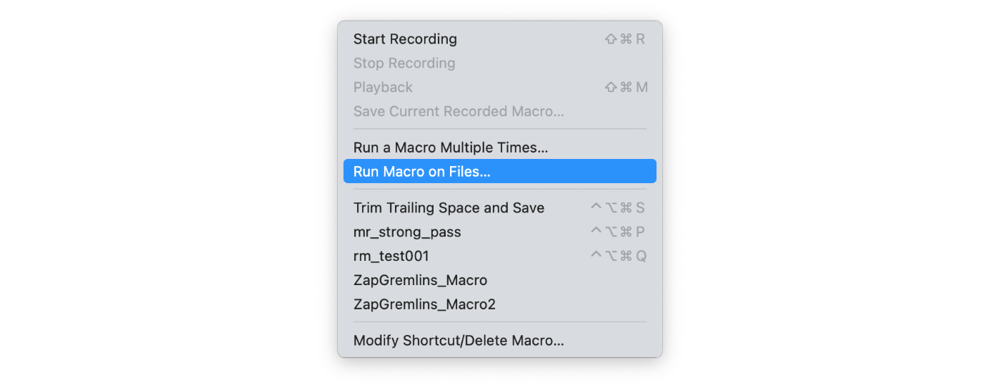
*Run macro on a folder or files*

- **Folder-as-Workspace** sidebar — right-click any folder node and pick   *Run Macro on Files…*. The folder path is pre-filled; you just pick a   macro and click Run.

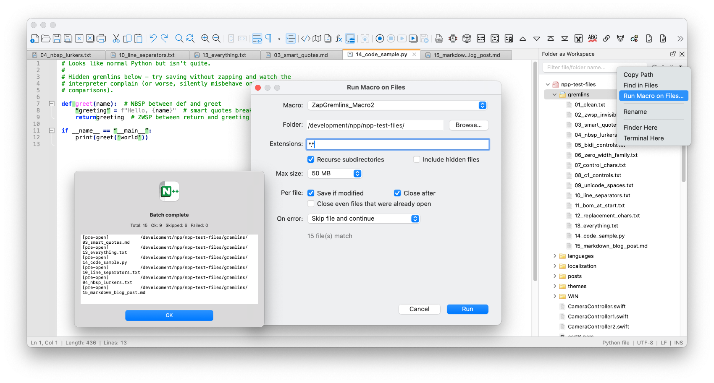
*Run Macro from the Folder as Workspace Panel*

- **Project Panel** — right-click any workspace, project, or virtual folder   node. Because Project Panel workspaces are XML-based **virtual trees**   (files can live in arbitrary on-disk locations), the dialog presents the   pre-collected, de-duplicated file list instead of a folder; the extension   filter still applies to narrow further.

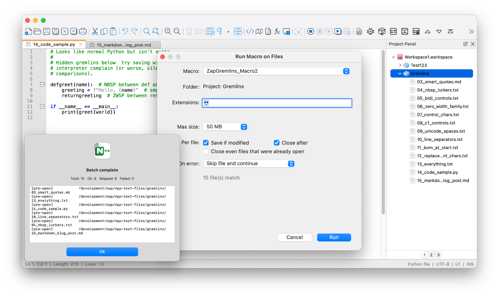
*Run Macro from the Project Panel*

Configuration options:

- **Macro** — any macro from `shortcuts.xml`, including ones that invoke   plugin commands.
- **Filters** — extension globs (`*.cpp; *.h`), recurse subdirectories,   include hidden files, maximum file size (1 / 10 / 50 / 200 MB / unlimited).
- **Per-file options** — *Save if modified* (skipped if your macro didn't   change the buffer) and *Close after processing*. Pre-existing tabs the   user had open before the batch are protected from auto-close by default;   a separate checkbox lets you opt in to closing those too.
- **Error policy** — *Skip and continue* or *Stop on first error*.
- **Live match count** updates as you tune the filter, so you can see exactly   how many files the batch will hit before running.

While running:

- Progress bar + current file label + running counts (Ok / Skipped / Failed)   shown in-place inside the dialog.
- **Esc** or the **Cancel** button stops the loop cleanly (current file   finishes; subsequent files are not touched).

When finished, a summary dialog reports total / Ok / Skipped / Failed counts and an expandable list of per-file outcomes for anything that wasn't fully successful (open failure, macro exception, save failure, size-skip, pre-existing-tab skip).

Typical workflow: record once — e.g. *Zap Gremlins → Quick Zap* followed by *Save* — and let the batch sweep a whole `.cpp` tree, a project's worth of config files, or every Markdown file under a docs directory. The macro itself stays a pure transformation; the batch driver owns file lifecycle.

### Languages

- **User Defined Language extension auto-apply fixes** — `.md`, `.json`, custom   UDL extensions and friends now activate the right styler as soon as the   file opens. The Language menu got a full overhaul, with bundled Markdown   (Light and Dark variants) shipping out of the box.
- **Theme-aware UDL selection fixes** — switching to Dark Mode automatically pulls   in the dark-tuned UDL variant where available; switching back to Light   reverts.

### File Operations

- **File Status Auto-Detection + Update Silently** — Nextpad++ detects when   a file is changed by another process. Toggle "Update silently" to   auto-reload buffers with no local edits; dirty buffers still prompt. The cursor stays in place.

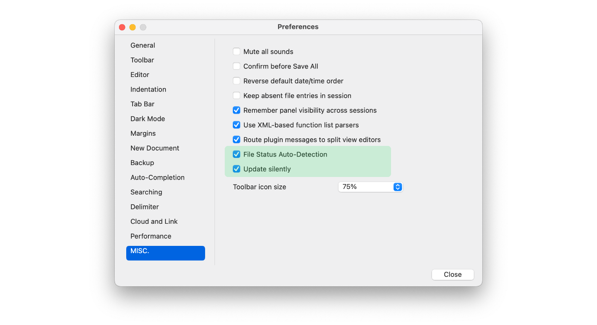
*Enable silent updates for saved files*

  
- **"Open with Nextpad++" Finder context-menu item** — right-click any file   in Finder and send it straight to a running (or fresh) instance.

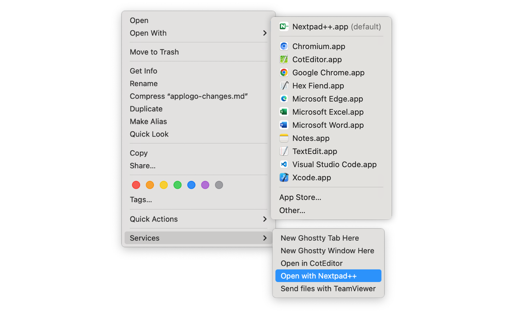
*Open with Nextpad++ finder updates*

- **CLI single-instance routing** — `nextpadplus path/to/file` opens the   file in your running window instead of spawning a second copy of the app.

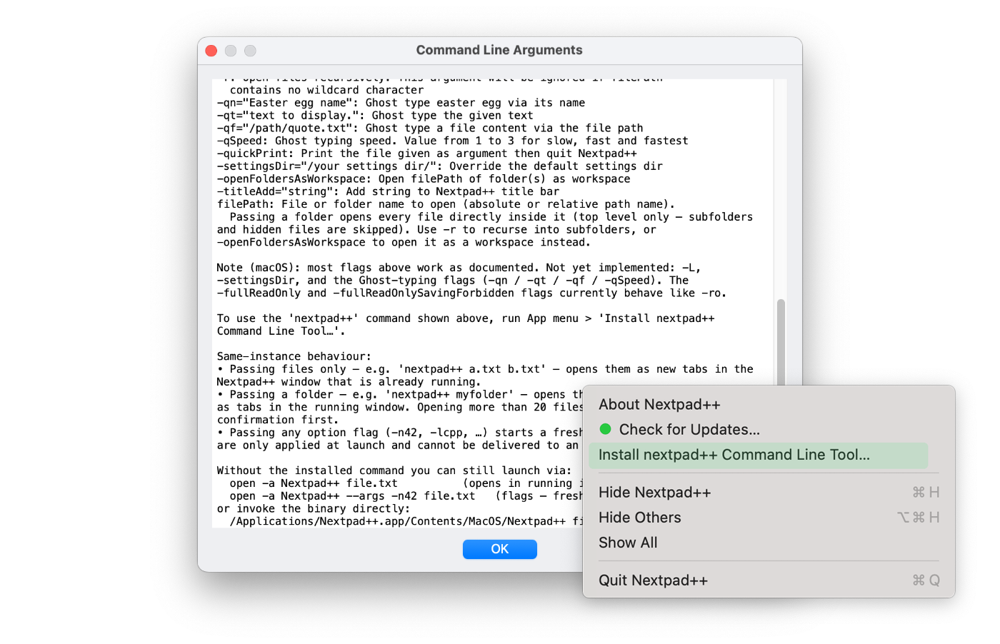
*Using command line / terminal*

### Editor right-click menu

- **Localized context menu fixes** — switching the app to a non-English language   now retranslates the editor's right-click menu (previously stayed in   English regardless of UI language). Customization via   `~/.nextpad++/contextMenu.xml` continues to work in English — translation   happens at render time.

## Stability & Bug Fixes

### Crash hardening

- **`$` regex Replace All freeze** — applying a regex like `$ → X` to a   file ending in `\n` used to lock the app for ~20 seconds before terminating   by hard cap. Fixed by introducing a custom Scintilla regex backend with   empty-match continuation semantics that mirror Notepad++ for Windows.   Replace All / Find All / Mark All / Count are all on the fixed path now.
- **Plugin bufferID crash** — plugins caching a buffer ID across a tab close   used to crash the host when they re-used the stale pointer. Now safely   rejected.
- **Plugin panel registration crash** — bogus NSView pointers from plugins   no longer take down the host; the registration is guarded by a   heap-allocation check.
- **Dangling observer crash on teardown** — fixed a rare race during app   quit / window close.

### Editor behavior

- **Change-history markers + horizontal scroll range** behave correctly on   files opened from disk (previously could be misaligned for the first edit).
- **Markdown UDL stays applied after Dark / Light Mode toggle** — was   reverting to plain text after a theme switch.
- **Monitoring (tail -f) keeps the caret in place** across reloads —   previously jumped to the top on every refresh.
- **Tab key navigates between the Find window's controls** as users expect.

### Side panels

- **Side-panel visibility + Indent Guide toggle persist across launches**.
- **Plugin commands appear in the editor's right-click menu** (the user-   customized `contextMenu.xml` entries were silently skipped for plugins).

### Plugin notifications

- **`SCN_DWELLSTART` / `SCN_DWELLEND` are forwarded** to plugins, enabling   hover calltips (NppDoxy-style features).

---

# Plugin API additions

- **`NPPM_GETOPENFILENAMES`** — list every open file in one call.
- **`NPPM_SAVECURRENTSESSION` / `NPPM_LOADSESSION`** — round-trip the open   buffer set as a session file from a plugin.
- **`NPPM_GETPOSFROMBUFFERID`** — given a bufferID, find its view + tab index. Round-trip with the existing `NPPM_GETFULLPATHFROMBUFFERID`.
- **`NPPM_GETNBOPENFILES` fixed** — previously a stub always returning 0;   now honors the `iViewType` filter (0=all, 1=primary, 2=secondary).
- **`NPPM_MENUCOMMAND` extended** — `IDM_FILE_CLOSEALL` (41004) is now   routed, letting plugins like SessionMgr clear the workspace before   loading a fresh session.

Together these unblock the SessionMgr port and several other Windows plugins that depend on the open-files / session APIs.

---

## Newly ported plugins (shipping alongside v1.0.7)

Five new entries in the Plugin Admin catalog since v1.0.6, taking the total from 24 → 29 macOS-native plugins:

- **XML Tools v1.0.0** — XML / XSLT pretty-print, validation, XPath   evaluation, schema check. Bundled with the macOS-tuned Options pane   and a "Toolbar" section. Auto-parse safety guards (size cap, language   detection) prevent runaway processing on huge files.
  
- **Random Values v1.0.0** — generate UUIDs, numbers, hex, dates, IPs,   Lorem ipsum, and other random data at the cursor. Full ObjC++ port   of BdR76's Windows plugin.
  
  
- **Npp ZapGremlins v1.0.0** — BBEdit-style hidden-character cleaner.   Removes / replaces invisible control characters, zero-width chars,   smart quotes, etc. Ships with a *Quick Zap* command (no UI) and a   separate *Settings…* screen.

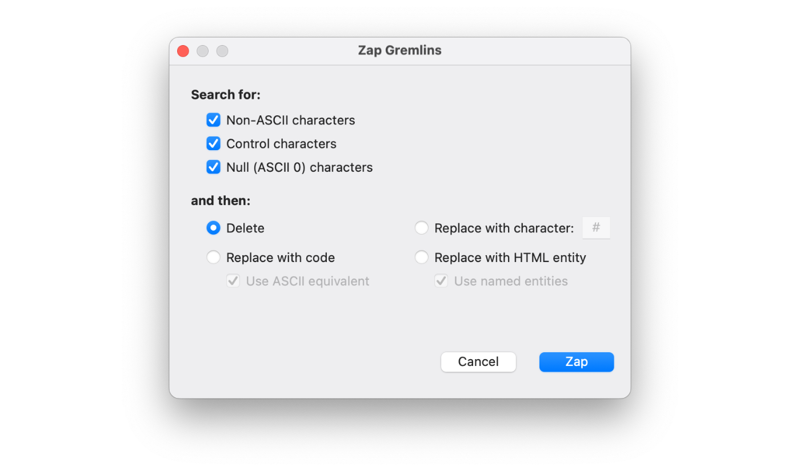
*Npp ZapGremlins*

- **DSpellCheck v1.0.0** — multi-language spell checker with bundled   Hunspell. Self-contained (universal binary, no external dependencies),   in-code filtering (skip comments / strings as you prefer), download   dialog for adding language dictionaries, and a debug log for   diagnosing dictionary issues.

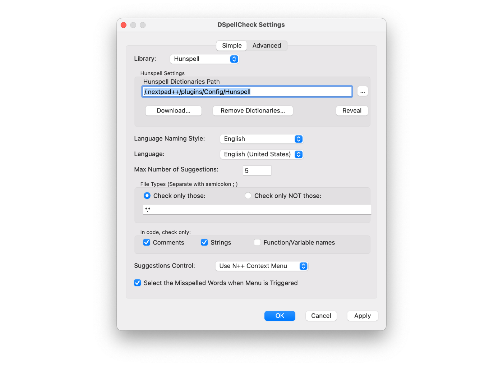
*Npp ZapGremlins*

- **Session Manager v1.0.0** — save and restore named sets of open tabs   as sessions. Switch contexts between projects in one click, auto-save   the current session on quit, manage a sessions library. Native macOS   port of the Windows SessionMgr plugin; sessions stored as Apple plist   files. Unblocked by the host's plugin-API additions in this release   (`NPPM_GETOPENFILENAMES`, session save/load messages, and the   `IDM_FILE_CLOSEALL` menu-command route).

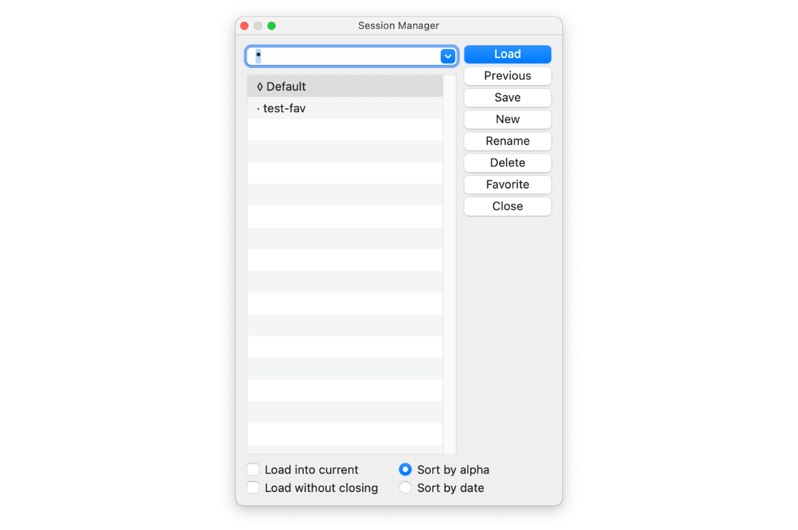
*Session Manager*

All five are notarized, stapled, and installable directly through *Plugin Admin → Available* inside Nextpad++. Note that if a plugin doesn't have a UI or a shortcut, you can always add a shortcut to it, wrap it in a Macro and run it on the entire folder.

---

# Compatibility

- **macOS deployment target**: 12.0+
- **Architecture**: universal (arm64 + x86_64)
- **Plugin API**: backward-compatible. Plugins built for v1.0.6 keep
  working; the new messages are additive.
- **Saved settings** (`~/.nextpad++/config.xml`, `shortcuts.xml`,
  `themes/`, etc.) are read by v1.0.7 unchanged.
  
**Note:** Keep in mind that starting in September I may start releasing some cool AI plugins that may need up-to-date Nextpad++ application. Check if the app is up to date here    

---

*Nextpad++ is the native macOS port of Notepad++ — built fresh in Objective-C++ on top of Scintilla and Lexilla, with all the host-side conveniences (full menu bar, native Find/Replace, dark mode, 137 UI languages, Git panel, spell check) that Apple-platform users expect.*
