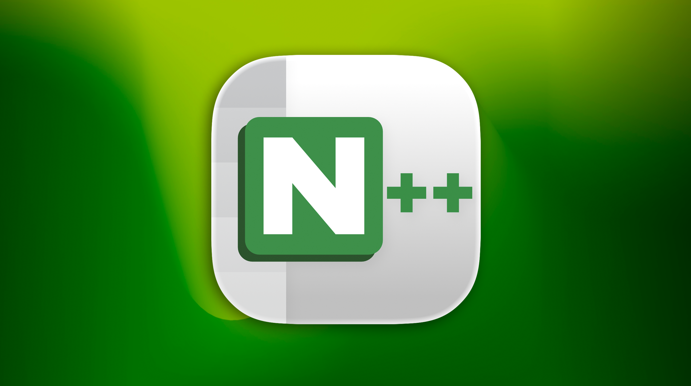 *Nextpad++ v1.0.8 re-imagined for macOS Tahoe (26)*

# Nextpad++ v1.0.8 — Release Notes

Successor to **v1.0.7** (May 27th, 2026). This is a substantial visual release since the port began: a **macOS Tahoe "Liquid Glass" redesign**,  per-language autocompletion with a brand-new **User Defined Language Admin Browser**, an **Optional advanced Boost regex engine (ported from Notepad++**, and the ability to **import macros recorded on Notepad++ for Windows**. 100 commits, 20+ reported issues resolved, and 3 community pull requests merged. New NextZip Plugin. Power and keeping it user-friendly is the main goal of Nextpad++. The Nextpad++ release 1.0.8 will be available for download on Tuesday, June 16th. See all details below.

---

# Native macOS Tahoe Look (beta)

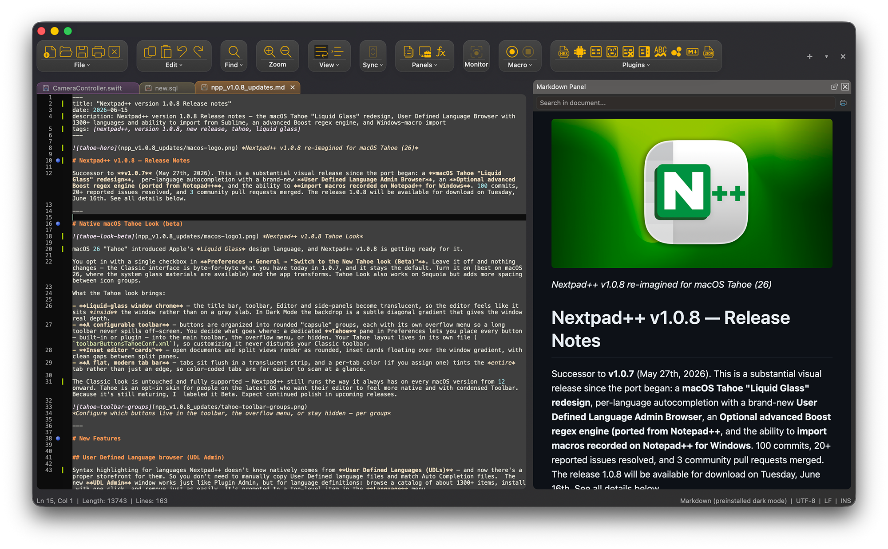 *Nextpad++ v1.0.8 Tahoe Look Dark*

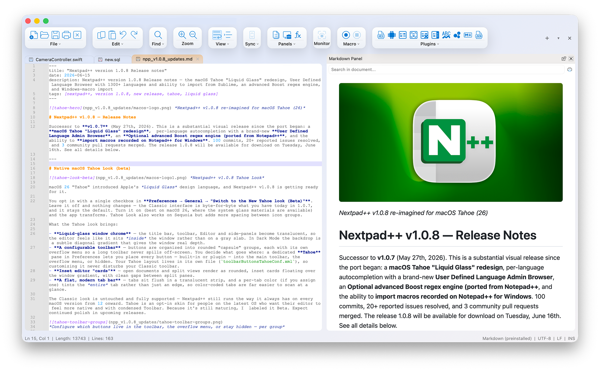 *Nextpad++ v1.0.8 Tahoe Look Light*

**macOS 26** "Tahoe" introduced Apple's *Liquid Glass* design language, and Nextpad++ v1.0.8 is getting ready for it. You can enable it with a single checkbox in **Preferences → General → "Switch to the New Tahoe look (Beta)"**. Leave it off and nothing changes — the Classic interface is byte-for-byte what you have today in 1.0.7, and it stays the default. Turn it on (best on macOS 26, where the system glass materials are available) and the app transforms. Tahoe Look also works on Sequoia but adds more spacing between icon groups. 

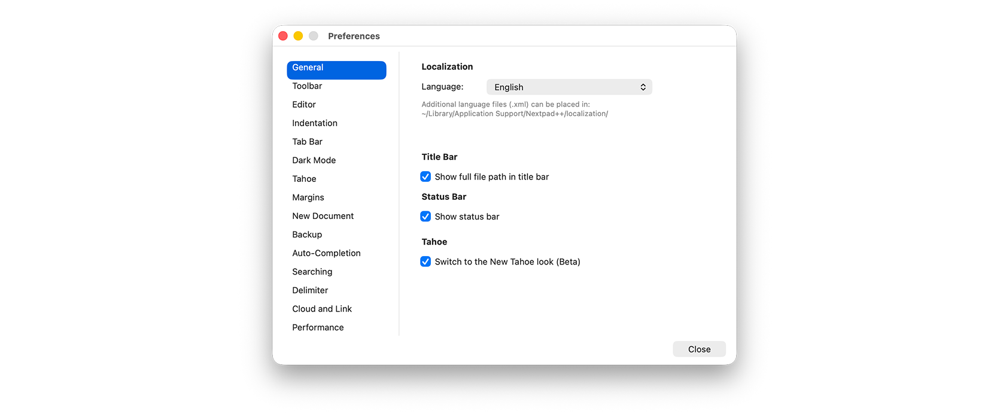 *Nextpad++ v1.0.8 Tahoe Look*

What the Tahoe look brings:

- **Liquid-glass window chrome** — the title bar, toolbar, Editor and side-panels become translucent, so the editor feels like it sits *inside* the window rather than on a gray slab. In Dark Mode the backdrop is a subtle diagonal gradient that gives the window real depth.
- **A configurable toolbar** — buttons are organized into rounded "capsule" groups, each with its own overflow menu so a long toolbar never spills off-screen. You decide what goes where: a dedicated **Tahoe** pane in Preferences lets you place every button — built-in or plugin — into the main toolbar, the overflow menu, or hidden. Your Tahoe layout lives in its own file (`toolbarButtonsTahoeConf.xml`), so customizing it never disturbs your Classic toolbar.

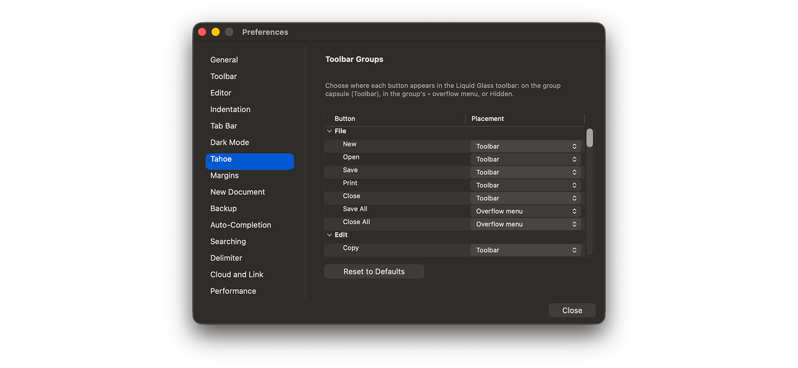 *Nextpad++ v1.0.8 Tahoe Look*

- **Inset editor "cards"** — open documents and split views render as rounded, inset cards floating over the window gradient, with clean gaps between split panes.

- **A flat, modern tab bar** — tabs sit flush in a translucent strip, and a per-tab color (if you assign one) tints the *entire* tab rather than just an edge, so color-coded tabs are far easier to scan at a glance.

The Classic look is untouched and fully supported and you can switch between Tahoe and Classic look any time. Nextpad++ still runs the way it always has on every macOS version from 12 onward. Tahoe is an opt-in skin for people on the latest OS who want their editor to feel more native with condensed Toolbar. Because it's still maturing, I  labeled it Beta. Expect continued polish and bug fixes in upcoming releases.

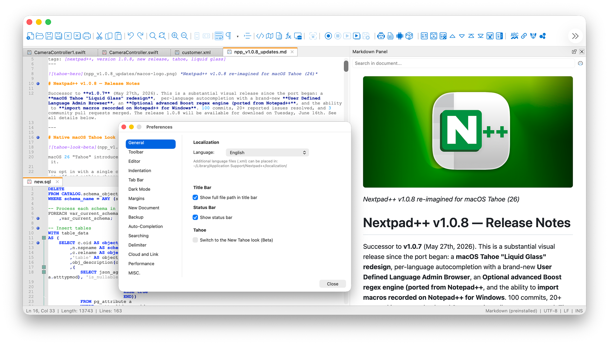*Classic Look*

---

# New Features

## User Defined Language browser (UDL Admin)

Syntax highlighting for languages Nextpad++ doesn't know natively comes from **User Defined Languages (UDLs)**. Now there's a proper storefront for them so you don't need to manually download and copy User Defined language UDL files and match Auto Completion files.  The new **UDL Admin** window works just like Plugin Admin, but for language definitions: browse a catalog of about 1300+ Languages, install with one click, and remove just as easily. It's promoted to a top-level item in the **Language** menu. Localization to be added.

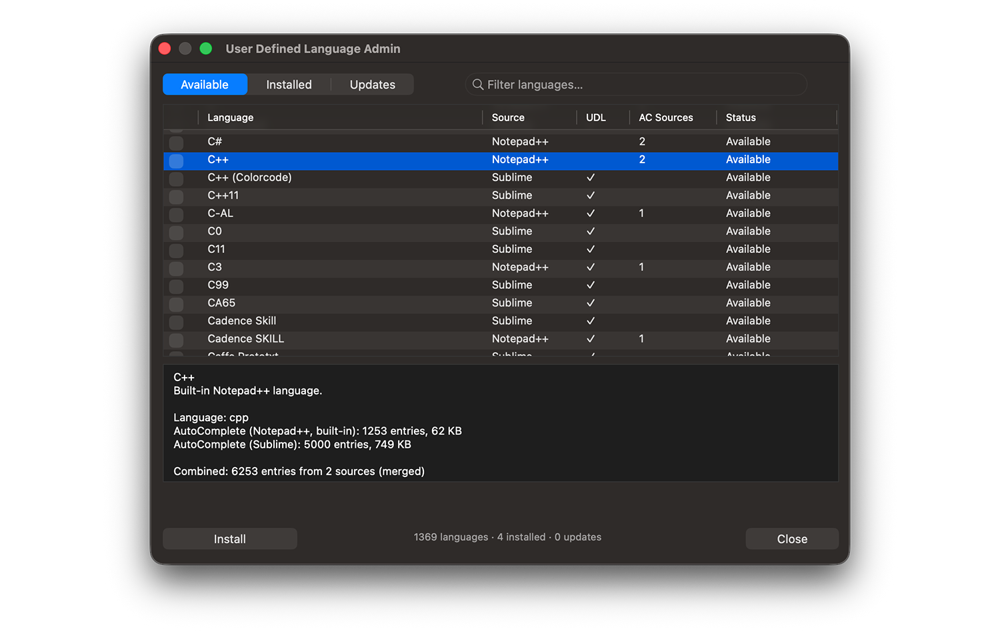*User-Defined Language Admin*

- **A large bundled catalog** — over 1,300 entries from the community collection, including many Sublime-Text syntax definitions and Auto Completion, so there's a good chance the language you need is already there.

- **Autocompletion comes along for the ride** — many UDLs carry their own API list, so installing a language can also give you the per-language completion described above. The window shows which sources each entry provides and what Auto Completion files are merged from Notepad++ repo and SublimeText repo which gives you a merged super-set.

- **Sortable, searchable** — find what you need fast, with a search box and sortable columns matching the Plugin Admin layout.

## Autocompletion — per-language API completion + calltips

Nextpad++ supports Notepad++ **autocompletion** tuned to the language of the file you're editing. As you type, you get completion suggestions drawn from a bundled API list specific to that language, and when you open a function's parentheses, a **calltip** pops up showing its parameters. **33 language API files** ship out of the box.

- **Zero-config extensibility with ".d" folders** — want to add your own API definitions for a language? Drop an extra XML file into that language's `.d` directory and Nextpad++ merges it in automatically — no config editing, no restart-and-pray. Multiple Auto Completion files for the same language are combined (quite a few ACs are already combined from Notepad++ and Sublime), so teams can layer a shared base list with project-specific additions.

## Advanced regex — optional Boost backend

Nextpad++'s default Find/Replace regex runs per-line, which is fast and matches how the desktop editors most people come from behave. For the times you need more, v1.0.8 adds Notepad++ **optional Boost.Regex backend** you can switch on in **Preferences → Searching** (a restart applies it). It brings **multi-line matching and lookbehind** to parity with heavyweight desktop tools, while the default engine stays exactly as it was for everyone who doesn't need it.

## Import your Windows macros

If you're coming from Notepad++ on Windows, your recorded macros can come with you. v1.0.8 can **replay Windows-recorded macro actions** — both menu-command steps and Find/Replace steps — directly from a Windows `shortcuts.xml`. Record a cleanup routine on Windows, bring the file over, and run it on macOS. 

## Help menu

The **"?"** menu has been renamed to **"Help"** to make it macOS native. Now it hosts the standard macOS **Help search box**, so you can search the menu bar the way you do in every other Mac app. 
In the future versions (1.0.9 or 1.1.0) there is a plan to re-shuffle main menus specially for Tahoe Look to make them more user-friendly on macOS. However, I will always keep original Classic menu layout to switch to in Preferences.

*Help Menu instead of ?*

## Editor & UX

- **Non-linear mouse-wheel scroll acceleration** — a gentle "flick faster, scroll faster" curve, tunable in *Preferences → Misc*, for covering long files quickly without losing fine control.

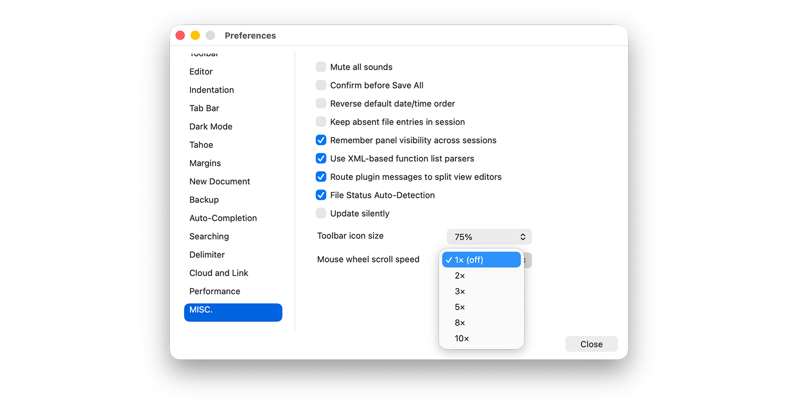*Mouse scroll speed adjustment*

- **Self-sizing line-number gutter** — the line-number margin now widens automatically as your document grows. Pasting a 13,000-line block into a fresh tab no longer clips the leading digits of high line numbers; the gutter just fits.
- **Find window "rescue"** — press the Find shortcut again while the Find window is already focused and it re-centers itself over your document window. If it ever drifts off-screen or onto a disconnected monitor, one keystroke brings it back — matching the behavior Windows users rely on.
- **More editor shortcuts you can remap** — 28 additional Scintilla editor commands are now listed in the Shortcut Mapper, and the keymap that backs them is authoritative and live, so the overrides you set actually take effect (no more "both keys still work").
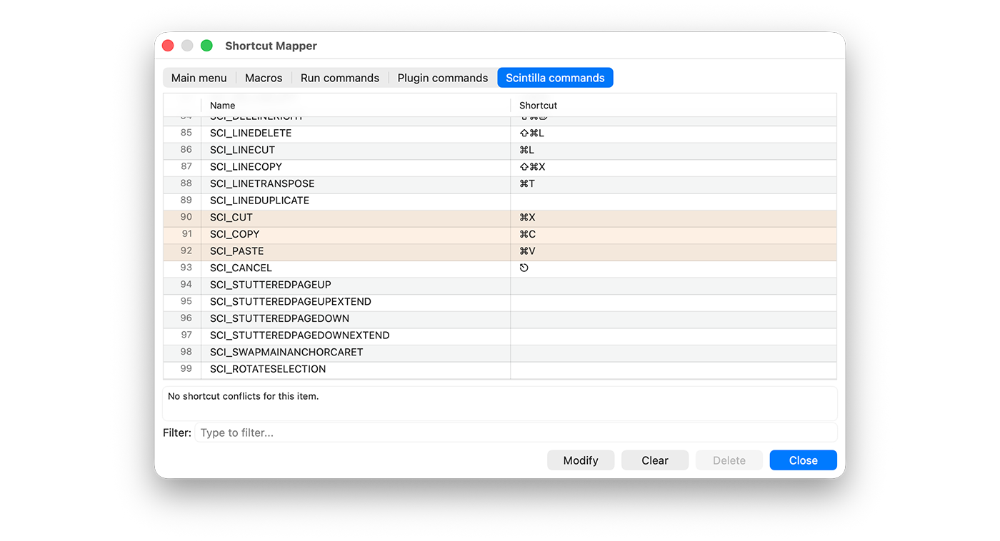*Full Scincilla Command set*

- **Hide the tab bar** — a new *Preferences → Tab Bar* option reclaims the strip for people who navigate by Document List or keyboard or want to work with hundreds of files.

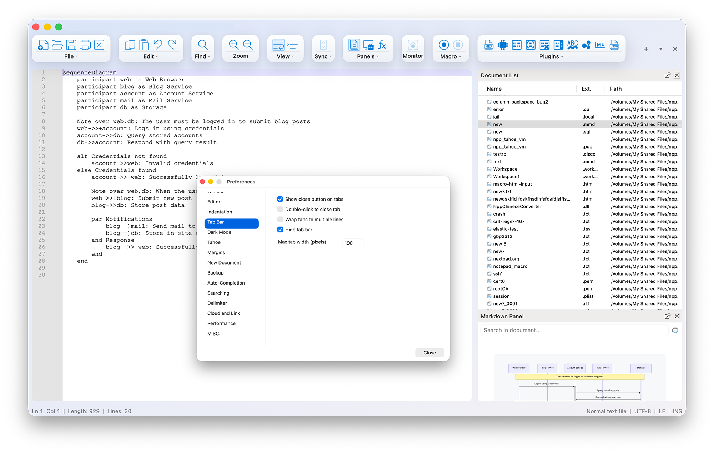*For people who love working with hundreds of files*

- **Column selection + Backspace** — deleting a column (vertical) selection now does the expected thing and drops you into multi-cursor editing.

## Files & Encoding

- **CJK encoding, fixed both ways** — saving **GB2312** files used to fail outright on macOS (the OS recognizes the encoding but ships no converter); it's now remapped to GBK/CP936 and round-trips cleanly, exactly like Windows. And non-UTF-8 CJK files — GBK, Big5, Shift-JIS, EUC-KR — are **auto-detected on open** instead of opening as Western-1252 "mojibake" gibberish. Western files are unaffected.

---

# Stability & Bug Fixes

## Tabs, split view & panels

- **No more lost files when saving a split tab** — saving a document that you'd moved into a split view could previously lose the file or its crash-recovery backup. Fixed (#162).
- **Document List Panel** — the panel now aggregates tabs across all split groups so every open document is listed and reachable, and each row is tinted with that document's tab color for quick scanning.

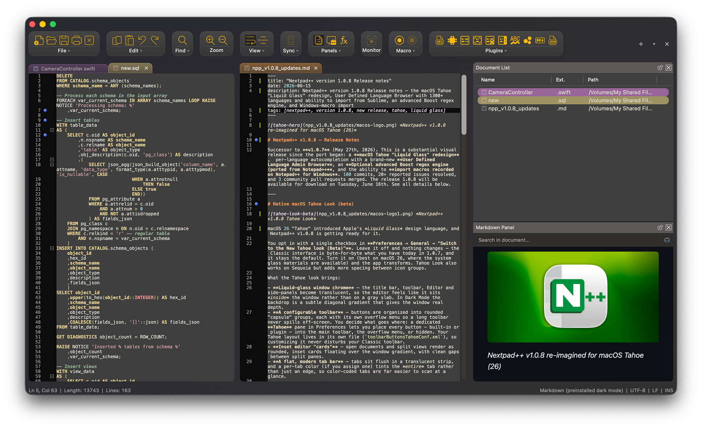*Document List panel that shows Tab colors*

- **Rename an untitled tab** — you can now give an unsaved "new" tab a custom name before you ever save it (#177).
- **Locale-proof tab context menu** — the tab right-click menu now shows all its items (Rename…, Save As…, Print…) correctly in English and stays fully populated in every UI language.
- **Double-click the language in the status bar** to jump straight to the Language menu (#174).

## Plugin Admin

- **Truthful installed versions** — the *Installed* tab used to show whatever the catalog said was newest, even when your installed copy was older. It now reports the real state of what's on disk: the actual version when known, otherwise a clear *latest* / *outdated* / *unknown* marker.

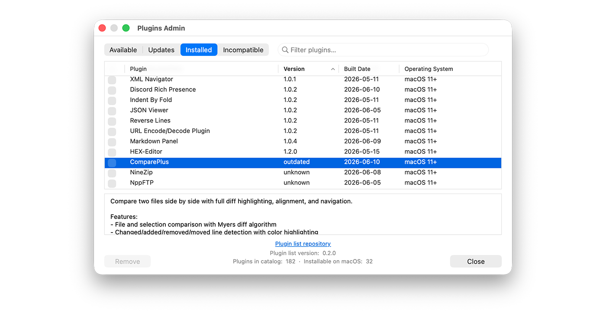*Updated Plugins Admin*

## Search results & readability

- **Readable search-result chrome in Light Mode** — the Find-results panel header is legible again in Light Mode (#170, community contribution).
- **Regex matches all line endings** — `\r\n`, `\n`, and `\r` are all matched correctly now (#167, community contribution).

## Appearance

- **Dark Mode selected-text color** — the default selection color in the Dark theme was tweaked to a calmer, more readable blue for new app install (#227FAD).

---

# New, Ported and Updated plugins

The Plugin Admin catalog has grown to **34 macOS-native ported plugins**. New since v1.0.7:

- **NppFTP v1.0.0** — connect to remote servers over **FTP, FTPS, FTPES, and SFTP**, browse them in a dockable panel, and open and edit remote files in place — save and they upload straight back. The classic Notepad++ FTP client, fully ported to native macOS (SFTP over libssh) and validated against live servers.

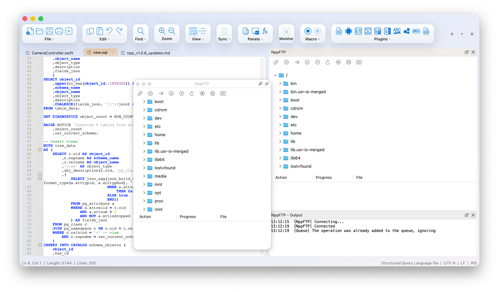*FTP Plugin*

- **NextZip v1.0.0** — absolutely new plugin I had to built **powered by 7-Zip**. Natively macOS doesn't have a great archive utility that would allow you to preview what you extract or extract only specific files (it's all or none). To solve this issue I had to built this plugin to Open and browse archives — 7z, ZIP, RAR, TAR, GZ, and more — in a dockable panel without leaving the editor. Open a file directly from an archive for editing and on-save it's refreshed back to the archive. It pretty intuitive to use and has compressed format support and similar UI approach that you find in Windows 7zip.

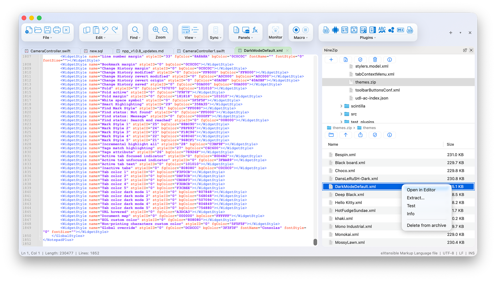*NextZip Archive/zip etc Plugin*

- **Poor Man's T-SQL Formatter v1.0.0** — reformat and beautify SQL with full control over casing, indentation, and clause layout. A faithful reimplementation validated byte-for-byte against the Windows formatter's output.

- **AnalysePlugin v1.0.1** — a dockable multi-pattern search panel that highlights and collects every line matching a set of patterns, with its own results view and a margin marker for hits.

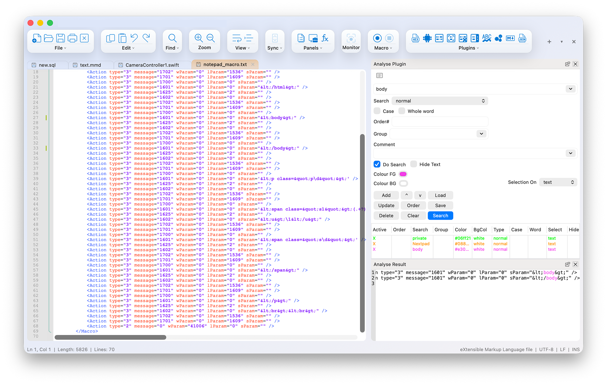*Analyse Plugin*

- **JSTool / JSMinNPP v1.0.0** — minify and pretty-print JavaScript, plus JSON sort and validation, right from the menu.

Small plugin updates this cycle:

- **ComparePlus v1.0.4** — gains a Windows-style **Navigation Bar** (a side-by-side diff minimap that shows the whole comparison at a glance) and **live dark-mode** switching.

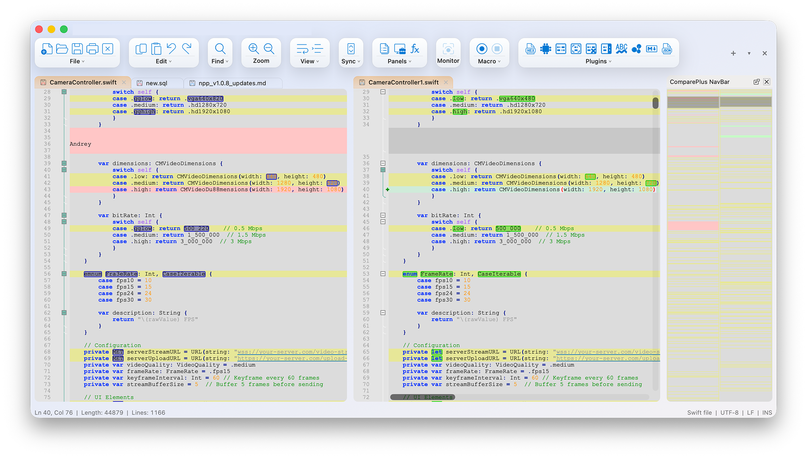*ComparePlus Navbar*

All plugins are notarized, stapled, and installable directly through *Plugin Admin → Available* inside Nextpad++. Remember: even a plugin with no UI or shortcut can be wrapped in a macro and run across an entire folder using the batch runner from Nextpad++ v1.0.7.

---

# Thanks to our contributors

Three community pull requests landed in this release: column-selection-to-multi-editing (#165), Light-Mode search-result chrome (#170), and regex end-of-line matching (#179). Thank you for making Nextpad++ better — Issues and PRs are always welcome.

---

# Compatibility

- **macOS deployment target**: 12.0+
- **Architecture**: universal (arm64 + x86_64)
- **macOS Tahoe (26)**: the new Liquid Glass look is supported and opt-in; the Classic interface remains the default on every macOS version.
- **Plugin API**: backward-compatible. Plugins built for v1.0.7 keep working.
- **Saved settings** (`~/.nextpad++/config.xml`, `shortcuts.xml`, `themes/`, etc.) are read by v1.0.8 unchanged; your existing Classic toolbar layout is never touched by the separate Tahoe configuration.

**Note:** Keep an eye out for some cool upcoming AI plugins this fall for which may need an up-to-date Nextpad++. You can check whether the app is current right from the Nextpad++ menu.

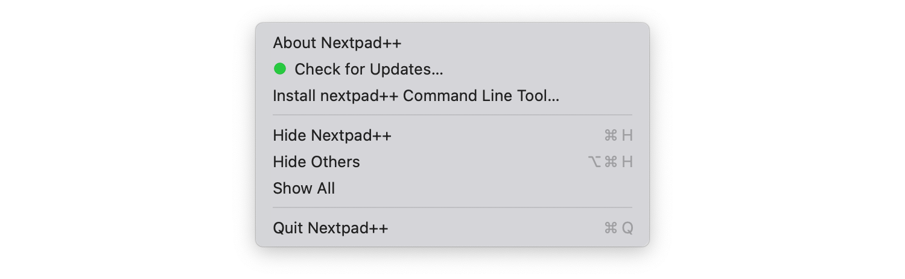
*Nextpad++ version check — Green/Yellow*

---

*Nextpad++ is the native macOS port of Notepad++ — built fresh in Objective-C++ on top of Scintilla and Lexilla, with all the host-side conveniences (full menu bar, native Find/Replace, dark mode, 137 UI languages, Git panel, spell check) that Apple-platform users expect.*
