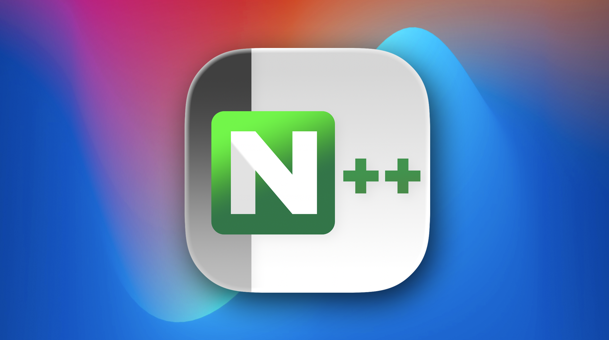
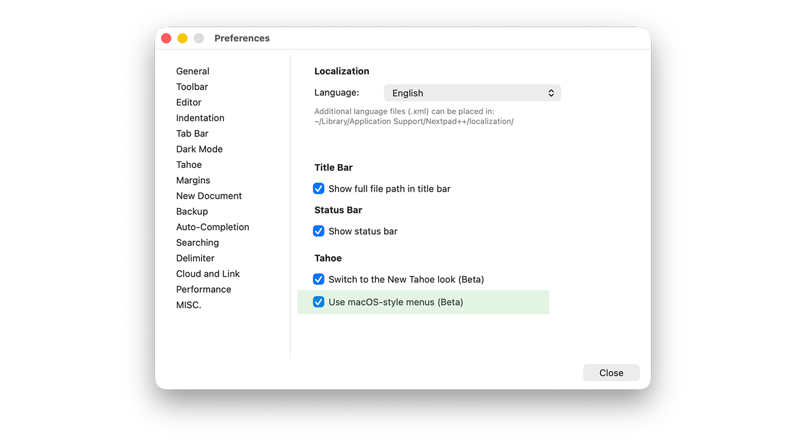
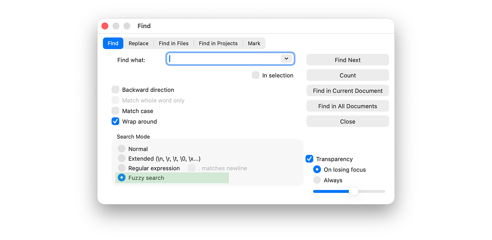
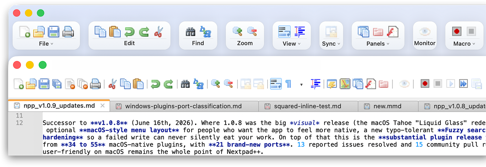
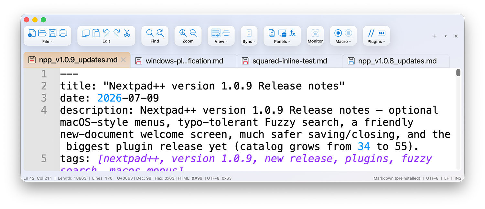
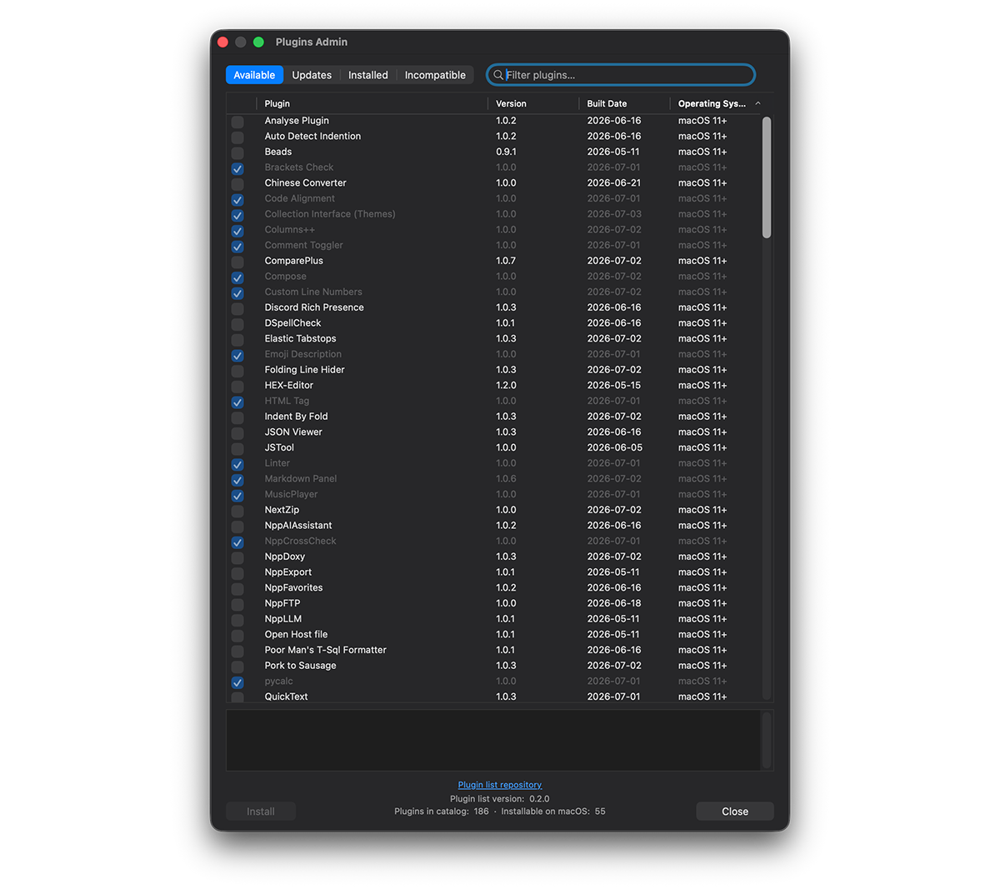
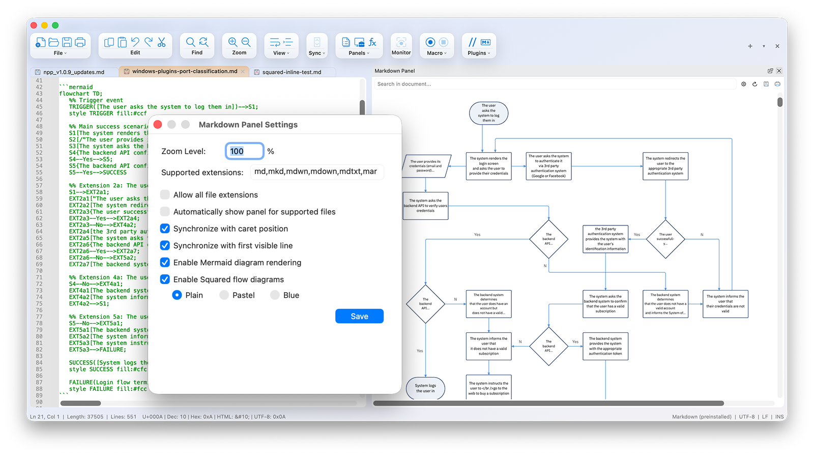
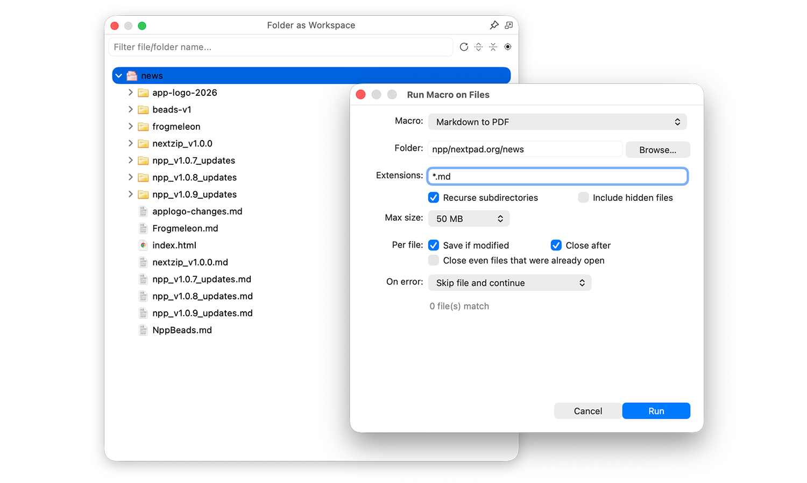

 *Nextpad++ v1.0.9*

# Nextpad++ v1.0.9 — Release Notes

Successor to **v1.0.8** (June 16th, 2026). Where 1.0.8 was the big *visual* release (the macOS Tahoe "Liquid Glass" redesign), 1.0.9 is about *ergonomics and safety*: an optional **macOS-style menu layout** for people who want the app to feel more native, a new typo-tolerant **Fuzzy search** mode, and a serious round of **save/close hardening** so a failed write can never silently eat your work. On top of that this is the **substantial plugins release** — the Plugin Admin catalog nearly doubled, from **34 to 55** macOS-native plugins, with **21 brand-new ports**. 13 reported issues resolved and 15 community pull requests merged. Keeping the editor genuinely user-friendly on macOS remains the whole point of Nextpad++.

---

# New Features

## macOS-style menus (Beta)

Back in the 1.0.8 notes I promised to start re-shuffling the main menus for the Tahoe look, and here it is. A new **Preferences → General → "Use macOS-style menus (Beta)"** checkbox (under the Tahoe section, restart to apply) rearranges the menu bar to follow Apple's Human Interface Guidelines instead of the Windows-Notepad++ layout. Leave it off and nothing changes — the Classic Windows-parity menus stay byte-identical and remain the default.

 *Optional macOS-native menu layout*

Turn it on and items **move** — nothing is added, removed, or renamed, they just land where a Mac user expects them: **Settings…** joins the application menu, the **Shortcut Mapper**, **Edit Popup ContextMenu** and the whole **Encoding** submenu move under **Edit**, **Appearance** (Style Configurator, Import Theme) moves under **View**, the **MD5 / SHA** hash tools and **Import Plugin(s)…** move under **Plugins**, and the top-level Settings, Encoding and Tools menus fold away because their contents now live elsewhere. Because every moved item keeps its exact English title and selector, your translations (137 UI languages), your `shortcuts.xml` overrides, and plugin menu insertion all keep working across both layouts. As always, the Classic layout is one checkbox away.

## Fuzzy search — typo-tolerant Find

Sometimes you don't remember exactly how something was spelled. v1.0.9 adds a **fourth search mode** on the Find tab — **Fuzzy search** — that does approximate, typo-tolerant matching for **Find Next**, **Count**, **Find in Current Document**, and **Find in All Documents**. It matches over real Unicode code points, so it works correctly for CJK, Cyrillic and accented text with no dictionaries and no per-language data. Replace is intentionally left out of fuzzy mode (substituting an approximate match is ambiguous), and it respects "In selection" and "Match case" like every other mode.

 *The new Fuzzy search radio on the Find tab*

Under the hood it's built on the well-regarded **rapidfuzz** library, vendored behind a small swappable facade so the search engine never depends on the library's internals — a clean base to grow fuzzy matching in future releases.

## A friendly new-document welcome screen

Open a fresh, empty tab and you'll now see a centered, subtle **welcome overlay** with a few quick tips and two links — one to open **Preferences** (appearance and Dark Mode), one to open the **Style Configurator** (fonts). It's designed to be completely out of your way: it's an AppKit overlay that is *never* part of the document, so it can't affect the text, length, encoding, saving, printing or undo, it disappears the instant you start typing (and comes back if you empty the buffer), clicks and scrolls fall straight through to the editor, and it recolors itself to match your light/dark/custom theme.

## Selected-character count in the status bar

The status bar gains a Windows-parity **"Sel:"** field, right after Ln/Col. With a single selection it shows the selected **characters and lines**; with a multi-caret or column selection it shows the selection count too ("Sel N : chars | lines"); with nothing selected it stays out of the way. The character count is a true UTF-8 character count, so a multibyte glyph counts as one character, not as its byte length (#234).

## More UX updates

- **Old Windows toolbar icons** — a new *Preferences → Toolbar* checkbox swaps the built-in toolbar buttons for the old flat, mode-agnostic "standard" icon set that looks identical across dark, light, Tahoe and Classic, for people who prefer the very old look and miss their Windows Notepad++ icons (restart to apply).

 *Oldschool Windows icons*

- **Tab size follows document zoom** — an optional *Preferences → Tab Bar* setting makes the tabs grow with the editor zoom level (⌘+ or Control-scroll): height, label font and icons all scale together, capped at 2×, and never shrinking below today's baseline (#158).

 *Tabbar zoom*

- **Save As suggests a sensible extension** — untitled "new N" tabs now default to the current language's primary extension in the Save panel (Python → `.py`, C++ → `.cpp`), falling back to `.txt` for normal text, exactly like Windows Notepad++. It's only a default suggestion; the panel stays unrestricted so you can still save as anything.

---

# Editor, Preferences & Search polish

- **Indentation preferences, reworked** — the Indentation prefs page swaps its scrolling table for a clean "Indent Settings" drop-down, tightens the Auto-indent layout to match, and — most importantly — now commits your indent size when you **close** the window, not only when you press Return, so a value you typed actually survives quit-and-relaunch (#226).
- **"In Selection" now scopes Count / Find All / Mark All** — previously "In Selection" only affected Replace All, while Count, Find in Current Document and Mark All silently searched the whole document. All three now honor the selection, matching Windows; this also fixed a latent wiring bug where the Find tab's checkbox was reading the Replace tab's state (#235).
- **Search results auto-collapse** — running a new search now folds the previous "Search …" result groups so only the newest one stays expanded, cutting clutter when you search repeatedly (matching Windows behavior).
- **Find in Files button layout** — a small fix that nudges the directory "…" and "<<" buttons clear of the folder drop-down so they no longer overlap.
- **Multi-line tab-bar rows fill the bar** — a community PR: in "wrap tabs to multiple lines" mode each row now fills the full width with balanced tab counts (e.g. 12+11 instead of 20+3), keeps short titles readable, middle-truncates long ones, and avoids lonely single-tab rows (PR #203).

---

# Your work is safer — save & close hardening

A quiet but important theme this release: several paths that could lose unsaved content on a *failed* save were tightened up.

- **No more silent data loss when a save fails** — three close / Save-All paths used to treat a failed write (a read-only path, a full disk, an encoding that can't represent the text) as success and remove the tab anyway, destroying your edits with no warning. Now a failed save shows the error and keeps the tab open, and **Save All** surfaces per-file failures instead of claiming everything saved.
- **"Save a Copy As" no longer hijacks your document** — the command used to rebind the live buffer to the copy, so your next ⌘S went to the copy, the original's pending edits were stranded, and the original's crash-recovery backup was deleted. It now writes a true side snapshot and leaves the document associated with its original file, which is exactly what "a copy" should mean.
- **Prompt to save on quit when the session isn't remembered** — with "Remember current session for next launch" turned off, quitting used to discard unsaved changes silently. A native Save / Don't Save / Cancel prompt (with an "Apply to all documents" option) now guards the close and vetoes it on Cancel or a failed save (#224).

- **"Don't Save All" when closing many tabs** — closing several unsaved tabs no longer forces you to click "Don't Save" once per document; a **Don't Save All** button (shown only when more than one document is unsaved) discards the rest in a single click, and a double-prompt plus a shifting-tab-index bug in the batch-close paths were fixed along the way (#214).

---

# For plugin developers — API additions

- **UDL buffers report as `L_USER`** — `NPPM_GETCURRENTLANGTYPE` used to return `L_TEXT` for User Defined Language buffers; it now returns `L_USER` (15) for genuinely-loaded UDLs, exactly like Windows, so comment togglers and snippet tools can detect a UDL and resolve its comment tokens. The updated **QuickText** already relies on this.
- **A plugin-addressable status-bar field** — `NPPM_SETSTATUSBAR` is now implemented, routing a plugin's text to a dedicated middle status-bar field without disturbing the host's own Ln/Col or language/encoding/EOL blocks. The new **Emoji Description** plugin uses it for live readouts.
- **Crash-hardened file open** — a plugin calling `NPPM_DOOPEN` with a borrowed / stack-allocated path could crash the app; the open path now copies the string synchronously and guards nil/empty/invalid paths, protecting every open call site.

---

# Stability & Bug Fixes

- **Git panel handles non-ASCII filenames** — files named `café.txt` (and anything else non-ASCII) can now be staged, unstaged, diffed and opened from the Git panel; git is asked to emit raw UTF-8 paths instead of C-quoted octal (#256). A separate pipe-buffer deadlock in the Git helper was also fixed.
- **Sort Lines / Remove Duplicate Lines** — no longer truncate lines containing multibyte UTF-8 text, and no longer float a blank line to the top or swallow the file's final newline on newline-terminated documents (#257).
- **Go to Matching Brace scrolls into view** — the caret jumped to the matching brace but didn't scroll it on-screen; now it does (#231).
- **Shortcut Mapper** — only one Shortcut Mapper window can open at a time now, so two of them can't clobber each other's `shortcuts.xml` (#230); and arrow / navigation-key shortcuts assigned in the mapper actually take effect instead of turning into stray punctuation (#231).
- **Copy / selection crash** — retrieving a selection wrote one byte past its buffer and discarded genuine single-character selections; both are fixed.
- **Two window-controller leaks** — a synchronized-scroll timer that kept firing ~60×/second against a closed split window, and a leaked controller for every opened-and-closed secondary window, are both released on close now.
- **Define Your Language (UDL) dialog** — fixes to dialog extensions, keywords, styles persistence, and a newly created language shows up in the Language menu immediately instead of only after a restart (#247).
- **Default editor fonts are Menlo 11** — the two default themes carried Windows fonts (Courier New / Consolas), and Consolas doesn't exist on macOS, so the editor font visibly changed on every Light↔Dark switch. Both defaults are now Menlo 11.

---

# New, Ported & Updated plugins

The Plugin Admin catalog has grown from **34** macOS-native plugins in v1.0.8 to **55** — **21 brand-new ports** this cycle, all notarized, stapled and installable straight from *Plugin Admin → Available* inside Nextpad++.

 *Plugin Admin*

**New this release:**

- **Columns++ v1.0.0** — serious column and tabular-data editing: elastic tabstops that keep columns aligned as you type, column alignment (left/right/numeric/custom), and sort-by-column with binary, locale or numeric ordering.
- **Code Alignment v1.0.0** — vertically align selected lines on a delimiter (`=`, `==`, a quote, a dot, a space, or any custom string/regex in ICU syntax) by inserting spaces, expanding to the surrounding block or XML scope.
- **Chinese Converter v1.0.0** — convert between Simplified and Traditional Chinese with the OpenCC engine, offering 12 conversion directions (including Taiwan and Hong Kong standards) right from the Plugins menu.
- **Comment Toggler v1.0.0** — toggle line and block comments on your selection(s), auto-detecting the comment syntax for the current language, multi-selection aware.
- **HTML Tag v1.0.0** — jump to the matching open/close tag, select or rename tags, and encode/decode HTML entities and Unicode escapes.
- **Brackets Check v1.0.0** — verify that round, square, curly and angle brackets are balanced across the document or the current selection, with per-type toggles.
- **Surround Selection v1.0.0** — select text and type a pair (`"`, `'`, `(`, `[`, `{`, `<`, …) to wrap it; works with multiple and rectangular selections.
- **Custom Line Numbers v1.0.0** — render the line-number margin in a custom format: hexadecimal, Vim-style relative distance from the caret, or decimal with a custom starting number.
- **Compose v1.0.0** — a compose key for characters that aren't on your keyboard: press Compose, then a short mnemonic — `'a → á`, `AE → Æ`, `-L → £`, `&copy; → ©` — including all HTML named and numeric entities.
- **Collection Interface (Themes) v1.0.0** — browse and install color themes from the official online Notepad++ Themes Collection directly into Nextpad++, one click each, much like UDL Admin does for languages.
- **Linter v1.0.0** — run the external command-line linters you already use, parse their checkstyle XML output, and underline problems inline with a status-bar summary and hover messages.
- **WakaTime v1.0.0** — automatic coding-time tracking via the official `wakatime-cli` helper, keeping your wakatime.com dashboards up to date as you edit.
- **REST API To Text v1.0.0** — describe an HTTP/REST request in the buffer (verb, URL, headers, body, `$(env:VAR)` expansion) and write the response — JSON pretty-printed — into a new tab.
- **SecurePad v1.0.0** — encrypt or decrypt the whole document or a selection in place with a Blowfish key of your choice.
- **pycalc v1.0.0** — a live Python calculator inside the editor: press Enter to evaluate the line you just finished and print the result on the next line, with variables and imports persisting across lines.
- **NppCrossCheck v1.0.0** — compare two lists in the document and append a COMMON / LIST 1 ONLY / LIST 2 ONLY report.
- **Strip IP and Host v1.0.0** — sanitize logs and configs by replacing IPv4/IPv6 addresses and hostnames with configurable placeholders, with per-document undo.
- **Emoji Description v1.0.0** — stream live character-encoding details (code point, decimal/hex, UTF-8/UTF-16 bytes, name) for the character under the cursor into the status bar.
- **Select 'N' Launch v1.0.0** — turn the selection into a temp file on the fly and open it with its associated app, with user-defined launch commands.
- **MusicPlayer v1.0.0** — play `.wav` / `.mp3` / `.m4a` / `.aiff` files without leaving the editor.
- **SpeechPlugin v1.0.0** — read the current document or selection aloud with a chosen system voice and rate.

**Notable plugin updates this cycle:**

- **ComparePlus v1.0.7** — the diff plugin (which shipped its side-by-side Navigation Bar in the 1.0.8 cycle) picks up a Clear-compare tab fix and a rebuild, and its in-source version stamp is now in sync.
- **Markdown Panel v1.0.6** — added Squared flow diagrams, toolbar buttons, PDF export and HTML export, and preview zoom. 

 *Markdown plugin Mermaid Squared flow diagrams*

If you have a folder full of markdown files which you need to export, you can record a Markdown to PDF/HTML as a Macro and then simply run Batch recursively on the entire folder of markdown files.   

 *Markdown to PDF or HTML Export on the entire folder*

- **QuickText v1.0.3** — snippet expansion now understands UDL / `L_USER` buffers (paired with the host API change above), so per-language snippets fire in User Defined Languages too.
- **Session Manager v1.0.2** — self-heals a stale sessions directory left over from the old `~/.nextpad++` location.

**Compatibility rebuild:** eleven plugins (plus NextZip) were rebuilt with a **macOS 12 minimum deployment target**, fixing a case where some plugins would refuse to launch on macOS versions below 26. If a plugin wouldn't load for you, grab the current build from Plugin Admin.

Remember: even a plugin with no UI or shortcut can be wrapped in a macro and run across an entire folder using the batch runner.

---

# Thanks to our contributors

Many community pull requests landed in 1.0.9 which you can explore here https://github.com/nextpad-plus-plus/nextpad-plus-plus-macos/pulls?q=is%3Apr+is%3Aclosed. Thank you for making Nextpad++ better — issues and PRs are always welcome.

---

# Compatibility

- **macOS deployment target**: 12.0+
- **Architecture**: universal (arm64 + x86_64)
- **macOS Tahoe (26)**: the Liquid Glass look and the new macOS-style menus are both opt-in; the Classic interface and Classic menu layout remain the default on every macOS version.
- **Plugin API**: backward-compatible and extended (new `L_USER` reporting and `NPPM_SETSTATUSBAR`); plugins built for v1.0.8 keep working. Plugins in the catalog were rebuilt for a macOS 12 minimum so they launch on older systems.
- **Saved settings** (`config.xml`, `shortcuts.xml`, `themes/`, UDLs, etc. under `~/Library/Application Support/Nextpad++`) are read by v1.0.9 unchanged; your Classic toolbar and menu layouts are never touched by the Tahoe options.

**Note:** Keep an eye out for the AI plugins arriving this fall, which will want an up-to-date Nextpad++ — you can check whether the app is current right from the Nextpad++ menu.

 *Nextpad++ version check — Green/Yellow*

---

*Nextpad++ is the full native macOS port of Notepad++ — built fresh in Objective-C++ on top of Scintilla and Lexilla, with all the host-side conveniences (full menu bar, native Find/Replace, dark mode, 137 UI languages, Git panel, spell check) that Apple-platform users expect.*
