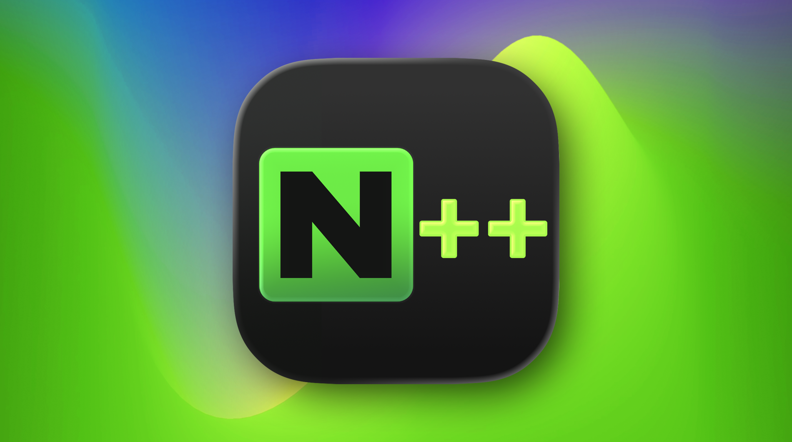 *Nextpad++ v1.1.0*

# Nextpad++ v1.1.0 — Release Notes

Successor to **v1.0.9** (July 9th, 2026). Two things define this release. First, Nextpad++ settles into your Mac like it owns the place: it can now be the **default app for your file types**, it **tells you when an update is out**, it has improved **printing**, and its side panels **dock on either side and remember exactly how you left them**. Second — the promise from the 1.0.9 notes comes true early: **the AI plugins have arrived**. The plugin catalog grows from **55 to 60**, headlined by **Parakeet AI** (on-device voice transcription, meeting capture, summaries and translation to 200 languages), the **MCP Server** (connect Claude, Cursor or any AI assistant directly to your open tabs), and **LuaScript** (script the whole editor). Under the hood, a serious round of correctness work landed for non-English text and for the paths that protect your unsaved work. A dozen reported issues closed and eleven community pull requests merged this cycle.

---

# New Features

## Make Nextpad++ your default editor — file associations

You can now tell macOS to open your file types with Nextpad++ without ever leaving the app. A new **Preferences → File Associations** pane lists common groups (code, config, logs, web, notes…) — tick the ones you want and macOS starts sending those files to Nextpad++ when you double-click them in Finder. Nothing happens behind your back: the system shows its own confirmation for each type, so you always stay in control, and your choices **survive app updates** — after a new version installs, Nextpad++ quietly re-registers the associations you picked.

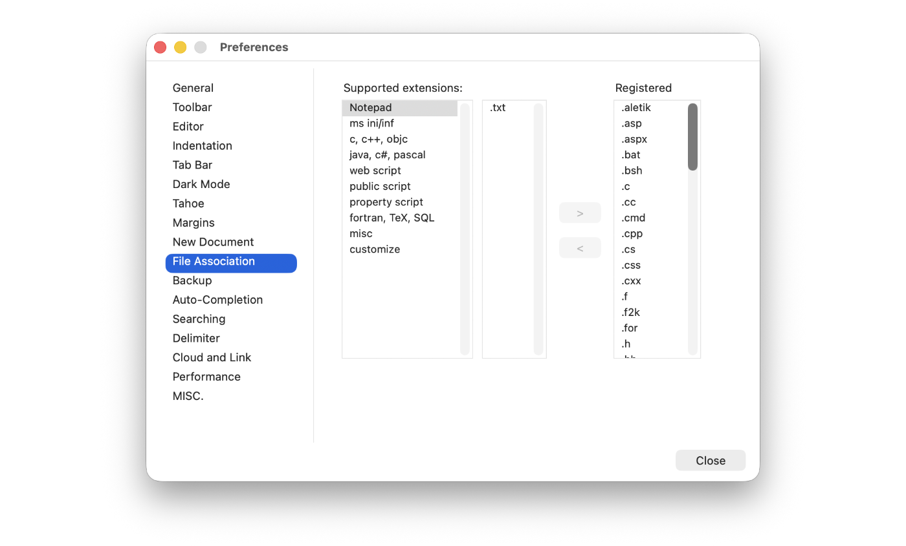 *The new File Associations pane in Preferences*

## Nextpad++ now tells you when an update is out

Until now you had to check the version yourself. From this release on, Nextpad++ checks quietly **once a day** and, when a new version is available, shows a small **card inside the app** — with the new version number and a download button. No nagging: the check is throttled, silent when you're up to date, honest when it can't reach the server (it just tries again another day), and it never downloads anything without you. You can still check manually from the **Nextpad++ menu** any time.

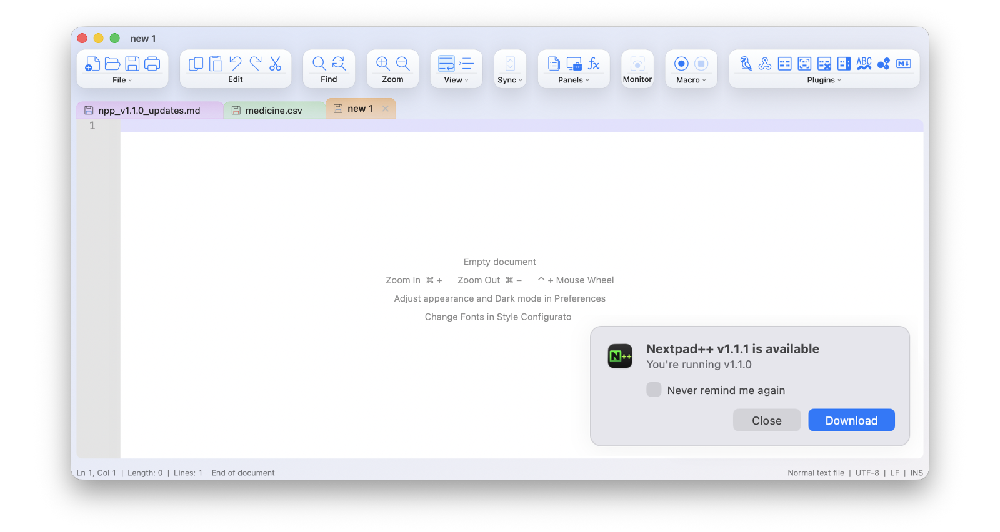 *The in-app update card — you'll meet it when 1.1.1 ships*

## Side panels, all grown up

The biggest batch of workspace improvements since panels were introduced, building on community PR #228:

- **Dock panels on the left.** Every panel — Document List, Function List, Folder as Workspace, search results, and every plugin panel — gets a new title-bar button that moves it between the right and left side. Mix and match: project tree on the left, Document List on the right.
- **Panels remember themselves.** Each panel now keeps **its own width** (instead of all sharing one), and widths, positions and open/closed states survive a restart.
- **Floating panels come back too.** Pop a panel out into its own window, quit, relaunch — it reappears as the same floating window, same size, same spot on screen.
- **Plugin panels reopen properly.** Panels from plugins (Parakeet, MCP Server, Beads, and friends) now restore at launch through the plugin itself, so the plugin is fully awake behind its panel — no more "the panel is there but empty" after a restart.
- The Detach and Dock-back buttons got cleaner icons, and panel titles now match the tab-bar typography.

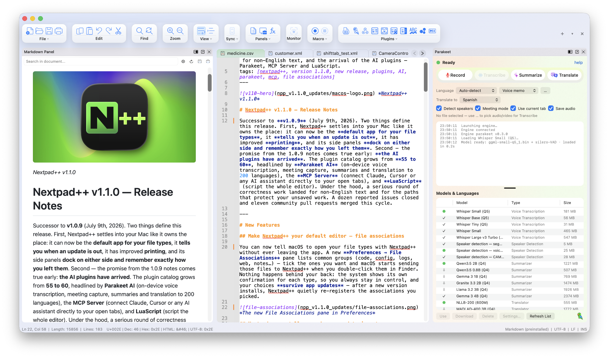 *A workspace with panels docked on both sides*

## Printing improvements

Printing used to print what was on screen — literally the visible part. Now **⌘P prints the entire document**, paginated properly, with the print panel's Scale setting doing what you'd expect and follows your font size. Long file, one command, every page.

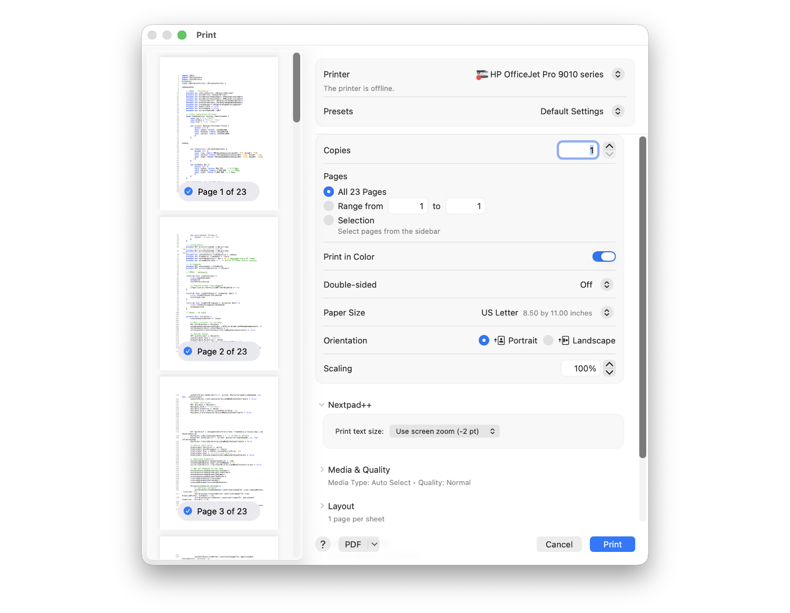 *Printing Dialog window*

## The tab bar, refined

A round of small changes:

- **Tab colors** (from the tab context menu) are richer — the translucent tints are stronger and the yellow and green got deeper, so a colored tab reads as colored at a glance.
- **Scroll the tab bar with your mouse wheel or trackpad** when there are more tabs than fit, and the overflow arrows were restyled into soft chevron buttons.
- Renaming a file now re-lays-out the tab instantly instead of leaving a stale-width tab behind.

## Document List improvements

- **Right-click the column headers** to choose which columns you see — and when you hide the Ext column, the Name column shows full filenames *with* their extensions, so nothing gets lost.
- The list now **follows tab reordering live** — move a document to start/end, drag a tab, pin one, and the list updates immediately instead of waiting for your next click.

## Full Character-sets menu

The **Encoding → Character sets** menu now matches Windows Notepad++ completely — the full tree of regional encodings (Arabic, Baltic, Celtic, Cyrillic, Central European, Chinese, Eastern European, Greek, Hebrew, Japanese, Korean, Thai, Turkish, Vietnamese, Western European…) for opening those legacy files that aren't UTF-8.

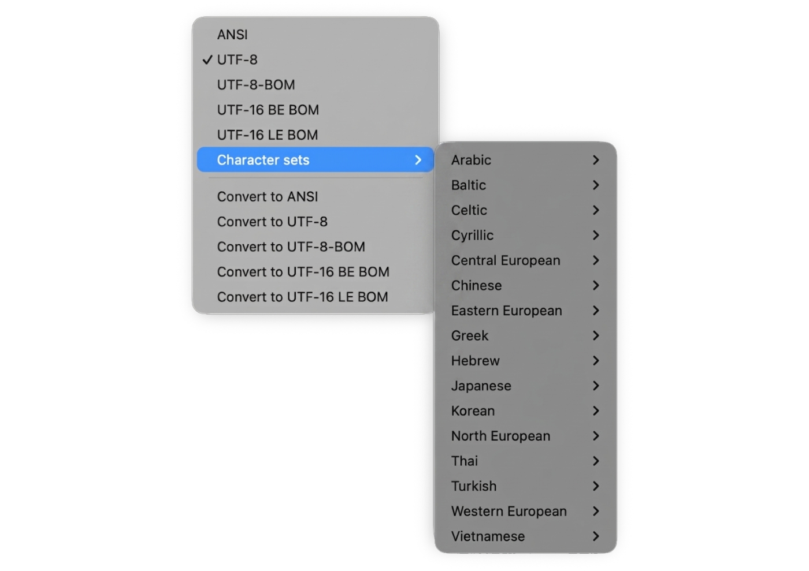 *Full character set menu*

## Better word wrap for Chinese, Japanese and Korean

A new **Preferences → Editor → "CJK-friendly word wrap"** checkbox makes wrapped lines break the way CJK text expects — long runs of Chinese, Japanese or Korean now wrap naturally instead of only at Western-style word boundaries. It's a per-preference switch, so nothing changes unless you turn it on.

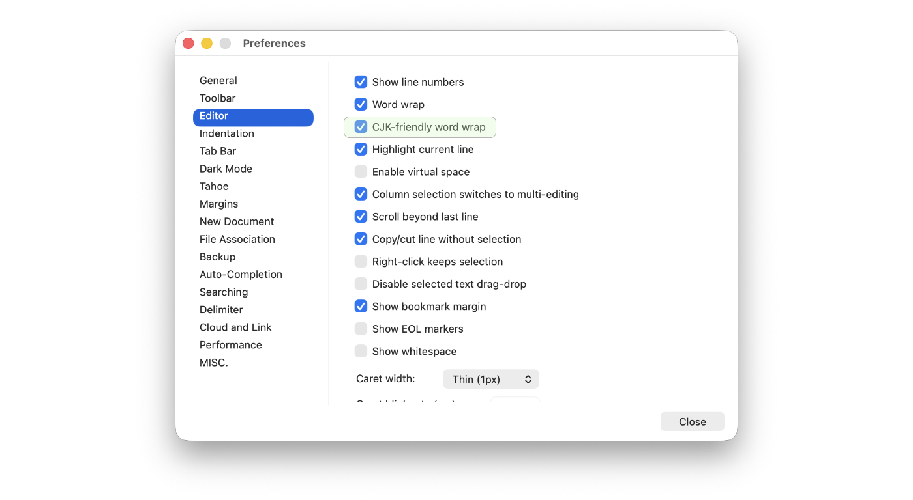 *CJK-friendly word wrap setting*

---

# Search & editing polish

- **Found text lands in the middle of the window.** Find Next used to leave the match on the very last visible line, hidden behind the horizontal scrollbar. A match that's off-screen now jump-scrolls to the **vertical middle** — and a match that's already visible doesn't scroll at all, so nothing jumps around. The same applies to clicking search results, and matches inside collapsed folds now unfold themselves.
- **Replace in Files / Replace in Projects, corrected.** Cross-file replace now uses the same engine as search — so regex, Match case and Whole word actually apply — reports the true number of replacements (not just matched lines), tells you when a file couldn't be written instead of failing silently, and skips rewriting files where the replacement wouldn't change anything (no more pointless "modified" timestamps).
- **Search results know about unsaved tabs.** Double-clicking a result from an unsaved document now jumps to that tab, instead of trying to open its name as a file on disk.
- **Word completion works in non-English documents.** With an accented or CJK character anywhere above your cursor, the suggestion popup could quietly stop working — or worse, suggest and insert the wrong text. Both are fixed.

---

# Your work is safer

The quiet theme continues from 1.0.9 — this cycle focused on backups, monitoring, and how the app behaves when files change under it:

- **Monitoring (tail -f) is safer.** If you typed into a monitored tab and the file grew on disk, your typing was silently replaced. Now a monitored tab with unsaved edits asks you — *Reload* or *Keep My Version* — and "keep" means keep: it won't nag again until you've saved or decided. Failed reloads (a permissions hiccup, a network drive blinking) retry instead of permanently missing that revision (community PR).
- **Same-named files no longer share one backup.** Two open files both called `notes.txt` used to overwrite each other's automatic backup; each buffer now keeps its own.
- **Backups get quarantined, not deleted.** When cleaning up stale backup files, Nextpad++ now moves them to a `.trash` folder inside the backup directory instead of deleting them outright — one more chance to recover if anything ever goes wrong (#215).
- **Quitting with several windows open** no longer discards the secondary windows' tabs and backups (community PR).
- **"File changed on disk" waits its turn.** That alert used to pop up while Nextpad++ was in the background — bouncing the Dock icon and interrupting whatever you were doing. It now waits until you come back to the app *and* to that tab, and multiple external changes collapse into a single question (#281).

---

# Stability & Bug Fixes

- **No more freezes scrolling huge wrapped files.** Navigating a large file with word wrap on — scroll, click, arrow down — could stall the app for seconds at a time. The wrap engine now measures only what it needs, making big-file navigation smooth.
- **Non-English text crash fixes.** Multi-Select (⌘D-style select-next) and the comment/uncomment commands could crash or mangle text in documents containing accented or CJK characters; both were rebuilt to handle multibyte text correctly.
- **Tahoe: double-clicking the title bar zooms again**, as macOS users expect.
- **Git panel** — staging and unstaging now report failures instead of silently doing nothing, and a "Stage All" with many files no longer deadlocks.

---

# For plugin developers — API additions

v1.1.0 is a big release for the plugin API — it's what made this cycle's new plugins possible:

- **Parity batch**: buffer activation and addressing (`NPPM_ACTIVATEDOC`, `NPPM_GETBUFFERIDFROMPOS`, `NPPM_GETPOSFROMBUFFERID`), file operations (`NPPM_DOOPEN`, save/reload by buffer), per-buffer language queries, and the `NPPN_FILEBEFORECLOSE` / `NPPN_FILEOPENED` / `NPPN_FILECLOSED` notification set — all matching their Windows semantics.
- **Panels that restore themselves**: the new `NPPM_DMM_SETPANELINFO` (the macOS answer to Windows' `tTbData`) lets a plugin declare which menu command reopens its panel, so the host can restore it at launch through the plugin's own code path.
- **Inter-plugin messaging** (`NPPM_MSGTOPLUGIN`) is in active use — it's how other plugins can ask LuaScript to run a script, or drive the MCP Server.

Plugins built for v1.0.9 keep working unchanged.

---

# The AI plugins are here

In the 1.0.9 notes I said to *"keep an eye out for the AI plugins arriving this fall."* They're early. The catalog grows from **55 to 60**, and three of the five newcomers change what kind of tool Nextpad++ can be. All are universal binaries, notarized, and one click away in *Plugin Admin → Available*.

## Parakeet AI v1.0.0 — your private voice notepad and translator you can take with you to a remote location with no Wifi or use in your zoom calls

Speak, and watch your words stream into a tab. You don't need Granola Notepad. **Parakeet** is a full voice suite that runs **entirely on your Mac** — nothing leaves your machine unless you connect your own AI account:

- **Live transcription** of voice notes in ~100 languages (Whisper)
- **Meeting mode** — transcribes *both* sides of a Zoom / Teams / Meet call, no bot joining your meeting
- **Summaries** with a local model, or bring your own Claude / ChatGPT / Grok account
- **Offline translation** across 200 languages (NLLB-200)
- **Speaker labels**, file transcription, compact audio recordings, and batch processing via macros

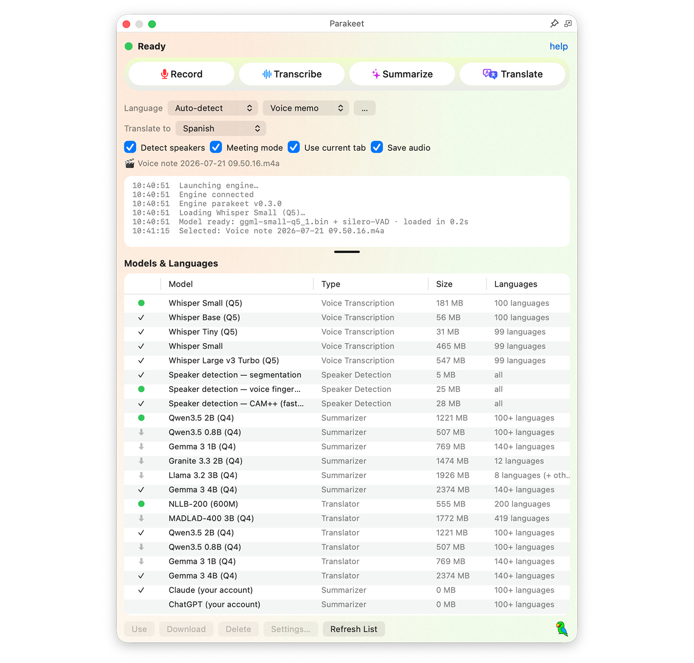 *Parakeet*

Read the full guide: [Parakeet v1.0.0](https://nextpad.org/news/?slug=npp_parakeet_v1.0.0).

## MCP Server v1.0.0 — connect your AI assistant to your editor

If you use **Claude Code, Claude Desktop, Cursor, VS Code agents or Windsurf**, this plugin teaches Nextpad++ the open **Model Context Protocol** — so your assistant can see your open tabs (live, unsaved edits included), search across them, and, only with your permission, edit them. It's local-only, guarded by a personal token, read-only until you flip the switches, and every request shows in a live activity log. No copy-pasting into chat windows anymore.

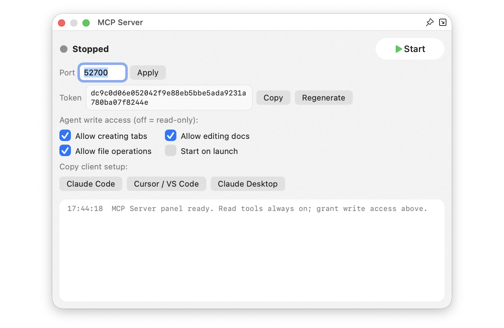 *The MCP Server panel*

Read the full guide: [MCP Server v1.0.0](https://nextpad.org/news/?slug=npp_mcp_v1.0.0).

## LuaScript v1.0.0 — script your editor

The beloved Windows scripting plugin, fully ported. An interactive **Lua console** (with syntax highlighting, autocompletion and history), a `startup.lua` that runs at launch, and a complete editor API: automate repetitive edits, add your own menu commands, react to editor events — strip trailing whitespace on save, insert timestamps, transform text with real logic that recorded macros can't express.

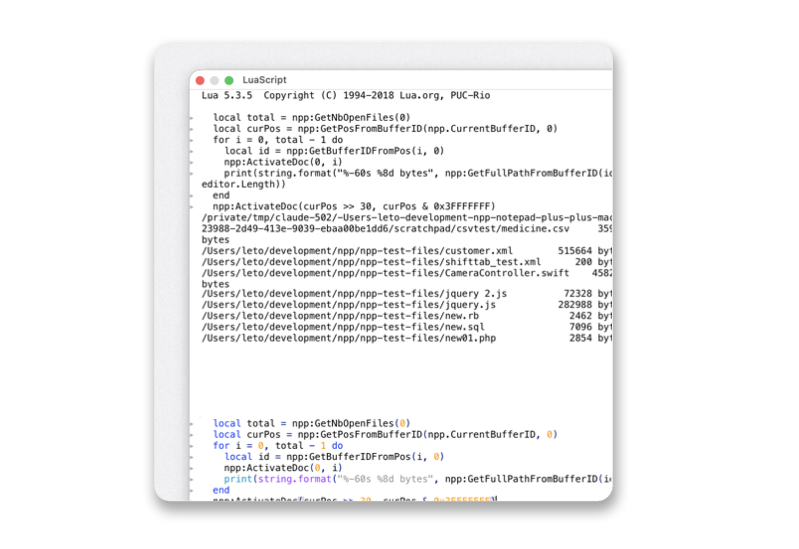 *The LuaScript console*

## CSV Lint v1.0.0 — delimited data, validated

Working with CSV / TSV / fixed-width data? CSV Lint **detects the separator and column schema**, validates rows against it and flags problems inline, converts between formats, and can even generate boilerplate code (SQL and more) from the detected schema.

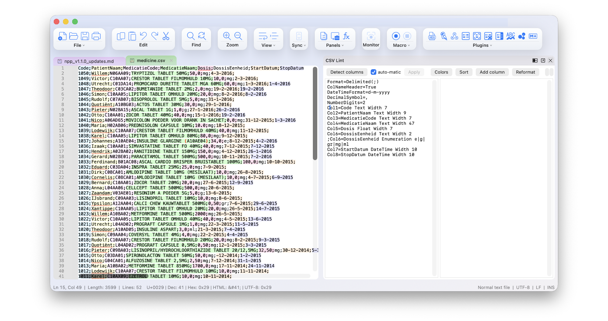 *The LuaScript console*

## SmartHighlight (Cisco Collab) v1.0.5

A community-contributed plugin by Anthony Nunez: select a word and every other occurrence lights up across the document, with configurable matching. Cisco log decoding as the cursor moves: Q.850 cause codes, DTMF blocks, X.509 certificates and SAML responses. CiscoCollab user-defined language for Cisco log syntax coloring.

**Also updated:** **Beads Viewer 0.9.3** (new icon, refreshed viewer app).

---

# Thanks to our contributors

Eleven community pull requests were merged this cycle — including the panel-persistence work, the non-ASCII crash fixes, the backup and multi-window hardening, and the monitoring and word-completion fixes. Explore them all here: https://github.com/nextpad-plus-plus/nextpad-plus-plus-macos/pulls?q=is%3Apr+is%3Aclosed. Thank you for making Nextpad++ better — issues and PRs are always welcome.

---

# Compatibility

- **macOS deployment target**: 12.0+
- **Architecture**: universal (arm64 + x86_64)
- **macOS Tahoe (26)**: the Liquid Glass look and macOS-style menus remain opt-in; the Classic interface stays the default everywhere.
- **Plugin API**: backward-compatible and extended (activation/file-op parity batch, panel-restore declarations, inter-plugin messaging); plugins built for v1.0.9 keep working. Note that the new AI plugins (Parakeet, MCP Server, LuaScript, CSV Lint) require v1.1.0 — they'll appear in Plugin Admin once you update.
- **Saved settings** (`config.xml`, `shortcuts.xml`, `themes/`, UDLs, etc. under `~/Library/Application Support/Nextpad++`) are read by v1.1.0 unchanged.

**Note:** this is also the first release with the new update card which will let you know when Nextpad++ 1.1.1 is out.

---

*Nextpad++ is the full native macOS port of Notepad++ — built fresh in Objective-C++ on top of Scintilla and Lexilla, with all the host-side conveniences (full menu bar, native Find/Replace, dark mode, 137 UI languages, Git panel, spell check) that Apple-platform users expect.*
