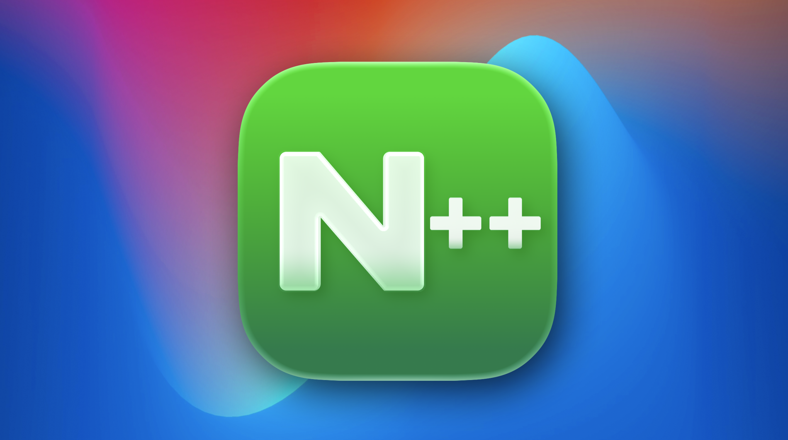
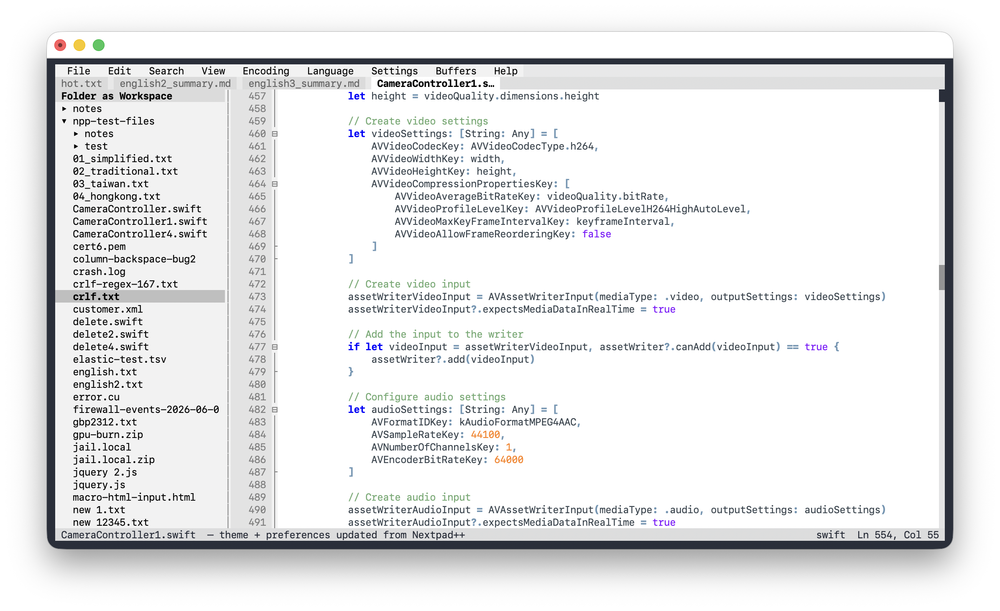
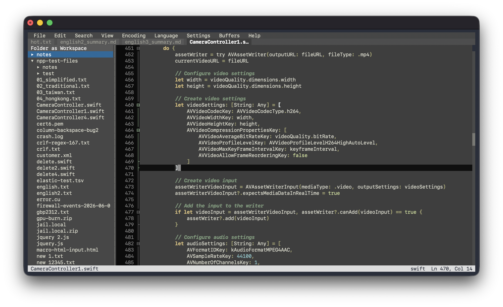
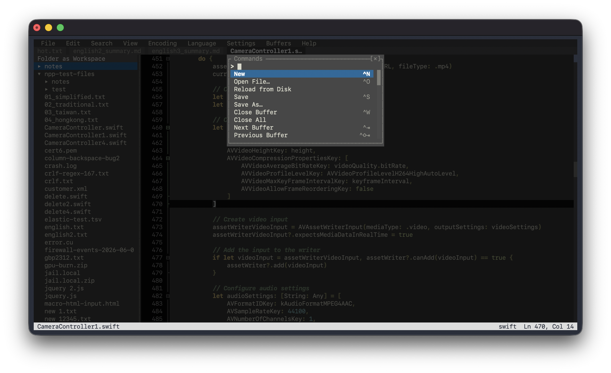
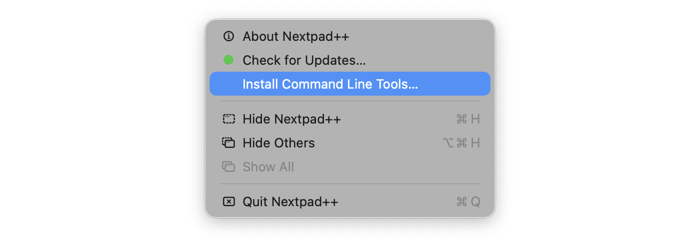
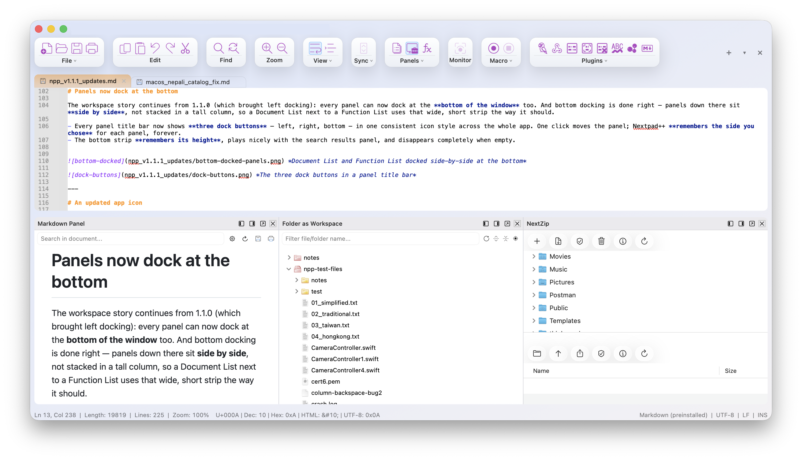
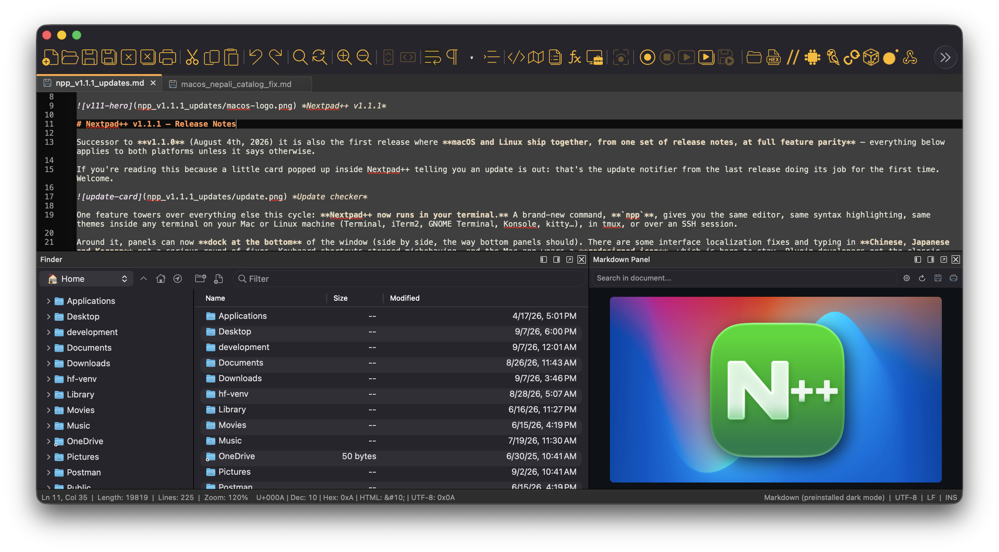
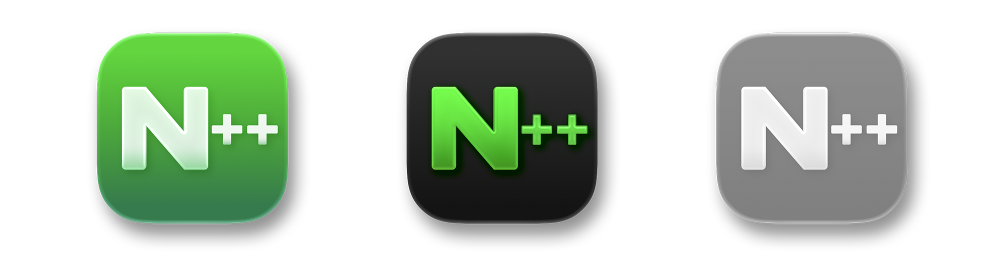

 *Nextpad++ v1.1.1*

# Nextpad++ v1.1.1 — Release Notes

Successor to **v1.1.0** (August 4th, 2026) it is also the first release where **macOS and Linux ship together, from one set of release notes, at full feature parity** — everything below applies to both platforms unless it says otherwise.

If you're reading this because a little card popped up inside Nextpad++ telling you an update is out: that's the update notifier from the last release doing its job for the first time. Welcome. 

 *Update checker*

One feature towers over everything else this cycle: **Nextpad++ now runs in your terminal.** A brand-new command, **`npp`**, gives you the same editor, same syntax highlighting, same themes inside any terminal on your Mac or Linux machine (Terminal, iTerm2, GNOME Terminal, Konsole, kitty…), in tmux, or over an SSH session. 

Around it, panels can now **dock at the bottom** of the window (side by side, the way bottom panels should). There are some interface localization fixes and typing in **Chinese, Japanese and Korean** got a serious round of fixes. Keyboard shortcuts stopped misbehaving, and the Mac app wears a **redesigned icon**, which is here to stay. Plugin developers get the classic Windows docking API, ported faithfully — on both macOS and Linux platforms. Fourteen reported issues closed across the two trackers, and several community pull requests merged this cycle.

---

 *npp — Nextpad++ running in a terminal window*

# Meet npp — Nextpad++ in your terminal

Some days you live in the terminal. You're SSH'd into your Mac or your Linux from another machine, or deep in a tmux session, and you just want to edit a file *there* — without reaching for the mouse, without waiting for a GUI. That's what **`npp`** is for — shipping now, on both platforms, as a **version 0.9.0**.

`npp` is built on the **same Scintilla engine** as Nextpad++ itself, which means:

- **Every language, highlighted** — all built-in languages, colored exactly as in the app. On Linux, your user-defined languages come along too.
- **Your themes, your settings.** `npp` reads the same theme and preferences as the GUI. Switch the app to a dark theme and a running `npp` follows **live, within seconds — even over SSH**. Tab width, word wrap, indent guides: one set of settings, both editors.
- **Tabs**, just like the app — open several files, switch with `^Tab`, see them in a tab bar.
- **Find and Replace** as clean overlay panels, plus incremental search.
- **Code folding** with real box-drawing glyphs and click-to-fold in the margin.
- **The command palette** on `^P` — type a few letters of any command and run it. Every command lives there, so you never need to memorize keys.
- **Menus** on `F10` — File, Edit, Search, View, Encoding, Language — mirroring the GUI's menus, so nothing is hidden behind terminal folklore.
- **Dock panels**: Document List, Function List, Project and Folder-as-Workspace panels, docked beside your text — yes, the file tree works in the terminal too.
- **Hot exit.** `^Q` quits instantly, and unsaved changes are snapshotted and restored the next time you run `npp`. Quit fearlessly.
- **Encodings handled properly** — files are detected on open and saved back in their own encoding, with conversions available from the Encoding menu.

 *Folder tree, Function List and tabs — in a terminal*

 *The ^P command palette, terminal edition*

## Installing it is your choice

**On Linux** every package deb, rpm, Arch, snapships `npp` right next to the app, so it's on your PATH the moment Nextpad++ is installed. Type `npp` and you're editing.

**On macOS**, installing Nextpad++ does **not** put anything on your command line. The terminal editor sits quietly inside the app until you ask for it:

**Nextpad++ menu → Install Command Line Tools…** *(on Linux the same item lives in the Help menu, handy if you run a build from source — it installs into `~/.local/bin`, no password needed)*

One action installs both commands: `nextpad++` (opens files in the GUI app) and `npp` (the terminal editor). You choose where — `/usr/local/bin` (asks for your admin password once) or `~/.local/bin` (no password needed). Uninstalling is just as clean: delete the links and it's gone.

Don't want to install anything? The full path always works, and it's stable across releases:

```
/Applications/Nextpad++.app/Contents/Helpers/npp file.txt    # macOS
/usr/bin/npp file.txt                                        # Linux
```

 *The Install Command Line Tools menu item*

## Everyday use

```
npp notes.md                  # open a file
npp a.txt b.txt c.txt         # several files, several tabs
npp                           # restore your previous session
npp --version                 # npp 0.9.0 (Nextpad++ 1.1.1)
```

The essentials: `^P` command palette · `F10` menus · `^O` open · `^S` save · `^F` find · `^R` replace · `^L` buffer list · `^Tab` switch tab · `F1` help card with all key bindings · `^Q` quit (hot exit).

## Over SSH

This is where `npp` earns its keep. SSH into your Mac or your Linux box from anywhere — a laptop into a build server, a Mac into a Raspberry Pi — type `npp file`, and you're editing with full syntax colors: no setup on the far end, no X11 forwarding, no remote desktop. For a one-shot command, remember the `-t` flag (`ssh -t host npp file.txt`), since editors need a real terminal. Copying text works across the wire too: `npp` speaks the standard OSC 52 clipboard protocol, so a copy inside a remote `npp` lands on your local clipboard, exactly like modern vim or tmux. (Working locally instead? On macOS the system clipboard is used directly; on Linux, `npp` talks to `wl-clipboard` or `xclip` when they're around.) Two tips for the best experience: forward `COLORTERM` in your SSH config for full 24-bit color (you get 256 colors otherwise), and run `npp` inside `tmux` if your connection tends to drop — a built-in reattach mode is planned for a future release.


## The two editors work together

- Change a theme or an editor preference in the GUI — a running `npp` picks it up live.
- In `npp`, *File → Open in Nextpad++ (GUI)* hands the current file over to the app.
- `npp` keeps its **own** session and its own unsaved-work snapshots, separate from the GUI's — the two never fight over your state.

## Honest fine print — it's a beta (version 0.9.0)

I'm releasing `npp` now bundled with Nextpad++ version 1.1.1. It's fully usable, and tested — an automated battery of several hundred checks runs against every build. Still I number it **0.9.0** and call it a **beta**, deliberately: a brand-new terminal editor meeting a thousand different terminal setups is bound to have small rough edges, and I'd rather hear about them and fix them quickly than pretend there are none. If something looks off in your terminal, tell me. That's exactly the feedback this beta is for, and it will be fixed as `npp` matures.

A few things I already know aren't there yet: custom `shortcuts.xml` key bindings aren't honored in the terminal (defaults only), there's no built-in session reattach after a dropped SSH connection (use tmux), and menu mnemonics and a Recent Files menu are still to come. All of that is on the list for 1.0 — and as `npp` grows up, it will also gain support for **basic plugins**, bringing a first slice of the plugin ecosystem into the terminal.

## A note for IT and security folks

If you manage Macs or Linux fleets and are wondering what a new executable means: **`npp` opens no network connections** (the "works over SSH" above means you run it *inside* an SSH session you opened — it has no remote capability of its own, exactly like vim), **adds no entitlements**, **never elevates**, **installs no persistence**, and on macOS **is never on PATH unless a user explicitly runs the install menu item** — the Homebrew cask deliberately does not add it either, so fleet upgrades don't silently change the commands available on managed Macs. (On Linux, `npp` arrives at `/usr/bin/npp` with the package, the way any packaged editor does — same binary, same no-network, no-elevation properties.) On macOS it's signed with the same Developer ID as the app, notarized, hardened-runtime; on both platforms it's open source in the same repository. A full security review document — what it reads and writes, verification commands you can run yourself, and allowlisting guidance for Santa/Jamf/MDM — is published alongside this release.

---

# Panels now dock at the bottom

The workspace story continues from 1.1.0 (which brought left docking): every panel can now dock at the **bottom of the window** too. And bottom docking is done right — panels down there sit **side by side**, not stacked in a tall column, so a Document List next to a Function List uses that wide, short strip the way it should.

- Every panel title bar now shows **three dock buttons** — left, right, bottom — in one consistent icon style across the whole app. One click moves the panel; Nextpad++ **remembers the side you chose** for each panel, forever.
- The bottom strip **remembers its height**, plays nicely with the search results panel, and disappears completely when empty.


 *Panels docked at the bottom (Light mode)*

 *Panels docked at the bottom (Dark mode)*

---

# An updated app icon

On macOS, Nextpad++ 1.1.1 app icon got a small face lift, which I hope you will like and is here to stay. It looks simple and nice in the dock in light and dark modes.

 *The redesigned icon*

---

# The entire app in your language

Nextpad++ has shipped with 137 interface languages from the start — but if you used one of them, you kept bumping into stray English: a button here, a dialog there. This release cleans it up  issue #252 with the localization pass.


---

# Typing in Chinese, Japanese and Korean

1.1.0 fixed how CJK text *wraps and displays*; 1.1.1 fixes how it *types*:

- **Multi-caret composition (#330).** Place several cursors (⌘-click), start typing with a Pinyin or Japanese input method — composed text now appears at **every caret**, matching what Windows Notepad++ does. 
- **Compositions end when they should (#320).** Clicking elsewhere, switching apps, or switching input sources while composing used to leave half-composed text in a strange state. All of these now cleanly commit the composition first.
- **Font names in any script (#318).** Fonts whose names contain non-Latin characters (think Chinese font families) were garbled in the font preferences; they now display correctly.

(If you type CJK on Linux: GTK 4's input pipeline already did all three of these correctly, so nothing changes for you — this round brings the Mac experience up to the same standard.)

---

# Shortcuts that do what they say

Three long-standing shortcut bugs, all closed:

- **Remapped shortcuts with Shift work now (#268).** Reassigning an editor shortcut to a combination involving Shift (say, ⇧⌘L — Ctrl+Shift+L on Linux) simply didn't take.
- **Rectangular selection survives your custom keys (#266).** If you remapped the column-selection shortcuts, extending a rectangular selection collapsed it into a plain one. 
- **Function-key shortcuts apply immediately (#265).** Assigning a ⌘F-key shortcut used to need an app restart before it worked. 
- **Shortcut Mapper** now shows the *real* default key for each Scintilla command on your platform — macOS defaults on macOS, GTK defaults on Linux — instead of the Windows key that didn't apply. 

---

# Everyday polish

A long list of small comforts, many from your reports:

- **The status bar joined the team (#313).** Click the **encoding** or **line-endings** segment to get its conversion menu right there; double-click the **INS/OVR** segment to toggle overtype mode.
- **Live zoom indicator (community PR #325).** The status bar shows the current zoom level as you ⌘-scroll (Ctrl-scroll on Linux), and a **double-click resets zoom to 100%**.
- **Paste with Hyperlinks (#299).** A new Paste Special command that keeps the links when pasting rich content — paste a paragraph from a web page and the URLs survive as text you can see.
- **Your line-ending preference is respected (#312).** New documents are created with the EOL style you chose in Preferences, and opened files correctly detect and report theirs.
- **Find in Files: "In all sub-folders" actually recurses (#317)** — it quietly didn't.
- **No more phantom "new 1" tab (#315)** when you launch Nextpad++ by double-clicking a file.
- **Saving from a split view updates the right tab (#321)** — the checkmark/asterisk state follows the tab that actually holds the document.
- **Hide the toolbar (#319)** — a new checkbox in Preferences → Toolbar, for the minimalists.
- **Command palette glow-up (#314)**: now it follows light/dark mode properly, renders special keys with proper macOS symbols (⌫, ⇥, ⎋…), and its shortcut labels no longer get clipped by scroll bars.
- **Calltips in autocompletion respect custom word characters (#322)** — languages where `-` or `$` are part of identifiers get correct parameter hints.
- **Quitting is about six times faster.** Teardown was constructing windows it was about to destroy; it doesn't anymore. ⌘Q (Ctrl+Q), gone.
- **Safer in two quiet ways**: a failed auto-backup write no longer discards the last good backup, and *Import Style Theme* no longer destroys the theme it replaces.

## And on Linux specifically

The Linux tracker is younger, and this release clears it out:

- **Dropping a file onto the editor opens it (#1)** — it used to paste the file's path into your text instead, which is a special kind of almost-helpful.
- **The right-click menu is now bulletproof (#3).** On several distros it would sometimes simply not appear. Fixed.
- **Clicking far beyond the end of a line no longer strands the caret out in the void (#5, #6)** — an editor option was being switched on unconditionally. Your text, and your caret, stay together.
- **The window comes back where you left it (#7)** — position as well as size is restored on X11 (Wayland doesn't let applications place their own windows — that one's by design). And restoring a session no longer conjures a duplicate "new 1" tab alongside your real one.
- **Arch users: you asked (#4), it shipped** — official Arch Linux packages join the family this release. Details under Compatibility.

---

# For plugin developers — the Windows docking API parity

If you've ported a Windows Notepad++ plugin, you know the drill: everything compiles except the docking registration. Not anymore. v1.1.1 implements the **classic Windows docking surface** — `NPPM_DMMREGASDCKDLG` with a faithful `tTbData` (same field names, same order), plus `NPPM_DMMSHOW`, `NPPM_DMMHIDE` and `NPPM_DMMUPDATEDISPINFO` — so docking code ports with a typedef swap and UTF-8 strings:

- `uMask` picks the **default dock region** (left / right / bottom — with the user's own choice always winning afterwards, exactly Windows' semantics), and `DWS_DF_FLOATING` floats the panel on first show.
- `pszModuleName` + `dlgID` double as **session-restore metadata**, so registered panels reopen at launch with zero extra code.
- The existing macOS-native panel messages (`NPPM_DMM_REGISTERPANEL` and friends) are untouched and share one registry with the new surface — a panel registered through either can be driven through both.
- The startup path was also hardened so that a plugin showing its panel very early (right at `NPPN_READY`) can never disturb the user's saved panel layout — a subtle safety net that benefits every plugin.

The same surface landed in the Linux host — one implementation per platform, both validated field-for-field against the original Windows `Docking.h`. A complete, honest reference of **every message and notification the host implements** — including which Windows constants are stubs, and which notifications are actually emitted — is now published on the [Resources page](https://nextpad.org/resources/). Plugins built for v1.1.0 keep working unchanged.

---

# Thanks to our contributors

This cycle's community contributions include the Shift-shortcut fix, the rectangular-selection fix, and the status-bar zoom indicator — along with the bug reports behind most of the "Everyday polish" list, several of which came with exact reproduction steps that made the fixes quick. Explore the merged PRs here: https://github.com/nextpad-plus-plus/nextpad-plus-plus-macos/pulls?q=is%3Apr+is%3Aclosed — and the Linux tracker lives at https://github.com/nextpad-plus-plus/nextpad-plus-plus-linux/issues. Issues and PRs are always welcome, on either.

---

# Compatibility

**macOS**

- **Deployment target**: 12.0+ (unchanged from 1.1.0)
- **Architecture**: universal (arm64 + x86_64); the `npp` terminal editor is universal too
- **macOS Tahoe (26)**: the Liquid Glass look and macOS-style menus remain opt-in; the Classic interface stays the default.
- **The terminal editor** changes nothing for anyone who doesn't opt in: no PATH changes, no background processes, no network — see the security note above.

**Linux**

- **Packages**: deb (Ubuntu 22.04 and later, Debian), rpm, the Snap Store (`nextpad`, stable channel) — and, **new this release, Arch Linux packages** (`.pkg.tar.zst`). All of them in both amd64 and arm64, and every one of them ships `npp` at `/usr/bin/npp`.
- **Requirements**: GTK 4 (4.6 or later) and libadwaita; X11 and Wayland are both first-class.
- **Window position restore** is an X11 feature; on Wayland the compositor owns window placement, so size and maximized state are restored there.

**Both platforms**

- **Plugin API**: fully backward-compatible, extended with the Windows-named docking surface and bottom docking; plugins built for v1.1.0 keep working unchanged.
- **Saved settings** (`config.xml`, `shortcuts.xml`, `themes/`, UDLs — under `~/Library/Application Support/Nextpad++` on macOS, `~/.local/share/nextpad++` on Linux) are read by v1.1.1 unchanged. Panel layouts from 1.1.0 carry over; the bottom dock is simply a new place to put them.

---

*Nextpad++ is the full native port of Notepad++ for macOS and Linux — built fresh on Scintilla and Lexilla, in Objective-C++ on the Mac and in C on GTK 4, with all the host-side conveniences (full menu bar, native Find/Replace, dark mode, 137 UI languages, Git panel, spell check) that each platform expects. And now it fits in a terminal, too.*
