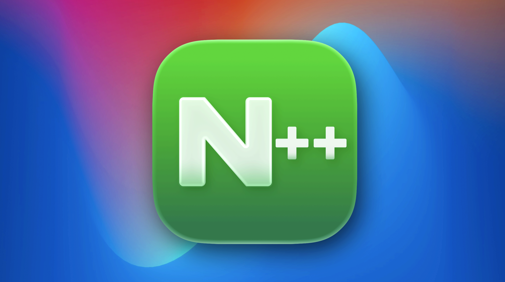
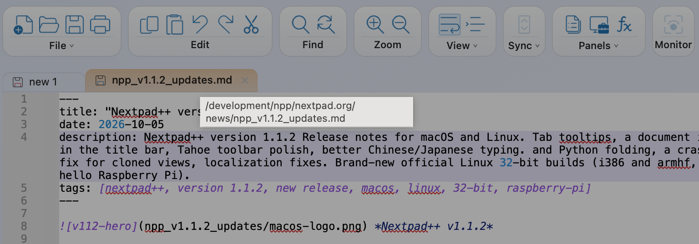
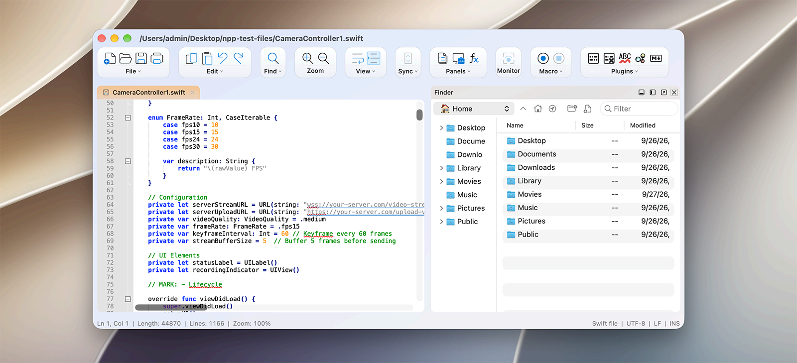
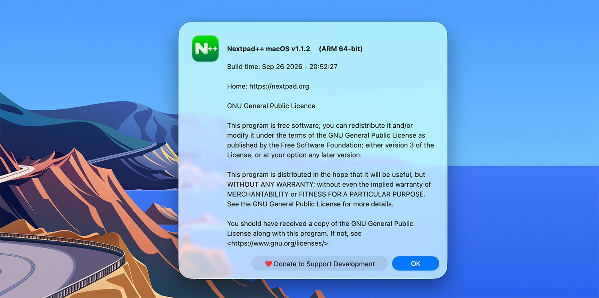

 *Nextpad++ v1.1.2*

# Nextpad++ v1.1.2 — Release Notes

Successor to **v1.1.1** (September 9th, 2026). As with 1.1.1, **macOS and Linux ship together, from one set of release notes** — everything below applies to both platforms unless it says otherwise. No headline feature this time — and that's on purpose. After two releases that each introduced something big, this one is four weeks of sanding things smooth: a dozen and a half of your reports investigated and closed across the two trackers, a round of polish for the Tahoe look.

(Linux does get one genuinely new thing, though: official **32-bit builds** — for old x86 machines and 32-bit Raspberry Pis. Details further down.)

---

# Two small things you'll touch daily

**Hover a tab, see where the file lives (#354).** Tabs now show a tooltip with the file's full path — every tab, not just the active one. No more clicking through tabs to figure out which of three `config.xml` files you're staring at. Unsaved documents show their name and when you last edited them, so even "new 1" and "new 2" tell themselves apart.

 *A tab tooltip showing the full file path*

**The title bar earned its icon (#336).** The little document icon next to the window title is now a real macOS *proxy icon*, like in every good Mac app: **⌘-click it** to see the file's folder trail, **drag it** to copy the file somewhere, drop it into a Terminal window to paste the path, or into Mail to attach the file. It was always supposed to do that; now it does. (This one is macOS-only — proxy icons are a Mac idiom with no Linux equivalent.)

---

# The Tahoe look polish

If you've opted into the Liquid Glass interface on macOS Tahoe (26), the toolbar got a careful going-over this cycle:

- Capsules keep a **steady, even spacing** in all macOS versions starting from Monterey all the way to Golden Gate. 

 *Golden Gate with Capsules (Tahoe look)*


- The overflow menu (the **≫** at the right edge) was rebuilt: it now matches the toolbar's own style, and buttons **fade smoothly** in and out of it when the window gets narrow, instead of popping.
- The **Plugins capsule fixes (#358).** When a newly installed plugin adds a toolbar button, it now shows up right away instead of staying invisible until you reset your toolbar layout. If you've hidden every plugin button, the Preferences → Tahoe page now says so, plainly, instead of leaving you wondering where the capsule went. And buttons that belong to a plugin you've since uninstalled are listed greyed out as *"(not loaded)"*, so the list always makes sense.

The Linux build offers the same Tahoe-style toolbar as its own opt-in look, and it picks up the Plugins-capsule fixes too — the greyed-out *"(not loaded)"* rows and the plain-words notice when every plugin button is hidden.


Also in that corner, on the Mac: **Help → Debug Info** got an upgrade. It now reports your actual settings, toolbar state, language and plugin situation — which means when you file a bug report and paste it in, I can better see the problem.

---

# Fixes

**A crash in split views, gone (#351).** Editing the same document in both halves of a split view (*Move/Clone Current Document*), selecting text in one side while the other showed the same region, could spin the CPU and, with the right timing, crash. 

**Typing Chinese, Japanese or Korean: the caret stays with you (#361).** While composing text (typing Pinyin, say, before picking characters), the caret used to sit stubbornly at the start of the underlined composition. It now moves inside it, exactly as it does in Windows Notepad++ — so you can see where you are mid-composition. 

**Folding in Python behaves like Notepad++ (#343).** *View → Fold Level* collapsed not just the level you asked for but everything nested inside it — so "fold level 2" quietly swallowed every function body in the file. It now folds exactly one level, matching Windows, in Python and every other indentation-based language (YAML, Haskell, CoffeeScript…).

**Preferences stick better without the Enter key (#341).** Type a number into a Preferences field — tab width, say — and close the window: the value now applies.

**Show Symbol toggles are remembered (#339).** *View → Show Symbol → Show End of Line* (and friends) now apply to all your tabs and survive a restart.

**The status bar stays in its lane (#345).** A long file path in the status bar could physically push your window wider. The window now stays the size you made it.

**And for `npp`, the terminal editor:** version 0.9.1 fixes the one report that `npp` no longer repaints your terminal's color palette on exit (#342), so your prompt looks like your prompt again after you quit.

## And on Linux specifically

The Linux tracker had a productive month — every open report, closed:

- **`npp` now starts on all distributions (#8).** The terminal editor refused to launch on some distros because each one builds the ncurses library in a subtly different flavor. The packaged `npp` now carries its own copy (statically linked), so the same binary runs wherever the app does.
- **The Preferences window stopped playing tricks (#9, #11).** Closing it with the title-bar ✕ and asking for it again could present the wrong window — or nothing at all. The two reports turned out to be one and the same bug, and it's gone.
- **The mouse wheel works over long menus (#10).** With a submenu open, scrolling a tall menu — Language, say — did nothing: the submenu quietly swallowed the wheel. Now the submenu steps aside and the menu scrolls, as you'd expect.
- **Markdown code fences behave (#13).** Typing ```` ```python ```` and pressing Enter could trigger autocompletion instead of starting your code block — lines merged, fences mangled. Autocompletion no longer hijacks the Enter key. And while in that corner, the **Auto-Completion preferences page** was rebuilt to match the Mac's two-column layout, including the previously missing **Matched pair 1–3** auto-insert settings.
- **The Document Map fixes again** — it could come up blank until you poked at it.
- **Menus are safe at launch.** Opening a menu in the very first seconds after startup could, on some distributions, crash the app — startup no longer rebuilds the menu bar underneath your pointer.
- **Dark mode got its details pass.** Tooltips now follow light/dark mode instead of always being dark, and selected rows in the side panels are finally readable in dark themes.

---

# Localization keeps getting more attention:

- **German users spotted it first (#349):** a few menu items showed the wrong word entirely — *Close* appearing as "rechts" (right) being the star of the show. The cause was deep in how translations were looked up, and the fix makes the lookup **deterministic**

- **Chinese and Japanese got a vocabulary check (#340):** the Find window's "0 matches" read as "0 sports games" in Simplified Chinese, "hits" had become mouse clicks, and the Character column was a fictional person. 

If your language still shows something odd, please report it exactly like these folks did — one screenshot is enough.

---

# A quiet word about support

You'll notice a small **♥ Donate** link in the About dialog and on the update card. Nextpad++ is free and will stay free; if it saves you time and you feel like buying the project a coffee. I'm very very thankful for your support.

 *Donate to support the development in the About Nextpad++*

---

# New: Nextpad++ goes 32-bit (Linux)

The Linux family grows in an unexpected direction this release: **official 32-bit builds**, as `.deb` packages for **i386** (32-bit Intel/AMD) and **armhf** (32-bit ARM).

- **The i386 build** is for x86 machines living a second life on a 32-bit distribution. One package covers the current 32-bit Debian family — **Debian 12 and 13, antiX, MX Linux, Q4OS** and friends.
- **The armhf build** brings Nextpad++ to the **Raspberry Pi OS (32-bit)** world — the current Debian-13-based images — plus plain Debian 13 on armhf. (The older bookworm-based legacy Pi image uses an incompatible library ABI and isn't covered.)

Both are the full application: same editor, same themes, same 137 languages — and the same **`npp` terminal editor**, which might be the real star here; a headless Pi over SSH is `npp`'s natural habitat.

Two honest footnotes. 32-bit means files up to 2 GB — an architectural limit, not a bug. And the plugin catalog for these builds starts out empty: Plugins Admin works, but plugins are 64-bit for now, and they'll follow if the 32-bit builds find their audience. Tell me which ones you miss.

---

# What's next: plugins, plugins, plugins

A peek at the roadmap: **1.1.3 will be the plugin release.** A large batch of newly ported plugins from the classic Windows Notepad++ family has been quietly building up — ported, reviewed and tested — and the next version is where they land in the Plugins Admin catalog, all at once. If there's a Windows plugin you've been missing since you switched, there's a good chance it's in this wave.

And alongside the plugins: a few **new dark themes**, with color schemes you'll recognize if you're coming from **Sublime Text** or **VS Code** so your eyes can move in without redecorating. 

One more thing on the horizon, further out and said with all the usual caveats: an **Android build** of Nextpad++ is being explored. No promises and no date beyond "maybe sometime this year".

---

# Thanks to our contributors

This release is almost entirely made of your bug reports — the split-view crash came with a crash log, the German localization report came with screenshots, the folding report pointed straight at the right menu item, and the Preferences fix builds on a community pull request. That's exactly how a polish release should happen. The trackers are open: https://github.com/nextpad-plus-plus/nextpad-plus-plus-macos/issues for the Mac and https://github.com/nextpad-plus-plus/nextpad-plus-plus-linux/issues for Linux — issues and PRs always welcome, on either.

---

# Compatibility

**macOS**

- **Deployment target**: macOS 12.0+ (unchanged); universal binary (Apple Silicon + Intel)
- **macOS Tahoe (26)**: the Liquid Glass look remains opt-in; the Classic interface stays the default.

**Linux**

- **Packages**: deb (Ubuntu 22.04 and later, Debian), rpm, the Snap Store (`nextpad`, stable channel) and Arch Linux (`.pkg.tar.zst`) — in amd64 and arm64 as before, **now joined by the i386 and armhf debs** described above. Every package ships `npp` at `/usr/bin/npp`.
- **Requirements**: GTK 4 (4.6 or later); X11 and Wayland are both first-class.

**Both platforms**

- **Plugins**: fully backward-compatible — everything built for 1.1.0 or 1.1.1 keeps working unchanged.
- **Saved settings** (`config.xml`, `shortcuts.xml`, themes, UDLs — under `~/Library/Application Support/Nextpad++` on macOS, `~/.local/share/nextpad++` on Linux) are read unchanged; nothing to migrate.
- **`npp` terminal editor**: now 0.9.1, still opt-in on macOS, still zero network, same install story as before — and on Linux it no longer depends on your distribution's ncurses (see #8 above).

---

*Nextpad++ is the full parity native port of Notepad++ for macOS and Linux — built fresh on Scintilla and Lexilla, in Objective-C++ on the Mac and in C on GTK 4, with everything each platform expects: full menu bar, native Find/Replace, dark mode, 137 UI languages, and a growing plugin catalog. Sometimes the best release is the one where everything just works a little better — and now it fits on a Raspberry Pi, too.*
